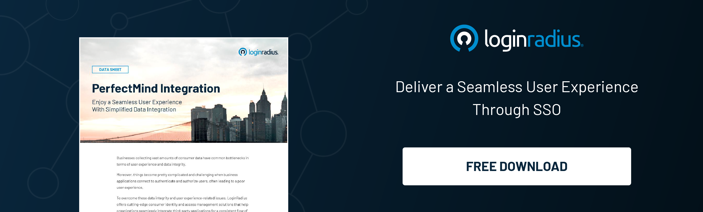

The LoginRadius PerfectMind integration is delivering a seamless user experience and helping cities in increasing user conversions allowing their users to register and authenticate flawlessly.

[Authentication](https://www.loginradius.com/authentication/) is one of the most important aspects that should be carried out without any friction since a great consumer experience is a key to business success; LoginRadius understands this and developed an out of the box SSO solution to deliver a seamless user experience between LoginRadius and PerfectMind applications.  

Users expect authentication experiences that are quick, delightful, secure, and seamless. Hence, a robust authentication mechanism becomes the need of the hour for enterprises collecting and storing vast amounts of user information and leveraging this across distinct systems and toolsets.

LoginRadius’ cutting-edge single sign-on helps overcome all the challenges related to consumer experience and data integration.  Let’s understand how LoginRadius paves the path for a robust user experience by integrating PerfectMind. 

## What is PerfectMind?

PerfectMind (part of Xplor) is a membership management software that uses cloud-based technology to help organizations of all sizes connect with their communities. 

PerfectMind started as a software solution for martial arts schools but has expanded over the years to serve other industries, most notably parks and recreation departments.

## Intent Behind the Integration 

Canadian municipal and community organizations were looking for a way to connect their native website to PerfectMind so users could log in and enjoy a seamless experience between the sites.

Since, PerfectMind does not support industry-standard [federated Single Sign-On](https://www.loginradius.com/blog/identity/loginradius-federated-identity-management/) methods like SAML, OAuth/OIDC, or JWT, LoginRadius offered its out-of-the-box SSO Connector solutions to create a Single Sign-on user experience between LoginRadius and the PerfectMind applications by leveraging APIs.

Through LoginRadius PerfectMind integration, the PerfectMind consumers are leveraging all the powerful capabilities of the cutting-edge CIAM platform, including social login, [passwordless login](https://www.loginradius.com/blog/identity/passwordless-authentication-the-future-of-identity-and-security/), single sign-on, reinforced by robust security. 

## Final Thoughts 

With the LoginRadius PerfectMind SSO, businesses can establish a flawless user experience by overcoming the barriers of frictionless authentication and authorization across multiple platforms/ servers. 

