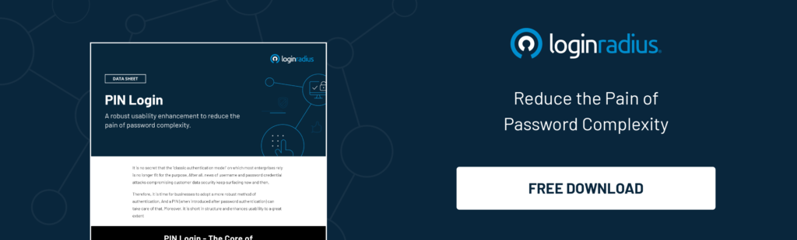

LoginRadius is a rapidly-expanding platform. And this time, the cloud-based customer identity and access management solution has launched a PIN Login authentication environment for its existing and new customers.

## Intend Behind The Launch

The [method of authentication](https://www.loginradius.com/multi-factor-authentication/) is an important aspect of security, and likewise, a PIN strikes just the right balance between security and usability.

To be clear, by authentication we mean how we identify and verify users on our platform to make sure **_'they are who they say they are.'_**

LoginRadius customers can now avoid time-consuming delays caused by entering long, complex credentials repeatedly within a trusted device. PIN login will also pose an additional challenge for hackers during or after login.

## The Benefits of PIN Authentication

In a new generation of end-users, a strong PIN based authentication uptake is a better way to validate their authenticity. Whether it’s PIN based authentication through platform or PIN authenticator, it’s always a reliable way of authentication when it comes to security and convenience. Here are a few more advantages of using PIN login as a method of authentication. 

- It simplifies the login process. 
- The validation happens in a matter of a few seconds. 
- PIN authentication is hassle-free, convenient, and less time-consuming.
- The need for re-authentication during critical events strengthens security.

## What Does the Threat Mitigating Model Look Like

We have followed strict authentication protocols to make this launch a success. Likewise, here is an outline of how our threat mitigation model looks like and what it offers:

**Enhanced usability for end-user**: For customers looking for a secure, seamless sign-in to justify the authenticity of end-users, PIN Login will offer a shorter, less time consuming, and more usable experience that [simplifies the sign-in process](https://www.loginradius.com/blog/2019/05/what-is-single-sign-on/).

**No third-party integration**: We conduct authentication and authorization of end-users inside our identity environment. No other third-party service provider is involved resulting in better response speed and boosted security.

**Re-authentication upon prolonged inactivity**: Long-lived sessions are harmful, especially if the user was inactive for a longer period of time. The new PIN login will require users to re-authenticate after a pre-set time duration.

**Critical Information Accessibility**: End-users will be validated every time when conducting a critical event. This event-based re-authentication flow will work for scenarios like while processing a transaction or deleting an account.

**Complete configurable solution**: Customers can configure the PIN length based on industry standards and set the flow as a mandate or optional for the end-users.

**Forced account lockouts**: The account will be locked automatically upon hitting the configured number of failed PIN attempts. The PIN will act as the protection layer against vulnerabilities like brute force attacks.

**Pin Login Data Sheet**

## Making Authentication Convenient and Simple for End-Users

It is quite impressive to deliver seamless experiences from the first interaction itself. With the latest PIN authentication, we aim to streamline end-users' journey by providing a [passwordless experience](https://www.loginradius.com/blog/2019/10/passwordless-authentication-the-future-of-identity-and-security/).

Our PIN login is another giant step towards achieving better security, usability, and identity management.

## A Final Word

PIN login is a successful attempt at not just embracing an alternative  two factor authentication PIN method or the multi factor authentication PIN method for the LoginRadius identity platform, but using a variety of other factors and combining them contextually for secured access management. 

All-in-all, we aim to ensure that logins are secure, simple, seamless, and frictionless. And if it can turn customers into loyal advocates, that will serve our purpose even better.

