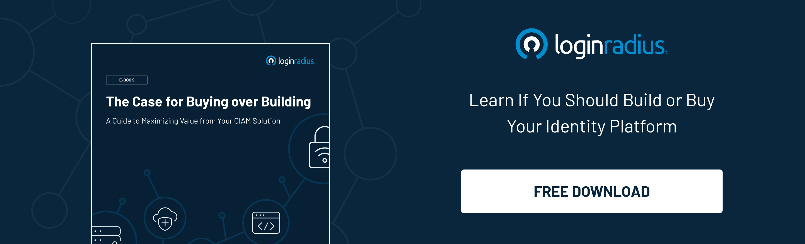
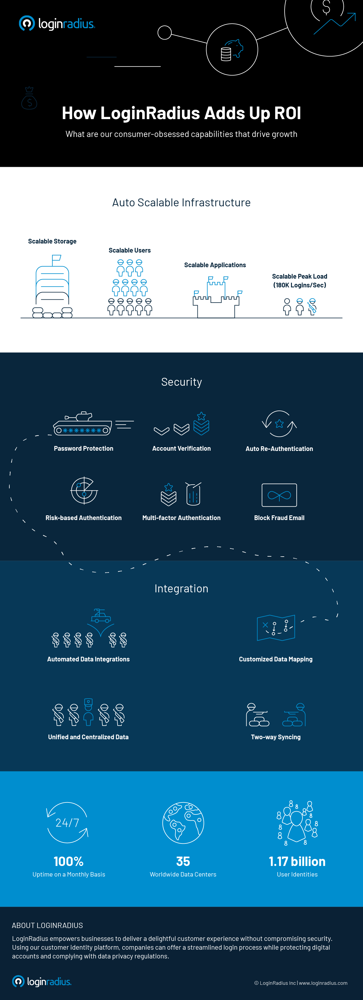

LoginRadius has been at the forefront of businesses' digital transformation with its advanced CIAM (Customer Identity and Access Management) platform, redefining how companies securely manage their users. The cloud solution also offers a host of initiatives that enhance ROI like [high scalability](https://www.loginradius.com/blog/start-with-identity/handling-scalability-security-loginradius/), customization, and customer-obsessed solutions. A few are explained below: 

### #1. Auto-scalable infrastructure

Organizations these days need to enable networks, processes, and software to grow and manage increasing demands effectively. [Scalable infrastructure](https://www.loginradius.com/scalability/) provides companies with the ability to add servers and computers to a network to handle increased workloads efficiently.

It, therefore, does not come as a surprise that scalable storage has gone from a novelty to a necessity with its ability to increase data capacity utilizing a single repository instead of multiple sentinel servers. 

To address the potential of applications growing over time, our platform is designed with scalability in mind and can resourcefully and seamlessly accommodate growth. At a peak load of 180K logins per second, you can rest assured our infrastructure can handle increased users and demand.

### #2. Unparalleled security

LoginRadius offers matchless security with password protection, account verification, auto re-authentication, [risk-based authentication](https://www.loginradius.com/blog/start-with-identity/risk-based-authentication/), multi-factor authentication, and in-built fraud email blocks. All these elements come together to form the most formidable and intelligent security system with protocols that enable access to users after thorough verification and authentication, restrict access to unauthorized elements, protect users from external threats and keep sensitive data secure.

### #3. Seamless integration

Our automated data integration options improve organizational efficiency to automate tasks to run entirely without minimal human intervention. Automation of repetitive and tedious tasks associated with data integration such as ingestion, extraction, transformation, and migration across the enterprise drives up efficiency and saves your business time and money.

LoginRadius provides customized data mapping to facilitate data integration, [data migration](https://www.loginradius.com/blog/start-with-identity/loginradius-identity-import-manager-data-migration/), warehouse automation, automated data extraction, data synchronization, and meet other data management requirements. 

Data mapping is a crucial aspect, and quality data mapping will ensure top-quality data for analysis. Our customized data mapping ability will allow organizations to gather user data for valuable insights.

Unified and centralized data further allows organizations to work from the exact blueprint to avoid discrepancies from different tools and disparate data. Furthermore, the availability of data at a single, central location improves accessibility. It enhances the decision-making process by providing a holistic and complete view of the organization's data. 

LoginRadius also provides two-way sync, allowing users to synchronize data irrespective of whether it has been uploaded from the source or the destination.

To learn more on how LoginRadius empowers businesses and delivers the utmost ROI, check out the infographic below.

## Implementing Customer-Obsessed Capabilities for Your Business

For businesses to grow and increase their profitability, there is a need to implement robust infrastructure to aid in productivity and increase efficiency. LoginRadius helps organizations scale up security, operability, data integration, and effective [data management](https://www.loginradius.com/data-governance/), among others. 

LoginRadius has 35 data centers worldwide and helps companies manage the needs of 1.17 billion user identities with its efficient 24/7 support for its valued customers.

