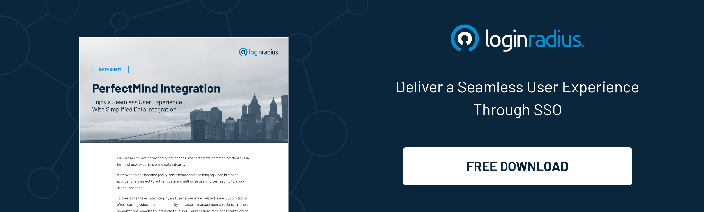

## Introduction

One of the leading municipalities known for biking and trekking in British Columbia is set to take off on its journey to digitize its citizenship services. 

The moment of truth came when the City decided to digitize its citizen services; it could never have predicted how valuable this modernization project would become. The City provides a wide range of services to its citizens, including recreational facilities, community building, etc. They join the dots to meet the needs of their residents to ensure a safe and livable community. Other services include taxes and utilities, garbage and waste diversion, and transportation. 

## Managing the Identities

The City’s IT team started looking for a CIAM solution to help secure the identities and streamline the [authentication process](https://www.loginradius.com/blog/identity/what-is-login-authentication/) for all their citizens across applications. After exploring multiple providers, they decided to try LoginRadius for managing the identities. 

After a detailed discussion which included platform demonstrations and requirement gathering sessions, the client gained confidence and awarded the project to LoginRadius.

Being the preferred choice by many other municipalities and with the experience LoginRadius brings to the table in similar projects, the choice was relatively easy for the City’s management team. 

## Easy Roll-Out

It was a straightforward implementation for the City as there were no legacy applications that needed to be replaced, which meant no data migration. It took less than four weeks for the City’s IT team to implement the solution on their end. With all the resources and pre-built SDKs, it was a smooth implementation for them. 

The City went on to implement the [LoginRadius Identity Experience Framework](https://www.loginradius.com/identity-experience-framework/) (IDX) - an out-of-the-box solution with pre-built user account flows. This solution had all major customer flows, including registration, login, forgotten password, account verification, and profile management. 

LoginRadius Identity Experience Framework pages are JavaScript, HTML, and CSS driven, meaning most of the logic is implemented using JavaScript. Hence, the city developer had to modify the design and script per their UI/UX requirements.

Even though it is hosted on LoginRadius, the solution is also entirely white label, which means that the City could customize the URL of the portal as well as all the UI elements of it. 

## PerfectMind Integration

One of the key integrations the City has is with the PerfectMind application, a membership management software that uses cloud-based technology to help cities connect with their communities. 

The LoginRadius PerfectMind SSO connector is an out-of-the-box solution that provides a seamless single sign-on experience between LoginRadius and the PerfectMind platform by creating contacts on-the-fly during SSO workflow. 

Whenever any citizen logs into the City’s website, they will be automatically logged into the PerfectMind site. The LoginRadius SSO connector will check if a corresponding contact exists on the PerfectMind site or not. If there is no contact in the PerfectMind application, LoginRadius will create the corresponding contact in the PerfectmInd application and let the customer log in to the PerfectMind application. 

With this integration, citizens are able to access recreational services to search and register for programs with a single account giving them the best experience while surfing the City’s website.

## Support

Right from the [customer onboarding](https://www.loginradius.com/blog/identity/loginradius-streamlines-user-onboarding-harry-rosen/), the City had access to a customer success manager and multiple support channels to ensure the success of the project every step of the way. The LoginRadius team continues to work closely with the city to ensure project success.

