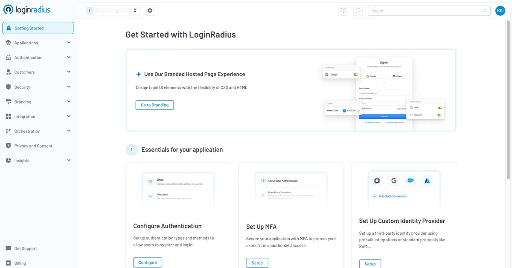

When I founded LoginRadius, I had a clear vision: to simplify digital identity while maintaining enterprise-grade security and scalability. Today, I'm incredibly proud to announce a milestone that represents the culmination of that vision - the complete redesign of the LoginRadius CIAM platform console - a transformation that puts unprecedented power and simplicity into the hands of developers, architects, and engineering teams.

After countless conversations with customers and technical teams, one message became clear: the industry needed a solution that eliminated complexity without sacrificing capability. For too long, developers have been forced to write extensive custom code or sacrifice the specific authentication workflows their applications require. You told us you needed both power and simplicity, and we listened.

The all-new LoginRadius console delivers a truly no-code/low-code experience that transforms what was once a complex development project into a straightforward configuration process. Through our intuitive dashboard, you can now implement sophisticated authentication flows, configure security policies, and customize the entire user experience—all without writing a single line of code. This isn't just an update; it's a revolution in how organizations approach customer identity management.

## Introducing the New LoginRadius Admin Console

The new Console is a fundamental shift in how businesses manage authentication. We’ve taken a traditionally cumbersome, development-heavy process and transformed it into an intuitive, self-serve model that gives developers complete control. There are no more unnecessary dependencies or roadblocks—just direct access to powerful CIAM capabilities.

Our philosophy has always been that enterprise-grade identity should be as seamless as it is secure. With this release, we are redefining what’s possible in CIAM:

* **Faster Implementation** – Configure authentication workflows, security policies, and user management in minutes, not months.
* **No-Code/Low-Code Simplicity** – Set up registration flows, social login, passwordless authentication, and MFA with a few clicks.
* **Uncompromising Flexibility** – For teams that need deeper control, our APIs and SDKs allow seamless integration and customization with minimal effort.

This is more than just a new interface. It’s a shift in how identity management should work—intuitive, developer-centric, and built for speed. Now, developers don’t have to choose between ease of use and enterprise power—they get both.

## What’s More? 

In the sections that follow, we’ll dive into how the LoginRadius Console makes it possible to “**code less and manage more**.” 

### Flows Like Code: A UI Built for Speed

The first thing you’ll notice about our revamped Admin Console is its fresh, modern design with updated fonts and colors that aren’t just easy on the eyes—they’re built for better accessibility and inclusivity. 

We’ve also reimagined navigation to make it more intuitive. The menu has moved to the left, creating a more scalable layout that can grow with future updates. Plus, there is a search bar at the top of every page, so you can quickly find what you need—without digging through menus.

What once required extensive custom code now happens with a few clicks in our intuitive GUI.

### Navigate Like a Pro. No Guesswork. No Hassle.

We’ve also redesigned our navigation. The Admin Console now features contextual grouping, bringing related settings together in a more logical, structured way. No more jumping between sections or searching for the right option.

This streamlined layout removes the guesswork, making workflows more efficient and reducing the time spent managing identity and access settings.

### One Click. Total Control. Zero Disruptions.

The Console dashboard brings self-serve CIAM to life, putting power directly in your hands. You can quickly set up authentication or explore its features—everything you need is now easily accessible from a single, streamlined interface.

## The Future of CIAM is Here—Hands-On, Instant, and Fully Autonomous

The best part? It’s here and now! The redesigned LoginRadius Admin Console is already live, with no extra setup or reconfiguration needed. All your settings have been seamlessly carried over, so you can start exploring right away. And if you need a little time to adjust, admins can temporarily switch back to the old design until the end of March, giving you the flexibility to explore at your own pace.

Now it’s your turn to experience it firsthand. Log in today and explore the new Admin Console, or if you’re new to LoginRadius, [sign up for free](https://accounts.loginradius.com/auth.aspx?return_url=https://console.loginradius.com/login&action=register) and watch the magic happen. 

We’d love to hear your thoughts. Your feedback drives our innovation—let’s shape the future of identity together!

