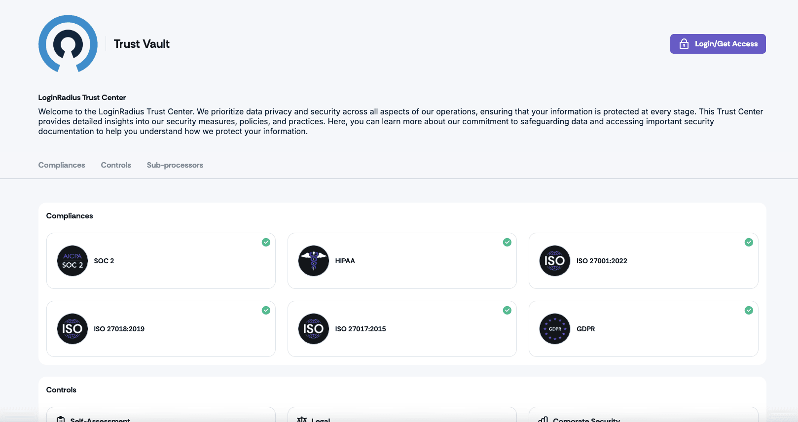

Over the past decade, expectations around trust and transparency in SaaS have undergone a massive shift. What was once a checkbox exercise, like having a SOC 2 or ISO 27001 certification, has now become mandatory.

Today, every company, no matter its size or industry, is expected to prove its security and privacy posture in real-time. But let’s face it: the process of getting through documentation is still painfully slow. Security teams wait for documentation. Legal teams get stuck in back-and-forths. Information is scattered across silos or buried behind forms.

**At LoginRadius, we believe trust shouldn’t take days to establish. It should be instant.**

That’s why I’m proud to introduce the LoginRadius Trust Center—a centralized, always-available repository for our customers, prospects, and partners to access up-to-date certifications, legal policies, and security documentation. It reflects our core value of **“transparency: be open and accountable”**. 

No waiting. No emails. Just everything you need, right when you need it. Because when trust is on the line, you shouldn’t be left searching.

Visit our [Trust Center](https://trust.loginradius.com) to explore how we’re raising the bar for transparency, security, and accountability every single day.

## What You’ll Find Inside the Trust Center

The LoginRadius Trust Center is your single source of truth for everything related to our security, compliance, and privacy posture—updated in real-time and accessible 24/7.

Here’s what’s inside:

* **Compliance certifications:** Download the latest versions of our SOC 2, ISO 27001, ISO 27017, ISO 27018, HIPPA, GDPR, and CCPA certifications.

* **Internal security and privacy policies:** Get full visibility into our InfoSec policies, SLAs, HR security measures, access controls, infrastructure security, and more—written for audits and security teams.

* **Legal agreements:** Access key documents like our DPA (Data Processing Addendum), SLA, and other contractual agreements, ready for procurement and legal reviews.

* **Integrations & subprocessors:** Review our list of subprocessors and technology partners, including AWS, Cloudflare, MongoDB, Atlassian, Datadog, and more.

* **Latest penetration test reports:** Stay informed with downloadable summaries of third-party penetration tests and security assessments.

* **Real-time security updates:** Track operational and security updates as they happen—no more chasing for incident timelines or impact assessments.

* **Industry compliance news:** Follow key regulatory developments that impact identity and data security, all in one place.

Security isn’t just a feature at LoginRadius—it’s foundational to how we build, operate, and support our customers. We follow leading compliance frameworks, implement strict internal controls, and undergo frequent third-party audits. That’s why we’ve maintained a breach-free record in an industry where threats are constant.

But security isn’t just about history—it’s about continuous transparency. The LoginRadius Trust Center ensures your teams have instant, self-serve access to the latest policies, certifications, and security updates—no waiting, no emails, just real-time trust.

## Built for the Teams Who Need It Most

<iframe src="https://player.vimeo.com/video/1069863549?badge=0&amp;autopause=0&amp;player_id=0&amp;app_id=58479" frameborder="0" allow="autoplay; fullscreen; picture-in-picture; clipboard-write; encrypted-media" style="position:absolute;top:0;left:0;width:100%;height:100%;" title="LoginRadius Trust Center"></iframe>

Our Trust Center is built not just for security experts but for every cross-functional team that touches trust.

Whether you're evaluating us as a vendor or already building with our platform, access to up-to-date, audit-ready information can streamline your workflow, reduce friction, and build confidence across the board.

Here’s how different teams benefit:

* **Security & IT Teams:** Eliminate manual vendor review cycles. Instantly access the latest compliance certifications, pen test reports, security policies, and subprocessor details without waiting on email threads. 

* **Legal & Compliance Teams:** Verify our approach to data handling, privacy practices, and regulatory alignment (GDPR, HIPAA, CCPA, and more). Cut down on back-and-forths with readily available legal docs and internal policies. 

* **Sales & Procurement:** Security delays kill momentum. With the Trust Center, buyers and procurement teams can self-serve everything they need to complete due diligence, accelerating evaluations and removing friction from the sales cycle. 

* **Developers & Architects:** Need to know how we secure APIs, data flows, or encryption protocols? The Trust Center offers technical transparency into our platform’s architecture, infrastructure, and resilience so your team can build with confidence.

## The People, Processes, and Systems Powering the Trust Center

Behind every always-on platform is a system that makes it run. To make our Trust Center reliable, and genuinely useful, we invested in cross-team enablement and operational excellence from day one.

### Enablement That Scales

We built an internal, centralized knowledge base as the single source of truth for our security certifications, policies, and trust practices. This ensures every customer-facing team—from support to sales can confidently respond to security questionnaires, due diligence requests, and compliance inquiries with speed and accuracy.

### Operational Excellence by Design

Our internal workflows are designed for alignment. Through structured review cadences, team playbooks, and tight handoffs between security and field teams, we ensure the latest updates are reflected in the Trust Center and relayed consistently across the organization.

These foundational practices make the Trust Center more than just a webpage—they make it operationally real. It’s how we ensure our transparency is promised, and delivered.

## Transparency Is Just the Beginning

Trust isn’t a one-time achievement—it’s a continuous responsibility. The launch of our Trust Center marks a meaningful step in that ongoing journey: to make security, compliance, and transparency not only accessible, but expected.

This isn’t a one-time release. The Trust Center will continue to evolve—adding new certifications, refining internal processes, and updating content in real-time, so you always have an accurate, up-to-date view of how we protect your customers’ identities and data.

We’re proud of what this milestone represents. But more than that, we’re excited about what it enables for you, your teams, and the future of trust in identity.

Visit the [LoginRadius Trust Center](https://trust.loginradius.com). 

And if you have feedback or ideas—we’re all ears!

