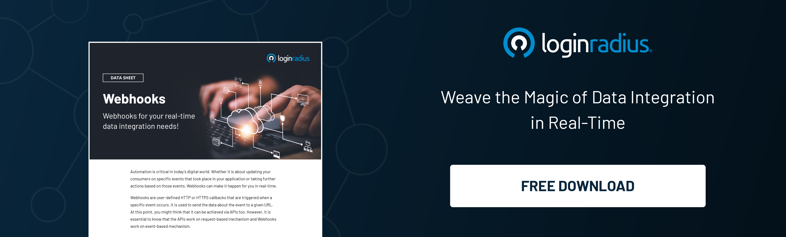

LoginRadius, a leading CIAM platform, offers endless possibilities to diverse businesses and ensures business success through advanced access control and seamless login capabilities. 

Moreover, when it comes to deriving valuable insights from consumer data, LoginRadius helps enterprises integrate third-party analytics and data-driven applications that help create winning marketing and [business-centric strategies](https://www.loginradius.com/blog/fuel/top-5-marketing-strategies-to-power-up-your-business/). 

Businesses can leverage the true potential of Webhook that allows them to build or set up integrations that subscribe to certain events on LoginRadius CIAM. 

Let’s understand how LoginRadius improves business performance through third-party integrations and helps sync your crucial business data in real-time through Webhook. 

## How LoginRadius Webhook Works

Webhooks allow you to build or set up integrations that subscribe to certain events on LoginRadius. When one of these events is triggered, LoginRadius automatically sends a POST payload over HTTPS to the Webhook's configured URL in real-time. You can use Webhooks to update an external tracker or update a backup mirror.

LoginRadius can integrate with hundreds of third-party tools. We can easily connect customer data to your existing API-driven tools, delivering an incredible experience for your customers and saving you money.

Enterprises can quickly set up third-party integrations like Webhook to ensure they receive consumer-behavior-related notifications in real-time. 

Once you [configure the webhook](https://www.loginradius.com/developers/) with an event, LoginRadius triggers that webhook every time for that event. For example, a webhook subscribed URL configured for a Login event will receive a POST request on your server with a payload. 

## Webhook Security 

LoginRadius follows the best practices to [ensure your endpoint security](https://www.loginradius.com/blog/identity/data-security-best-practices/) and provides several ways to verify that triggered events are securely coming from LoginRadius. 

Enterprises shouldn’t worry about the overall security of consumer data since the best security practices are already in place in the LoginRadius CIAM solution. When it comes to security, LoginRadius commits to: 

* Achieving the expectations of its customers and relevant regulatory authorities.
* Understanding customers’ needs to deliver high-standard services.
* Ensuring all of its employees follow the company’s best practices, processes, and procedures.
* Protecting customer data and LoginRadius’ information, intellectual property, people, and activities against loss, damage, disruption, or unauthorized disclosure.
* Implementing and [maintaining security policies](https://www.loginradius.com/security-policy) and procedures to meet the ISO 27001, ISO 27017, ISO 27018, NIST CSF requirements, and any other compliance that LoginRadius follows.
* Implementing an Information Security Management System and ensuring that it is continually improved and supported with the necessary resources required to achieve the commitments written in this policy statement.

## Benefits of Webhook LoginRadius Integration

Webhook LoginRadius integration allows enterprises to leverage the true potential of instant and real-time notifications. 

In a nutshell, the pre-requested consumer information is passed to the linked applications when an event happens. This removes the need for a manual poll for new data at predefined intervals. 

This helps enhance the overall efficiency of business processes running on data as their primary fuel. 

## Where to Use Webhook LoginRadius Integration? 

Depending on the various event and data needs, businesses can use webhooks to:

* Know that an event has occurred
* Ensure data is synced across multiple web apps
* Connect two or more apps where an event in one app triggers an event in another app and vice versa 
* Customize apps and their functionality based on the needs
* Create tailored marketing campaigns

## Conclusion 

The modern digital era demands businesses to efficiently manage and leverage data to stay ahead of the curve. 

With LoginRadius integration, enterprises can seamlessly integrate multiple applications, including Webhook that can help collect and sync crucial data in real-time. 

LoginRadius can easily connect customer data to your existing API-driven tools, delivering an incredible experience for your customers and saving you money.

If you wish to see the future of CIAM in action, [reach us](https://www.loginradius.com/contact-sales) for a personalized session. 

