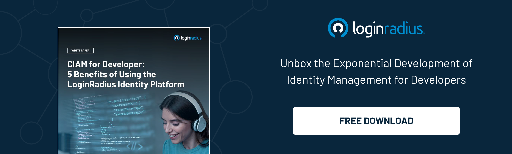

## Introduction 

Balancing robust security measures with seamless user experiences has become paramount for businesses in the ever-evolving digital landscape.

While enterprises are making every effort to strike the right balance between user experience and security by leveraging a robust identity management solution, the real challenge occurs during the development and deployment phase. 

No matter how capable a CIAM is, if it isn’t deployed properly or is delayed, the business may not be able to fully reap its advantages. 

Enter [No/Low Code(CIAM),](https://www.loginradius.com/) a revolutionary solution that empowers developers to enhance security while boosting user engagement. 

Let’s explore the significance of No/Low Code CIAM, why developers are drawn to it, its use cases, and its specific benefits, focusing on LoginRadius as an example.

## What is No Code/Low Code CIAM?

Customer Identity and Access Management (CIAM) solutions are at the forefront of securing user data and enabling seamless interactions with digital platforms. No/Low Code CIAM takes this further by offering developers a platform to build and deploy [robust CIAM solutions](https://www.loginradius.com/) with minimal manual coding.

These platforms provide pre-built components, drag-and-drop interfaces, and automated processes, reducing the need for extensive coding knowledge.

No/Low Code CIAM solutions typically offer:

* **Pre-built Templates:** Ready-made templates for common CIAM features like registration, login, password recovery, and more.

* **Drag-and-Drop Interface:** Intuitive interfaces that allow developers to design user flows visually without writing extensive code.

* **Automated Processes:** Automating repetitive tasks, such as user data validation and authentication, streamlines the development process.

## Why Developers Crave for No Code/Low Code CIAM?

Developers are increasingly turning to No/Low Code CIAM for several compelling reasons:

* **Efficiency:** With pre-built components and intuitive interfaces, developers can deploy CIAM solutions in a fraction of the time it would take with traditional coding methods.

* **Flexibility:** These platforms offer flexibility, allowing developers to customize and extend functionalities according to specific business needs.

* **Focus on Innovation:** By reducing the time spent on mundane coding tasks, developers can channel their efforts into innovation, creating more value for businesses.

## Low Code/No Code CIAM Use Cases

No/Low Code CIAM solutions find applications across various industries and scenarios:

* **E-commerce Platforms:** Implement seamless and secure [customer registration](https://www.loginradius.com/blog/growth/customer-identity-drives-digital-ecommerce-success/), login, and checkout processes.

* **Healthcare Systems:** Secure access to patient portals, ensuring confidentiality and compliance with data protection regulations.

* **Financial Services:** Authenticate users for online banking, manage digital identities, and prevent fraud.

* **Media and Entertainment:** Enhance user engagement with personalized experiences, such as content recommendations and targeted promotions.

* **Education:** Facilitate secure access to online learning platforms, manage student identities, and track progress.

## How LoginRadius No Code/Low Code CIAM Benefits Businesses?

LoginRadius is a prime example of a No/Low Code CIAM platform that offers a range of benefits for businesses:

* **Enhanced Security:** Implement [multi-factor authentication](https://www.loginradius.com/multi-factor-authentication/), fraud detection, and consent management to safeguard user data.

* **Improved User Experience:** Create seamless registration and login processes, reducing friction and boosting user engagement.

* **Scalability:** Easily scale CIAM solutions as businesses grow without extensive redevelopment.

* **Compliance:** Stay compliant with data protection regulations such as GDPR and CCPA through built-in features and tools.

* **Time and Cost Savings:** Reduce development time and costs significantly by leveraging pre-built components and automation.

## The Future of No/Low Code CIAM

Looking ahead, the future of No/Low Code CIAM is promising. As technology advances and user expectations evolve, businesses will rely more on these solutions to stay competitive. Here are some trends to watch:

* **AI-Powered Personalization:** No/Low Code CIAM platforms will integrate more AI capabilities to deliver personalized experiences based on user behavior and preferences.

* **Blockchain Integration:** Using blockchain for secure [identity verification](https://www.loginradius.com/blog/identity/digital-identity-verification/) and management will become more prevalent in CIAM solutions.

* **Zero Trust Architecture:** No/Low Code CIAM will embrace the principles of Zero Trust, where continuous verification is required for access, enhancing security.

* **IoT Integration:** As the Internet of Things (IoT) grows, CIAM solutions will extend to manage and secure access for connected devices.

## Final Thoughts 

In conclusion, a no- or low-code [CIAM solution like LoginRadius](https://www.loginradius.com/book-a-demo/) is revolutionizing how businesses approach identity and access management. By combining robust security measures with streamlined development processes, these platforms empower developers to create secure, user-friendly experiences without requiring extensive manual coding.
 
