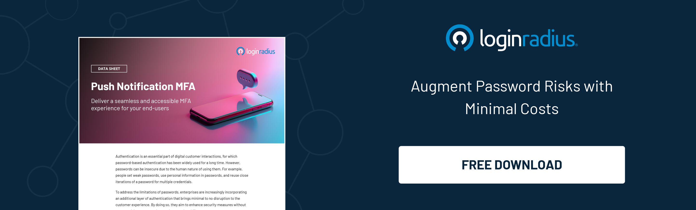

## Introduction 

In the ever-evolving digital landscape, ensuring secure and seamless customer authentication is paramount. Traditional password-based authentication has long been the standard but comes with significant security risks. Weak passwords, reused passwords, and personal information in passwords are common vulnerabilities that compromise the safety of digital interactions.

To combat these challenges, enterprises are now leveraging additional layers of authentication that enhance security without disrupting the customer experience. LoginRadius is proud to introduce a new feature to address these concerns: Push Notification MFA.

## Intent Behind the Launch

At LoginRadius, we understand the critical need for secure and seamless [customer authentication](https://www.loginradius.com/authentication/) in today's digital landscape. 

Our new Push Notification Multi-Factor Authentication (MFA) feature is designed to address the vulnerabilities of traditional password-based systems by providing an additional layer of security that is intuitive and user-friendly. This innovation reflects our commitment to enhancing security while ensuring a smooth and convenient customer experience.

## Key Functions of Push Notification MFA

1. **Enrollment Flexibility**: Customers can easily enroll in Push Notification MFA through your native mobile apps or the LoginRadius Authenticator. This process is straightforward and user-friendly, encouraging widespread adoption.

2. **Automated Triggers**: Once customers authenticate with their credentials, a push notification is automatically triggered for additional verification. This ensures an added layer of security without requiring extra steps from the user.

3. **Timeout Management**: If a customer does not respond within a defined timeframe, the push notification will time out, ensuring a secure authentication process. This helps protect accounts from unauthorized access attempts.

4. **Customizable Notifications**: Tailor your push notifications' branding and challenge message content as well as language to align with your brand identity. This customization ensures that notifications are consistent with your company's look and feel.

5. **Detailed Activity Logs**: Gain insights into customer activity and authentication attempts with comprehensive logging capabilities. This feature allows for better monitoring and analysis of security events.

## Seamless Integration and Deployment

Push Notification MFA is designed to introduce minimal friction in the customer experience while significantly enhancing security. By integrating this feature through LoginRadius CIAM's SDKs and APIs into your native mobile apps or directly with the LoginRadius Authenticator, you can ensure a robust and user-friendly customer authentication process.

## In Conclusion

Embrace the future of secure digital interactions with Push Notification MFA from LoginRadius and provide your customers with the seamless, secure experience they deserve. You can now enhance your security measures, reduce password-related risks, and maintain an exceptional user experience.

