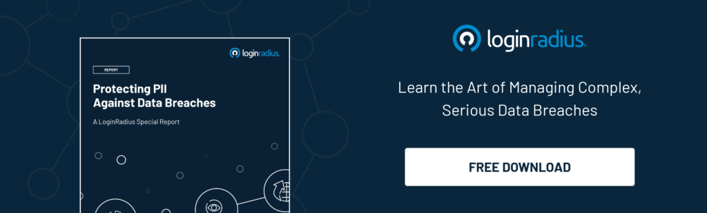

In mid-January 2020, Marriott International suffered a new data breach which affected around 5.2 million guests.

Marriott claims the security breach could have revealed 5.2 million guests 'personal details. This is the second data breach by Marriott in recent years following a [breach in 2018](https://www.washingtonpost.com/business/2018/11/30/marriott-discloses-massive-data-breach-impacting-million-guests/).

## Marriott Data Breach 2020: When and How Did It Happen?

[The breach was identified](https://news.marriott.com/news/2020/03/31/marriott-international-notifies-guests-of-property-system-incident/) at the end of February 2020 and dates back to mid-January 2020.

Marriott says it discovered in late February that the network of an unspecified hotel chain had been hacked, and hackers who obtained the login credentials of two Marriott employees may have accessed the guest details. The firm has reason to believe the operation began as early as mid-January.

The breach may have taken personal details such as names, birthdates, and telephone numbers, along with language preferences and loyalty account numbers. 

[Marriott stated](https://mysupport.marriott.com/), _"While our investigation is continuing, we currently have no reason to assume that the details involved included passwords or PINs for Marriott Bonvoy account, payment card details, passport information, national IDs or driver's license numbers."_

Adding to it, Marriott said it contacted guests whose details may have been taken via email and launched a website dedicated to those who were affected. The company offered the program for tracking the personal information of visitors whose details could have been compromised.

The hotel giant announced another [data breach in late 2018](https://news.marriott.com/2018/11/marriott-announces-starwood-guest-reservation-database-security-incident/), which affected up to 500 million guests while staying at its subsidiary, Starwood, [purchased by the company in 2016](https://www.cnbc.com/2016/09/23/marriott-buys-starwood-becoming-worlds-largest-hotel-chain.html).

It could be considered an honest mistake to suffer one data breach but to suffer two in less than two years looks like carelessness. There are some promising signs that the company has learned some valuable information security lessons in spite of how it may look to an outsider. From this experience, the [entire hospitality industry](https://www.loginradius.com/blog/2020/03/improve-customer-experience-hospitality-industry/) should now know better.

## What does the Hotel Industry do to avoid data breaches like Marriott’s?

**1\. Develop a Security-Centric Culture at the Top Level.**  
When the security of customer identities and profiles is priority number one. A security-centric mindset ensures a serious approach to [customer data security](https://www.loginradius.com/security/). The approach should be top-down instead of bottom-up, with responsibility resting with the CEO and board.

**2\. Stay ahead of the security curve.**  
It’s okay to be cautious in adopting innovations, but when it comes to customer data security products, companies should be proactive, constantly reviewing and trying new developments to [stay ahead of hackers](https://www.loginradius.com/blog/2019/10/cybersecurity-attacks-business/).

**3\. Make your security spend for customer data security unbudgeted.**  
Invest whatever it takes to protect sensitive customer data. Yes, stay within your financial metrics, but don’t cap the budget, because capping it means you’re compromising. Give the security team whatever they request to [protect the brand](https://www.loginradius.com/blog/2019/10/cybersecurity-best-practices-for-enterprises/). It’s not going to cost billions.

**4\. Recognize that customer data security is not a cost center but a revenue center.**  
Companies need to understand that customer data security is part of the revenue center, not the cost center. With better security, you are not only preventing breaches, but you are also [building trust within your customer](https://www.loginradius.com/blog/2019/10/digital-identity-management/) base to generate more revenue.

Let’s hope that Marriott and its peers in the travel industry have learned that, while the security of customer accounts may not be their core business, it still needs to be priority number one.

