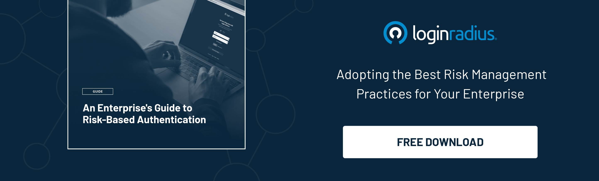

---
title: "Why MFA Fatigue Attacks May Soon Be Your Worst Nightmare?"
date: "2022-10-31"
coverImage: "mfa-fatigue.jpg"
tags: ["mfa fatigue", "risk-based authentication", "authentication process"]
author: "Deepak Gupta"
description: "MFA fatigue attacks bypass MFA by bombarding a user with multiple login attempts. The account owner accepts the MFA prompt out of desperation or annoyance, leading to an account takeover. Let’s learn how organizations can gear themselves to shield against these attacks."
metatitle: "MFA Fatigue Attacks: Is it the Next Cybersecurity Menace?"
metadescription: "MFA fatigue attacks are increasingly becoming more common and businesses must put their best efforts to minimize the risks. Here’s everything you need to know."
---

## Introduction 

Multi-factor authentication (MFA) has become integral to our modern digital lifestyle. We use it multiple times a day to securely authenticate ourselves on various platforms. 

MFA not only ensures robust authentication security through multiple layers of authentication but eventually offers compliance with various data security and privacy regulations. 

However, [incorporating MFA](https://www.loginradius.com/multi-factor-authentication/) was considered the perfect solution to mitigate the risks associated with account takeovers and identity thefts until MFA fatigue attacks targeted businesses. 

MFA fatigue attacks bypass MFA by bombarding a user with multiple login attempts. The account owner accepts the MFA prompt out of desperation or annoyance, leading to an account takeover. 

These kinds of attacks are used globally by hackers that have already gained access to the credentials of an account and then bombard users with MFA requests until they accept the same by mistake. 

Let’s learn more about MFA fatigue attacks and MFA prompt bombing and how organizations can gear themselves to shield against these attacks. 

## What is MFA Fatigue Attack? Why Should Businesses Worry About it? 

MFA fatigue attack is an attack method used by hackers to target a user once they have compromised their credentials. It targets the human mind by bombarding the user with requests for MFA authentication, in this case through phone calls or text messages. Since we react to these requests by getting annoyed, it’s easier to provide access mistakenly.

This way, cybercriminals can obtain the credentials of many targets very quickly, as they are bombarded with MFA requests repeatedly until they provide access to their accounts.

Businesses already leveraging MFA as the standard authentication security mechanism should consider their overall security posture since an MFA fatigue attack could lead to financial and reputational damages. 

On the other hand, organizations collecting heaps of customer information must stay alert. A little loophole in managing customer data could lead to hefty fines due to non-compliance with data and privacy regulations. 

So, what could be the ideal solution to offer secure authentication and mitigate the risks associated with MFA fatigue attacks? Let’s figure it out. 

## Implementing Risk-Based Authentication (RBA) for Robust Authentication Security

Nothing beats RBA when it comes to shielding an organization from MFA fatigue attacks. 

Risk-based authentication is a non-static authentication system that considers the profile (IP address, Browser, Physical Location, and so on) of a consumer requesting access to the system to determine the risk profile associated with that action. 

The risk-based implementation allows your application to challenge the consumer for additional credentials only when the risk level is appropriate.

It is a method of applying various levels of stringency to [authentication processes](https://www.loginradius.com/authentication/) based on the likelihood that access to a given system could result in a compromised account. As the level of risk increases, the authentication process becomes more complicated and restrictive.

Risk-based authentication is an essential security feature because it works in real-time to prevent cyber frauds like accounts getting compromised without causing an inconvenience for legitimate consumers.

Risk-based authentication helps businesses in achieving the following goals:

* It reduces online fraud and the risk of improper access by compromised MFA 
* It enforces different authentication levels depending on consumer activity, geolocation, and similar calculated risk scores.
* It helps in improving the consumer experience. Consumers need to provide additional details for authentication only when the associated risk appears.
* It help access control in federated setups.
* It is widely used and easy to deploy.

## LoginRadius’ Risk-Based Authentication to Prevent MFA Fatigue Attacks

LoginRadius’ Risk-based authentication applies the precise security level for each unique [consumer interaction](https://www.loginradius.com/blog/growth/unified-identity-ensures-great-customer-interactions/) and avoids unnecessary security steps for low-risk transactions, which can add friction for the consumer.

It allows a quick, simple, and time-saving way to implement this on your website. You can create a consumer risk profile based on IP, city, browser, and country, thus minimizing the chances of an MFA fatigue attack. 

Only when the consumer behavior deviates from normal activity (such as a different device or browser) are additional authentication challenges added, resulting in increased security hurdles for riskier transactions such as bank transactions. The consumer will be prompted to authenticate themselves in one form or another and if successful, they will go on to the correct portal or be blocked. 

## In Conclusion

MFA fatigue attacks are on the rise, and businesses can’t afford to take the risk about crucial customer details and sensitive business information. 

Adding a more robust authentication mechanism in the form of risk-based authentication can help minimize the chances of MFA fatigue attack and help secure crucial information. 

