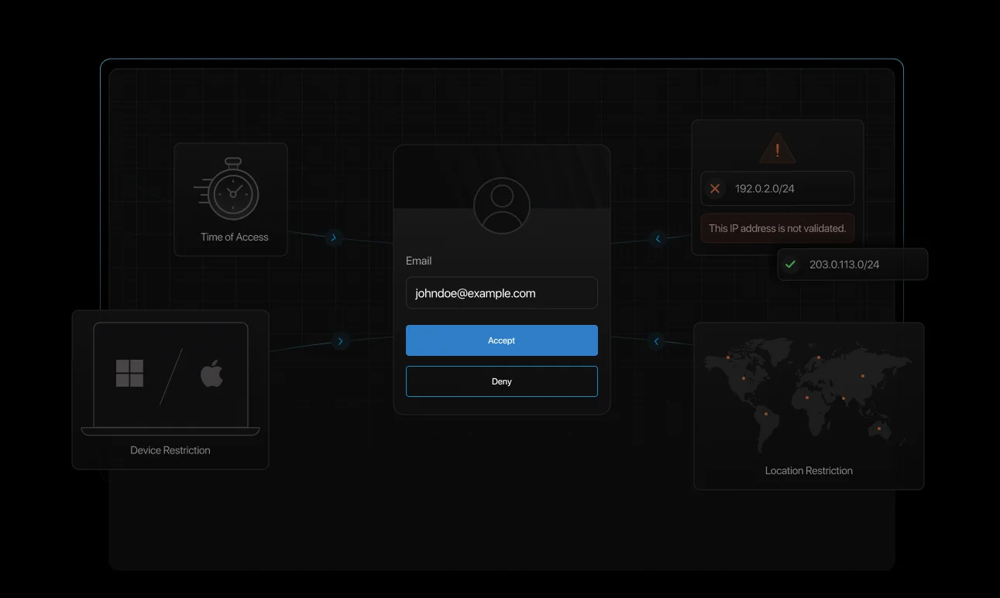
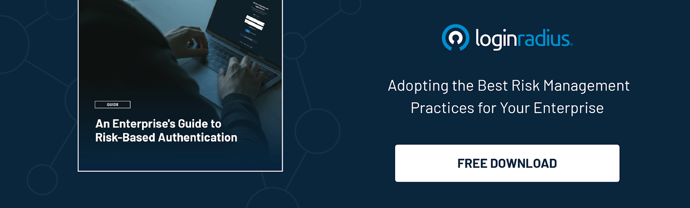

---
title: "Risk-Based Authentication vs. MFA: Key Differences Explained"
date: "2025-02-27"
coverImage: "banner.webp"
tags: ["API","Identity Management","User Authentication","CIAM Security"]
author: "Kundan Singh"
description: "With cyber threats on the rise, organizations need stronger authentication methods. Multi-Factor Authentication (MFA) adds extra security layers, while Risk-Based Authentication (RBA) adapts based on user behavior and risk levels. In this blog, we’ll explore MFA vs RBA, their benefits, and how they enhance security for businesses."
metatitle: "Risk-Based Authentication vs. MFA: Key Differences Explained"
metadescription: "Learn how Risk-Based Authentication adapts security dynamically while MFA enforces fixed layers. Discover their differences, benefits, and best use cases."
---

# Multi-Factor Authentication vs. Risk-Based Authentication?

With rising cyber threats, organizations need strong authentication to safeguard sensitive data and user accounts. Multi-Factor Authentication (MFA) adds extra verification layers, while Risk-Based Authentication (RBA) adapts security based on user behavior.

Both play a crucial role in preventing unauthorized access and reducing security risks. In this blog, we’ll explore what they are, how they work, and why they matter for your security.

## What is Multi-Factor Authentication?

[Multi-factor authentication (MFA)](https://www.loginradius.com/blog/identity/what-is-multi-factor-authentication/) is a security measure that requires users to provide multiple forms of verification before gaining access to a system. Instead of relying solely on passwords, MFA security uses a combination of authentication factors to strengthen security and prevent unauthorized access.

## Types of Authentication Factors

MFA typically involves three categories of authentication factors:

1.  **Something You Know** – Passwords, PINs, or security questions.    
2.  **Something You Have** – Smart cards, authentication tokens, or mobile authentication apps.    
3.  **Something You Are** – Biometric verification like fingerprints, facial recognition, or iris scans.
    

By combining these factors, multi-layer authentication ensures that even if one factor is compromised, the account remains secure.

## Benefits of Multi-Factor Authentication

### 1. Enhanced Security

Multi-factor authentication in cyber security significantly reduces the risk of account breaches by adding multiple layers of protection beyond just passwords.

### 2. Protection Against Credential Theft

Since MFA security requires more than one authentication factor, stolen passwords alone cannot grant attackers access to accounts.

### 3. Regulatory Compliance

Many industries require MFA for compliance with security regulations such as GDPR, HIPAA, and PCI-DSS, ensuring adherence to data protection standards.

### 4. Reduced Risk of Phishing Attacks

Phishing attacks often rely on stealing login credentials, but with MFA security in place, attackers would need access to an additional factor, making unauthorized access significantly more difficult.

Protect every login! Uncover [the benefits of MFA](https://www.loginradius.com/blog/identity/benefits-of-mfa/).

### 5. Improved User Trust and Confidence

When organizations implement strong authentication mechanisms, users feel more secure knowing their data is well-protected. This fosters trust in digital services and platforms.

By requiring multiple authentication factors, MFA enhances identity risk management, reducing vulnerabilities related to credential-based attacks.

## What is Risk-Based Authentication?

Risk-based authentication (RBA), also known as [adaptive authentication](https://www.loginradius.com/products/adaptive-mfa), is a dynamic security approach that evaluates user behavior and contextual factors before granting access. Instead of applying uniform authentication policies, risk-based security adjusts authentication requirements based on perceived risk levels.

## How Risk-Based Authentication Works?

1.  **Behavioral Analysis** – Identifies normal user behavior patterns to detect anomalies.    
2.  **Device Recognition** – Ensures access only from known and trusted devices.    
3.  **IP Address & Geolocation Monitoring** – Flags login attempts from unusual locations.    
4.  **Time-Based Access Control** – Monitors login times to detect suspicious activities.    
5.  **Real-Time Risk Evaluation** – Uses AI-driven analytics to assess risk dynamically.
    

## Benefits of Risk-Based Multi-Factor Authentication

### Better User Experience with Heightened Security

Risk-based MFA makes it easier for users. Low-risk users can log in smoothly. High-risk access attempts need extra authentication steps. This balance between security and convenience enhances overall efficiency.

### More Robust Defense Against Fraud

By analyzing login behaviors, device information, and geographical location, risk authentication detects suspicious activities and prevents fraudulent access attempts. It effectively minimizes risks related to identity theft and account takeovers.

### Regulatory Compliance

Organizations leveraging risk-based authentication ensure compliance with stringent security regulations like the GDPR and CCPA by implementing advanced identity risk management. This helps in meeting legal and industry-specific security requirements.

Failing to comply with GDPR can lead to security breaches, damage your brand's reputation, and result in hefty fines! [Learn more.](https://www.loginradius.com/resource/ebook/loginradius-gdpr-compliance/)

### Cost-Effective Security Implementation

Unlike static security measures, risk-based authentication optimizes authentication requirements based on risk assessment, reducing unnecessary authentication steps and streamlining security processes without increasing operational costs.

### Increased Adaptability to Emerging Threats

With cyber threats constantly evolving, risk-based MFA ensures security policies remain dynamic. Organizations can adjust authentication requirements based on new threat patterns and user behaviors.

Want a detailed guide on risk-based authentication? Download this insightful guide:

## Risk-based vs Traditional MFA

  

| **Factor** | **Risk-Based Authentication (RBA)** | **Traditional Multi-Factor Authentication (MFA)** |
|-- |-- |--|
| **Authentication Approach** | Adapts security measures based on user behavior and risk levels | Requires a fixed set of authentication steps for every login |
| **User Experience** | Seamless, prompts MFA only when risk is detected | Requires MFA for every login, which can be cumbersome |
| **Security Level** | Dynamic security based on real-time risk analysis | Static security, same for all users regardless of risk |
| **Risk Assessment** | Considers factors like location, device, IP, and login patterns | No contextual awareness, applies the same process to all users |
| **Efficiency** | Reduces friction for low-risk users while securing high-risk attempts | Increases login friction for all users equally |
| **Best Use Cases** | Enterprises needing adaptive security with minimal disruption | Organizations requiring uniform authentication enforcement |
| **Implementation Complexity** | Requires AI/ML-driven risk assessment and continuous monitoring | Easier to implement with standard authentication methods |
| **Compliance & Security** | Helps meet compliance with intelligent access controls | Meets compliance but can add unnecessary friction |

  

## Risk-Based MFA Examples

Risk-based MFA is widely used across various industries to enhance security while maintaining user convenience. For example, banking institutions employ risk-based authentication by analyzing user behavior, transaction location and history.

E-commerce platforms use risk-based MFA to keep customer accounts safe. They watch buying patterns to identify fraudulent purchases.

Similarly, corporate IT systems also leverage risk-based security to enforce strict authentication policies for high-risk access requests while allowing seamless logins for trusted employees.

## Conclusion

Implementing advanced security measures like multi-factor authentication and risk-based authentication is crucial in today’s modern digital landscape.

Multi-factor authentication enhances security by requiring multiple verification methods, while risk-based MFA dynamically assesses risk to provide a seamless yet secure user experience. Organizations that leverage these technologies benefit from stronger identity protection, compliance adherence, and improved cybersecurity resilience.

If you wish to reinforce your security by leveraging cutting edge MFA and risk-based auth, [reach us for a quick demo.](https://www.loginradius.com/book-a-demo/)

## FAQs

**How Does One Implement Risk-Based Authentication?**

Organizations implement RBA by using AI-driven tools like [LoginRadius](https://www.loginradius.com/products/adaptive-mfa) that analyze user behavior, device, and location data to assess risk and enforce adaptive authentication.

**How to Enable Multi-Factor Authentication?**

MFA can be enabled by integrating it into an organization's security framework through an identity provider, requiring users to verify identity through multiple authentication factors.

**What is Adaptive Multi-Factor Authentication?**

Adaptive MFA/ risk-based MFA dynamically adjusts authentication requirements based on real-time risk assessment, ensuring a secure yet seamless user experience.

**How Does Multi-Factor Authentication Make a System More Secure?**

MFA enhances security by requiring multiple authentication factors, making it harder for attackers to gain unauthorized access even if one factor is compromised.

**How Does Risk-Based MFA Differ from Traditional MFA?**

Traditional MFA uses set authentication steps. Risk-based MFA changes how we authenticate users. It does this by looking at user behavior and risk. Multi-factor authentication (MFA) is a way to improve security. It requires users to give more than one form of verification to access a system.