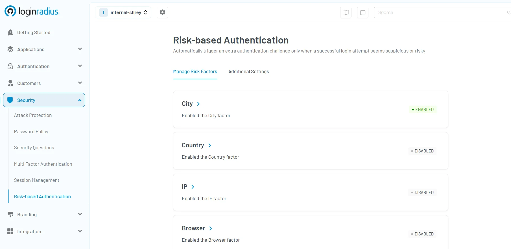

## Introduction

With mobile threats evolving rapidly, securing access to personal and business data isn’t just important—it’s critical. Cybercriminals are constantly finding new ways to exploit vulnerabilities in mobile applications, putting users and businesses at risk. That’s why adopting advanced mobile authentication methods is no longer optional.

This blog explores the importance of authentication in mobile security. It discusses the biggest threats to mobile users. It also compares traditional authentication methods with new solutions that improve mobile identity security.

Plus, we’ll explore the future of authentication and how emerging trends are set to transform mobile security. 

## What is Authentication in Mobile Security?

Mobile authentication ensures that users are who they claim to be, while authorization grants permissions based on their identity. Without proper security authentication methods, users risk exposing sensitive information to cyber threats.

For example, a banking app uses mobile phone authentication methods to verify a user's identity before allowing fund transfers. If authentication is weak, unauthorized individuals can access accounts, leading to financial losses and data breaches. LoginRadius specializes in implementing secure authentication methods that mitigate such risks and ensure robust mobile identity security.

## Authentication vs. Authorization- What’s the Difference? 

* **Authentication** verifies the identity of a user. For instance, when you enter a password or use biometric authentication for mobile devices, you prove who you are as a user.
* **Authorization** determines what an authenticated user is allowed to do. For example, a company employee might have access to email but not to its financial records. Authorization grants you the right access. 

A real-life example is social media logins: [authentication grants access,](https://www.loginradius.com/platforms/authentication-and-registration) while authorization determines whether users can edit profile information or manage an organization's page. Organizations must deploy secure authentication methods to prevent unauthorized access and ensure a seamless authentication process.

## What Are the Biggest Security Risks for Mobile Authentication?

As mobile usage skyrockets, so do the threats targeting mobile authentication. Cybercriminals are constantly finding new ways to exploit vulnerabilities, making strong authentication measures essential for protecting sensitive data. 

Mobile applications face many security challenges today. These include deceptive phishing attacks and unsecured networks, and more, which are listed below :

### Malicious Apps

Cybercriminals often create fake apps that mimic legitimate applications. Once installed, these apps steal user credentials and authentication codes. For example, a fraudulent banking app may capture login details and redirect funds without the user’s knowledge.

### Phishing and Smishing

Phishing emails and smishing (SMS phishing) trick users into revealing authentication codes and credentials. Attackers impersonate trusted entities, urging users to enter login details on fake websites, which leads to compromised accounts.

### Unsecured Networks

Public Wi-Fi networks pose security risks, as attackers can intercept authentication in mobile application data. Without advanced authentication methods, unauthorized users can hijack sessions and gain access to sensitive data.

**Did you know?** Microsoft security trend report suggests that more than 1,000 password attacks are carried on every second, with [99.9%](https://www.microsoft.com/en-us/security/blog/2023/01/26/2023-identity-security-trends-and-solutions-from-microsoft/) succeeding when there is a missing MFA. Don't risk it—secure your apps now with LoginRadius’ MFA!

Download this E-book to learn how LoginRadius’ Adaptive Authentication shields your digital assets even in the highest-risk situations! 

## What are Common Mobile Phone Authentication Methods?

* **Passwords and PINs**: The most common authentication process, but vulnerable to brute-force attacks.
* **Security Questions**: Often used as a secondary authentication process, but weak if answers can be easily guessed.
* **One-Time Passwords (OTPs)**: Sent via SMS or email but susceptible to interception.

While these methods provide basic mobile verification, they are no longer sufficient against modern cyber threats until they’re combined with a more robust authentication method through multi-factor authentication.

## What Are the Most Secure Authentication Methods for Mobile?

To enhance mobile identity security, businesses are adopting advanced authentication methods. These methods offer higher security levels while improving user experience.

### Multi-Factor Authentication (MFA)

[Multi-factor authentication](https://www.loginradius.com/blog/identity/what-is-multi-factor-authentication/) combines multiple authentications in mobile factors, such as:

* **Something you know** (password, PIN)
* **Something you have** (authentication codes from an app or hardware token)
* **Something you are** (biometric authentication for mobile devices)

For example, banking apps require a password (first factor) and an authentication code from a mobile authenticator app (second factor). This layered approach strengthens security.

### Biometric Authentication

Biometric authentication for mobile devices includes fingerprint scanning, facial recognition, and iris scanning. Apple’s Face ID and Android’s fingerprint authentication are prime examples of how biometric authentication enhances security while ensuring a seamless authentication process.

### Passkeys 

Passkey authentication leverages biometrics or hardware security keys to provide secure, password-free authentication. Passkeys are suitable for high-security applications such as banking, healthcare, and enterprise access management.

Go passwordless in just 5 minutes! [Add LoginRadius Passkey Authentication](https://www.loginradius.com/docs/authentication/passwordless/passkey-authentication/?q=passkeys) for seamless, secure logins. 

### Risk-based Authentication

Risk-based authentication, also known as adaptive authentication, is a security mechanism that dynamically assesses the risk level of a user's login attempt or transaction based on their historical behavior and contextual factors. 

Unlike static authentication methods, RBA adapts real-time security measures by analyzing parameters such as location, IP address, device, browser, and user behavior.

Want to add adaptive authentication to your apps? Get started with our developer documentation to quickly [Configure Adaptive Authentication ](https://www.loginradius.com/docs/security/customer-security/risk-based-auth/)on your apps.  

## What Are Some Emerging Trends in Mobile Authentication?

As cyber threats evolve, mobile authentication continues to advance. Future trends include:

* **AI-Powered Authentication**: AI will enhance authentication process efficiency by identifying fraudulent login attempts in real-time.
* **Decentralized Identity Systems**: Blockchain-based authentication eliminates reliance on centralized databases, improving mobile identity security.
* **Passwordless Authentication**: Biometric authentication and authentication codes will replace traditional passwords entirely, offering a seamless yet secure authentication experience.
* **Continuous Authentication**: Systems will continuously analyze user behavior to detect unauthorized access attempts dynamically.

## Final Thoughts

Ensuring mobile security requires adopting advanced authentication methods that balance security and usability. Whether through biometric authentication for mobile devices, multi-factor authentication, or AI-driven security authentication methods, organizations must stay ahead of cyber threats.

Protect your apps with cutting-edge security by LoginRadius! [Schedule a demo](https://www.loginradius.com/contact-us?utm_source=blog&utm_medium=web&utm_campaign=mobile-authentication) today and experience seamless mobile identity protection.

## FAQs

#### **Q1: What is the authentication method of Android?**

A: [Android supports various authentication methods](https://www.loginradius.com/docs/deployment/sdk/mobile-sdk-libraries/android-library/), including passwords, PINs, biometric authentication (fingerprint, face, iris), MFA, and passkeys for secure access.

#### **Q2: What is SIM authentication?**

A: SIM authentication checks users through their SIM card’s IMSI and cryptographic keys. However, it can be attacked by SIM swapping.

#### **Q3: Our users don't have mobile devices. Can we still use MFA?**

A: Yes! You can use hardware security keys, desktop authenticator apps, [email-based MFA](https://www.loginradius.com/docs/api/v2/customer-identity-api/multi-factor-authentication/email-authenticator/send-mfa-email-otp-by-mfa-token/), or biometric authentication on desktops.

#### **Q4: Is 2FA through SMS not safe? What should I use instead?**

A: SMS 2FA is vulnerable to SIM swaps and interception—use authenticator apps, [passkeys](https://www.loginradius.com/docs/authentication/passwordless/passkey-authentication/), or hardware security keys instead.

#### **Q5: What is advanced mobile security?**

A: It includes biometrics, adaptive authentication, AI-driven threat detection, and encryption to protect mobile data from cyber threats.

