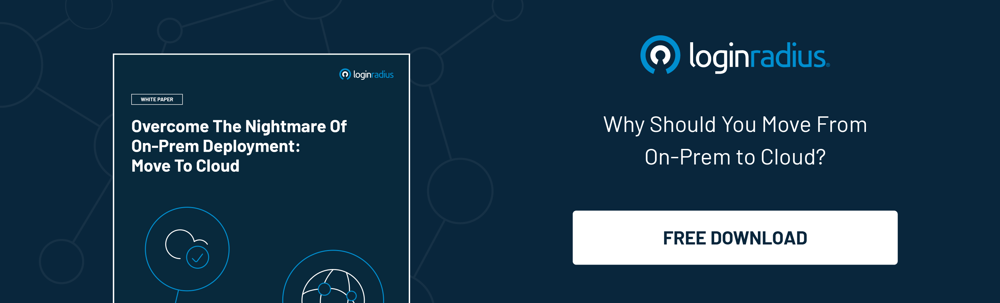

---
title: "A Lot Can Happen In The Cloud: Multi-Cloud Environment and its Optimization Challenges"
date: "2023-01-13"
coverImage: "cloud-multi.jpg"
tags: ["multi cloud", cloud cost optimization", "on prem"]
author: "Deepak Gupta"
description: "Although some features of the cloud are pretty attractive, there exist some that aren’t so attractive but are add-on features that make it highly complex to manage the cloud regularly.  Let’s uncover some optimization aspects of multi-cloud environments and the challenges that can help businesses plan their cloud adoption smartly."
metatitle: "Multi-Cloud Environment and its Optimization Challenges"
metadescription: "Multi-cloud deployments are becoming the new normal for accelerating overall business growth. However, specific challenges linger. Read more."
---

## Introduction

With the changing business landscape, cloud computing is undoubtedly broadening the horizons regarding the digital transformation of a business. 

However, while businesses think of leveraging the cloud, there remain specific challenges that may [increase operational costs](https://blog.loginradius.com/growth/5-ways-reduce-cloud-cost-optimization/) and could raise the need for more resources. 

And when it comes to multi-cloud environments, things are no different. The ideal scenario for any organization leveraging the cloud is to ensure they’re running the right workload on the right cloud with optimal capacity, performance, and cost that meets a business goal. 

Although some features of the cloud are pretty attractive, there exist some that aren’t so attractive but are add-on features that make it highly complex to manage the cloud regularly.  

Let’s uncover some optimization aspects of multi-cloud environments and the challenges that can help businesses plan their cloud adoption smartly. 

## What are the Most Common Multi-Cloud Environment Challenges? 

When it comes to multi-cloud environments, businesses aren’t aware of specific challenges that may impact overall performance, running costs, and efficiency. These challenges include: 

### #1. Application Complexibitlity: 

Enterprises are rapidly moving towards a multi-cloud environment. Undoubtedly, it is a great move to do so, but it is essential to understand the challenges and risks associated with this shift.

Many enterprises aren’t aware of the fact that the size, dependencies, and complexity of the applications may lead to specific challenges. And that, if not planned, could severely face the consequences of unplanned expenses and certain security risks.

We suggest you take a proactive approach by planning well to overcome these challenges and risks. 

### #2. Handling Multiple Cloud Providers and Environments

If you're running a business, you have a few different cloud providers. If you're like most businesses, you probably don't have four of them—you probably have one or two.

But if you use the same self-service deployment for each provider and environment, keeping track of what's happening in each environment can be challenging. You may even accidentally expose sensitive data to the wrong audience when users log in to your application on one provider and then try to access it from another using the same credentials.

This can happen because some providers store user information differently than others do. For example, some may store it as part of their [identity management](https://blog.loginradius.com/identity/what-is-iam/) system, while others store it as part of their collaboration system. 

If this happens, users might not realize they're logging in to a different environment because they're using the same credentials but seeing additional information depending on which provider they're accessing at any given time!

### #3. Manual Analysis 

Enterprises leveraging multi-cloud are often forced to correlate heaps of data manually from various tools across several clouds. 

And this is quite time-consuming. Since manually correlating a large amount of data can be overwhelming for enterprises that have chosen the cloud to streamline their processes.

Here's where the problem comes in: Enterprises that rely on multiple cloud providers and environments are at risk of being unable to keep track of all their resources, which could lead to costly mistakes, security vulnerabilities, and other problems.

## 4 Tips to Reduce Your Cloud Bills

Let’s uncover cloud cost optimization aspects and learn how to reduce your cloud bills.

### #1. Choose Your Cloud Wisely!

When choosing a reliable cloud architecture, most businesses aren’t sure whether they need a single-tenant cloud solution or a multi-tenant cloud.

For startups and budding entrepreneurs, multi-tenant cloud deployment is the best as they need not spend much money on the services they don’t require. Instead, they just need to pay for the resources they need on shared cloud space.

### #2. Analyze Unused Resources

One of the easiest ways to begin your cloud cost optimization journey is to analyze unused resources on your cloud. Sometimes a temporary deployment over a server could be the reason for your unexpected cloud expenses. The IT administrators may deploy some temporary server and forget to turn it off.

### #3. Use Heat Maps

Nothing could be as helpful as heat maps in reducing cloud storage costs. Heat maps are virtual tools that portray valleys and peaks whenever there’s a computing demand.

Based on the data from heat maps, businesses can quickly analyze idle programs or storage and establish starting and stopping points to minimize overall costs.

### #4. Choose the Right Storage Size

Most businesses choose storage that is more excessive than their actual requirements. Hence, they must pay more for the extra storage they aren’t utilizing.

It’s always a good idea to analyze your requirements and choose the cloud storage plan that meets your needs. Otherwise, you can select an [auto-scalable infrastructure](https://www.loginradius.com/scalability/) that scales with your needs, and you’re billed accordingly.

## To Conclude

The multi-cloud challenge is difficult to solve without proper planning, and the same goes for enterprises. The days of putting all data in a single cloud storage facility are numbered as more firms are turning to hybrid cloud configurations. 

Businesses should carefully consider a number of points before moving forward: which cloud services best meet the needs of their applications? What is the solution's total cost of ownership? And will users be satisfied with that solution?

