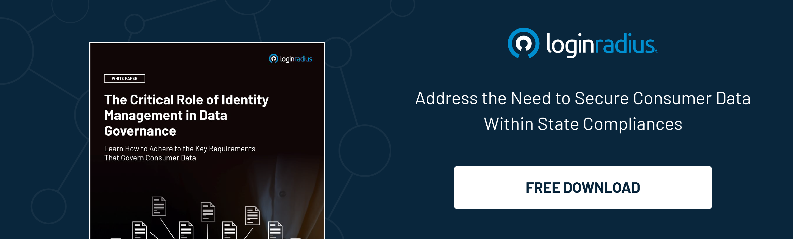

## Introduction

Customer identity and access management (CIAM) has become a critical capability for organizations to secure the digital identities of the users or customers, along with giving a personalized experience to customers. Adopting a multi-tenant CIAM platform is gaining widespread attention and adoption as it offers enhanced security measures. 

Usually, there are two deployment methods for SaaS-based CIAM platforms: single-tenant and multi-tenant. In single-tenant architecture, each customer has a dedicated instance of CIAM infrastructure; however, in the case of multi-tenant, multiple customers share a common instance of [CIAM infrastructure](https://www.loginradius.com/blog/identity/loginradius-private-cloud-ciam-benefits/). 

Multi-tenancy is a cost-effective approach that allows businesses to deploy CIAM solutions without compromising security or scalability. Delivering seamless, secure, and robust customer experience is a necessity to grow in this competitive landscape; let's learn how a multi-tenant CIAM solution offers a compelling approach to improve security. 

## How Does a Multi-Tenant Architecture Work?

Multi-tenancy refers to an architecture where a single instance of an application serves multiple customers or "tenants". The tenants are logically isolated but share the underlying resources. This approach is contrasted with a single-tenant design where each customer has a dedicated software instance running on allocated infrastructure.

In a multi-tenant [customer identity and access management](https://www.loginradius.com/blog/identity/customer-identity-and-access-management/) system, tenant isolation is achieved through logical separation. One tenant's users, roles, permissions, and workflow do not impact other tenants. 

However, the CIAM software and infrastructure, such as databases and application servers, are shared across tenants. Such a shared model allows economies of scale and makes it easier to apply updates or fixes universally. At the same time, tenants can customize the IAM solution as per their needs without affecting others.

The **multi-tenant architecture** brings several advantages:

### Centralized control and visibility

The single administrative interface offers centralized visibility and control over all managed identities and their access. It is far easier to manage than individual CIAM instances.

### Lower Total Cost of Ownership (TCO)

By utilizing shared infrastructure and not needing dedicated hardware/software per tenant, multi-tenancy incurs a significantly lower total cost of ownership. 

### Seamless scalability

Onboarding new tenants is seamless since existing resources can be leveraged. No capacity planning is needed with support for unlimited tenants.

### Faster deployment

With no system setup needed for each customer, new tenants can quickly use the CIAM through configuration.

### Uniform security controls

Multi-tenant solutions allow uniform application of security best practices. Critical updates and fixes can also be rolled out centrally.

## How Does Leveraging a Multi-Tenant CIAM Architecture Enhance Efficiency and Security?

[Multi-tenant Customer IAM](https://www.loginradius.com/multi-tenant-cloud/) presents a compelling way to allow secure collaboration at scale. Companies have partnerships with hundreds of vendors, channel partners, and software providers. Customers also want access to services through client portals.

Traditional single-tenant CIAM models make such customer and partner integration quite challenging. However, a multi-tenant cloud identity and access management (CIAM) solution allows secure onboarding of new collaborators in just minutes.

There are several ways such a multi-tenant architecture enhances security:

### Granular Access Controls

Multi-tenant CIAM solutions provide granular control to isolate access on an attribute level while presenting a unified interface. For instance, Partner A can access Resources 1 & 2. Partner B can access Resource 3 only, and so on.

Such context-based access works smoothly across tenants without complex integrations. Administrators get fine-grained visibility into what resource guest users from each tenant can access.

### Inherent Segmentation

The logical separation of tenants contains damage. If a user account on Tenant A is compromised, it does not automatically grant access to Tenant B's resources. It protects against lateral privilege escalation risks.

### Uniform Identity Governance

Multi-tenant solutions make it easy to define and implement identity governance policies uniformly. Secure password policies, access reviews and certification, role lifecycle management, and de-provisioning workflows can be standardized across customers.

### Consolidated Audit Trail

Activity can be centrally logged for simplified audits, eliminating the need for disjointed logs from various SaaS apps and CIAM instances. Analytics to identify risks are also made easier.

A multi-tenant CIAM architecture offers an unparalleled ability to collaborate securely while preventing tenant-to-tenant attacks, both malicious external threats and insider risks.

## Best Practices to Make the Best Use of Multi-Tenant CIAM Solutions

Choosing a CIAM solution is just the first step. How you ultimately use and manage such CIAM capabilities determines if security goals are actually met. Here are some best practices to securely unlock the power of multi-tenancy:

### Implement Least Privilege Access

Though convenient, avoid using admin roles everywhere. Define granular roles aligning to job functions and grant minimal access to prevent internal abuse.

### Enforce MFA

For all admin and privileged access, enforce [multi-factor authentication](https://www.loginradius.com/multi-factor-authentication/) (MFA). Whether via OTP over SMS, authenticator apps, or hardware keys, MFA blocks [99% ](https://www.microsoft.com/en-us/security/blog/2019/08/20/one-simple-action-you-can-take-to-prevent-99-9-percent-of-account-attacks/)of automated attacks and abuse of stolen credentials.

### Automate Governance

Use automated identity lifecycle workflows around user onboarding/offboarding/updates to minimize reliance on manual review. Automated access reviews also regularly clean up outdated permissions.

### Adopt SSO

Implement [Single Sign On (SSO) ](https://www.loginradius.com/single-sign-on/)across apps to simplify access for users while giving admins single visibility through one dashboard. With SSO, access can be instantly revoked by disabling the CIAM user account.

### Formalize Tenant Onboarding/Offboarding

Have a formal process documenting requirements and steps for secure onboarding and eventually offboarding tenants. It ensures nothing is missed when collaborators join or leave.

### Provide Tenant Self-Service

Empower tenant admins to manage their users, group roles, and access requests. It reduces dependency on customer support, while tenant isolation contains any risks.

### Create Operational Runbooks

Maintain current technical manuals documenting your CIAM deployment, architecture, policies, and procedures. It speeds up troubleshooting, maintenance, or audits by administrators.

Applying these leading practices enables harnessing the power of your multi-tenant CIAM solution while keeping your organization secure. 

## Wrapping Up

Multi-tenancy in CIAM solutions has compelling advantages over traditional single-tenant models or companies managing their own CIAM stacks. Multi-tenant capabilities allow easy onboarding of partners, contractors, and customers to unlock digital transformation while enhancing security.

Architectural isolation mechanisms naturally provide tenant segmentation and resource isolation and prevent lateral privilege escalation threats. It also builds fine-grained access controls, governance guardrails, and rich intelligence.

Whether you need to onboard business partners, merge acquired companies, or manage a contractor ecosystem, the LoginRadius CIAM platform has proven capabilities trusted by leading enterprises. Schedule a discussion to see the power of multi-tenancy in action!

