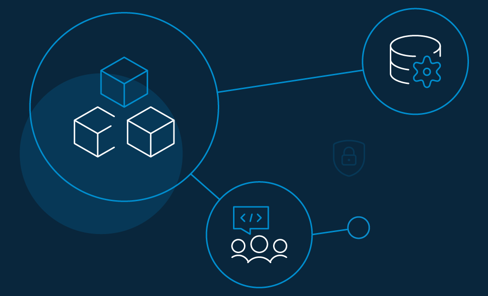

## Introduction
The evolution of CIAM has been smooth and seamless. What started as an exception has turned out to be inevitable. The introduction of a wide assortment of lateral software packages designed to simplify each core aspect, including multi-factor authentication (MFA), [single sign-on](https://www.loginradius.com/single-sign-on/), and self-service account management, has proved to be the much-needed shot-in-arm for the new age CIAM.  

With the incorporation of advanced technologies, CIAM has become more versatile, fluid, and secure. Considering that consumers expect nothing less than the best experience while interacting with brands and a trusted shield to keep privacy violations and fraud at bay, CIAM's ability to address these aspects with precision has been the headlining feature of the evolution. 

## What is a CIAM? 

[Customer identity and access management](https://www.loginradius.com/blog/identity/customer-identity-and-access-management/) (CIAM) is a digital identity management software solution for businesses that combines login verification with customer data storage. CIAM aims to improve the customer's sign-up and login experience while securely managing customer identities.

CIAM offers the luxury of a centralized customer database that links all other apps and services to provide a secure and seamless customer experience.

## Key Identity Management Features Essential for Any Modern CIAM Solution

A Customer Identity and Access Management (CIAM) platform can help businesses provide a secure and seamless customer experience. 

An ideal CIAM solution should include every feature that not only enhance customer trust and loyalty but also streamline business operations and boost revenue growth without compromising security.  

Here’s the list of features that a modern CIAM solution must have: 

### 1. Centralization of access management

Centralization of access management is a crucial feature of modern CIAM platforms that enables organizations to manage user access across multiple applications and systems.

Moreover, with centralized access management, businesses can enforce consistent security policies, reduce the risk of unauthorized access, and improve the user experience.

Centralization also simplifies the administration of access policies, making it easier for IT teams to manage user access and quickly respond to security threats.

### 2. Unified identity profiles

Unified identity profiles are a critical component of modern CIAM platforms that allow organizations to create a single, comprehensive view of each user's identity and attributes.

By maintaining unified identity profiles, businesses can provide personalized experiences, simplify the user onboarding process, and reduce the risk of data duplication and errors.

With a unified view of user data, organizations can also gain insights into user behavior, preferences, and interactions, enabling them to deliver more targeted and effective marketing campaigns.

### 3. Progressive profiling

[Progressive profiling](https://www.loginradius.com/progressive-profiling/) is an essential feature of modern CIAM platforms that enable businesses to collect user data in a non-intrusive and progressive manner.

With progressive profiling, organizations can gradually collect user information over time, reducing user friction and increasing the completion rates of registration and sign-up processes.

By collecting only the most relevant user information, businesses can also minimize the risk of collecting unnecessary or sensitive data, reducing the burden of compliance and data management.

### 4. Consent Management

[Consent management](https://www.loginradius.com/consent-management/) is crucial in modern CIAM because it enables users to exercise control over their personal data, giving them the power to grant or revoke consent for how their data is collected, stored, and shared by the application.

### 5. Robust Session Management 

Robust session management is essential for modern CIAM because it ensures that users are securely authenticated and authorized, while also protecting against session hijacking and other types of attacks.

### 6. Intuitive Admin Portal 

An intuitive admin portal is important in modern CIAM because it provides a user-friendly interface for managing user data, applications, and access policies, making it easier for administrators to configure and monitor their CIAM system.

### 7. Flexible Authorization

Flexible authorization is critical in modern CIAM because it allows administrators to define and enforce fine-grained access policies, ensuring that users only have access to the resources they need while also supporting complex use cases and workflows.

### 8. Extensible Identity Store 

An extensible identity store is necessary in modern CIAM because it enables the integration of multiple identity sources, such as social media, LDAP, and custom databases, giving users more options for how they authenticate and improving the accuracy and completeness of user data.

## CIAM as a Seamless Business Enabler

Aside from playing a vital role in enhancing consumers' experience as they interact with brands, CIAM is also a seamless business enabler. The best CIAM platforms deliver seamless registration, secure consumer identity management, as well as control consumer access to applications, systems, and services.

Being a solution that simplifies the entire consumer experience - CIAM is now seen as a business enabler. It allows consumers to connect across devices and touchpoints in a way that suits them best.

## What Does the Modern CIAM Architecture Looks Like?

The modern CIAM architecture is built around four key aspects: 

**1. Enhanced safeguard against hacking:** With multiple layers of protection, new-age CIAM offers the much-needed shield against hacking. Hence, consumers can access the personal data securely without the fear of privacy breaches or malicious attacks.

**2. Providing intuitive user experience:** By striking a balance between advanced technologies and ease-of-use, modern CIAM architecture emphasizes boosting intuitive experience. Thus, even not-so-tech-savvy consumers can feel at home while interacting with the applications. 

**3. Much-improved emphasis on the single consumer-view:** Another pivotal aspect of the modern CIAM is the repertoire of providing detailed insight into a single consumer view. Hence, discovering what clicks for consumers becomes straightforward.

**4. Being in sync with the latest privacy changes:** In the backdrop of rampant privacy breaches and illegal mining of personal data, privacy has become a focal point. Be it the end-to-end encryption of personal information or the ability to disable tracking or completely restrict access to every sensitive feature, applications have been forced to adhere to strict privacy regulations that hardly assumed much significance a few years ago. Modern CIAM architecture is designed to comply with the latest privacy changes to ward off concerns and win [consumers' trust](https://www.loginradius.com/blog/identity/2019/10/digital-identity-management/). 

Not that the old CIAM architecture didn't put much stress on these afore-mentioned, modern CIAM has doubled down on these core points as they have a significant role in improving the overall user-experience. 

However, in the end, what matters is whether or not consumers are satisfied with their service. This is where the intuitive experience (which allows instant and hassle-free access to the user data) comes into the reckoning. 

Another equally pivotal component that needs more emphasis is the shield put into place to defend the private data. By checking off these essential boxes, the new-age CIAM aims to bolster the user-experience.

## Benefits of Using New-Age CIAM 

There are four major benefits of the new-age CIAM 

### 1. Omni-channel consumer experience

An [omnichannel consumer experience](https://www.loginradius.com/blog/fuel/2020/04/omnichannel-customer-experience/) refers to seamless interaction across multiple channels. Consumer expectations fall into categories like speed, flexibility, reliability, and transparency. 

For example, it is omnichannel when marketing, sales, consumer support, and even in-store experiences are synced up so users can seamlessly switch channels and make the purchase. 

### 2. Single consumer view

A single consumer view (also known as SCV) is where all consumers' data is stored securely and presented as an easy-to-read record. 

That may include the basic information about a consumer, the past and present purchasing data, all interactions with customer service, as well as their social media behavior under a single admin panel. It assists brands to have an in-depth insight into their consumers.

### 3. Strengthened security

In an age where sensational hacking and malicious attacks have become the order of the day, enhanced safeguard against the ever-looming threats is indispensable. 

By adding multiple layers of shields, new-age CIAM brings into effect strengthened security. Thus, the entire cluster of data remains protected from the prying eyes or, for that matter falling prey to data trackers.  

New-age CIAM takes advantage of [multi-factor authentication](https://www.loginradius.com/blog/identity/2019/06/what-is-multi-factor-authentication/#:~:text=Team%20LoginRadius&text=10%20min%20read-,Multi%2Dfactor%20authentication%20(or%20MFA)%20is%20a%20multi%2D,user%20account%20will%20remain%20secure.) to guard against unauthorized access. Each layer is designed with the utmost security in mind to prevent hackers from breaking into the account.

While MFA keeps a tab on the security checks, adaptive authentication aims at simplifying the process. Driven by advanced artificial intelligence and machine learning, the new-age [CIAM](https://www.loginradius.com/blog/identity/2019/06/customer-identity-and-access-management/#:~:text=CIAM%20simplifies%20every%20business%20task,%2C%20business%20intelligence%2C%20and%20services.) adapts over time for a more personalized experience. 

### 4. Privacy and regulatory compliance

Gone were the times where privacy could hardly get a fixed checkbox. Unlike ever before, privacy warrants must-have attention. 

Therefore, companies have to be upfront with how they deal with [users' privacy](https://www.loginradius.com/blog/identity/2020/06/consumer-data-privacy-security/) and come clean on the measures they take to prevent sensitive data from being misused. 

With the new age CIAM put into practice, organizations can easily remain in line with the privacy and regulatory compliance and adopt the essential changes from time to time. 

Whether it's adhering to international data protection laws like the GDPR and the CCPA 2.0, the modern CIAM enables enterprises to embrace the needed changes with the heightened fluidity. 

## An Introduction to The LoginRadius Modern CIAM Solution

LoginRadius' modern CIAM solution is designed to be more flexible, intuitive. It addresses every subtle component that can improve consumers' experience while also providing an unmatched safeguard for the private data. 

What puts LoginRadius ahead of the curve are the three most fundamental aspects: 

   **1. Frictionless security:** Strengthened security doesn't have to come at the cost of convenience. LoginRadius' modern CIAM solution like MFA, passwordless login, phone login, social login etc. ensures there is no friction while authenticating.

  **2. Privacy management:** Proficient privacy management is the key to winning the trust of consumers. Our new-age CIAM solutions considers every subtle privacy concern related to international regulations like the [GDPR and the CCPA](https://www.loginradius.com/blog/identity/2019/09/ccpa-vs-gdpr-the-compliance-war/).

  **3. Seamless integration**: Another feature that sets LoginRadius' new-age CIAM apart from the rest is the seamless integration with the modern tools that are geared to offer smooth and secure access.

## Conclusion

CIAM ensures brands have a better understanding of consumers. Hence, they can quickly figure out what clicks for their consumers and what they must do to get rid of. 

Add to that the top-of-the-line shield against the prying eyes and the new-age CIAM seems to be a must for modern enterprises.

