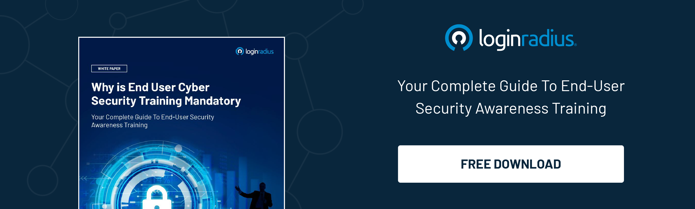

Safeguarding customer data stands as a top priority for every business entity. Despite businesses implementing rigorous security protocols, malicious actors manage to exploit vulnerabilities, breaching network systems and jeopardizing the confidentiality, integrity, and accessibility of information.

Cybersecurity firms such as Okta, specializing in identity management and authentication solutions, form the core of an organization's cybersecurity framework. 

Okta caters to a global clientele of around 15,000 customers. The recent Okta data breach compromising its customer support unit is a stark reminder of the risks associated with social engineering attacks and the growing sophistication of cyberattacks. 

This incident also serves as a warning for Cybersecurity Managed Services Providers (MSPs) and IT Solution Providers (ITSPs) to enforce stringent security measures, ensuring they are equipped to prevent such incidents from occurring. 

## Why is Okta in the News?

Okta, the identity management platform, reported an intrusion in its customer support system. Given its role as an access and authentication service, any breach in Okta poses risks to other organizations. 

On October 20, 2023, the [company verified](https://sec.okta.com/harfiles) that "certain Okta customers" were indeed affected and informed approximately 1 percent of its customers about the impact, according to the officials. 

According to David Bradbury, Chief Security Officer at Okta, “_Okta Security has identified adversarial activity that leveraged access to a stolen credential to access Okta's support case management system._

_The threat actor could view files uploaded by certain Okta customers as part of recent support cases. It should be noted that the Okta support case management system is separate from the production Okta service, which is fully operational and has not been impacted._” 

## Okta Breach: What Was the Impact?

On October 19, Okta issued an advisory to an unspecified group of customers, revealing the detection of malicious activity. This activity involved unauthorized access to Okta's support case management system through a stolen credential. The threat actor gained access to files uploaded by specific Okta customers as part of recent support cases.

Apart from this, Okta experienced an over [11% drop in shares](https://www.cnbc.com/2023/10/23/okta-hack-wipes-out-more-than-2-billion-in-market-cap.html) following the disclosure that an unknown hacking group managed to breach client files through a support system.

### 1. Control Access Based on Need

The initial step involves restricting employees' and contractors' access to essential information. Access should be granted strictly on a 'need-to-know' basis and adhere to the principle of 'least privilege,' meaning individuals should have the minimum access required to perform their tasks. 

For instance, support engineers shouldn't have entry to internal HR, accounting, or payroll systems. Similarly, marketing personnel shouldn't be able to access network configurations or applications they don't utilize.

### 2. Verify Third-party Apps and SaaS Solutions

In the increasingly complex landscape of multi-cloud and hybrid-cloud environments, it's crucial to comprehend the IT ecosystem, including third-party APIs (Application Programming Interfaces), applications, and Software as a Service (SaaS) solutions in use. 

Requesting SOC reports from vendors and contractors aids in understanding how their information systems are managed and protected.

### 3. Educate Employees and Customers

The human element is an organization's most valuable asset but can also pose a significant cybersecurity risk. Thus, organizations need to consistently assess training processes and educate employees, vendor-contractors, customers, and users about basic cyber hygiene practices.

### 4. Stay Alert

Organizations must remain vigilant by continuously monitoring and auditing their control environments. Employing automated monitoring and alerting tools can help overcome various challenges SOC teams face.

### 5. Regularly Audit and Review

Internal audits should be conducted regularly, focusing on system reviews and monitoring network traffic and access permissions more frequently. Additionally, engaging third-party audit firms provides an external and independent perspective on the organization's cybersecurity posture.

### To Conclude 

The Okta breach demonstrates the vulnerability of all businesses to cyber-attacks. Even a minor security gap can be exploited, jeopardizing customer data. 

This incident emphasizes the critical need for businesses to prioritize cybersecurity, update protocols, and educate employees. Staying vigilant and proactive is essential in the face of evolving cyber threats.

