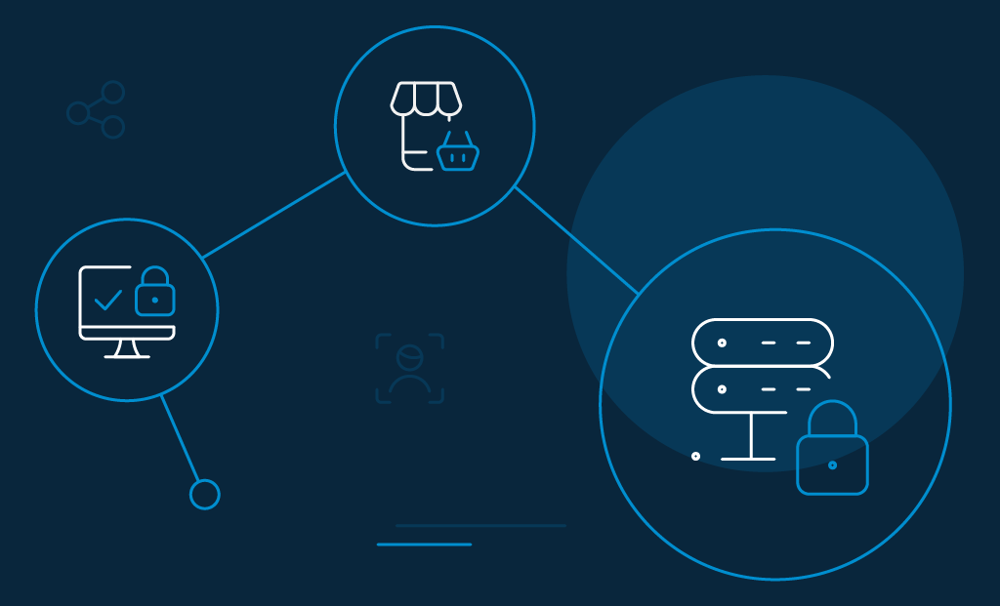

Can the biggest shopping days of the year also be the biggest security disaster? 

Turns out -- it can be (no surprise there!).

Every year, online fraudsters concoct new ways to dupe holiday shoppers out of their money. It only takes one mistake to have your consumers' data stolen and for you to end up in a pit of losses, fines, and miscellaneous costs to revive your business. 

According to [Verizon's 2021 Data Breach Investigations Report](https://www.verizon.com/business/resources/reports/dbir/), cybercriminals mostly target confidential data that retail outlets hold. The numbers go as high as 42% for consumer payment data, 41% for personal data, and 33% for credentials. 

So, [protecting your consumers’ data online](https://www.loginradius.com/blog/2020/06/consumer-data-privacy-security/) is an essential part of securing your business at large. Your job is to let them shop with confidence with some of the best online shopping tips (discussed below).

But first, we have a few stats to share. 

Stay calm. While the holiday season is around the corner, some figures may be alarming, but that shouldn't keep you from encouraging your consumers to shop online. 

## Black Friday & Cyber Monday Statistics that Shows What to Expect In 2023 

* Research from[ Finder](https://www.finder.com/black-friday-statistics) reveals that in 2023, a staggering 132 million Americans are set to engage in shopping activities throughout Cyber Week.
* The prevalence of online shopping for Black Friday sales has risen, with an increasing number of individuals recognizing the convenience of shopping from the comfort of their homes. A [Drive Research study ](https://www.driveresearch.com/market-research-company-blog/black-friday-holiday-shopping-statistics/#BF2)indicates that approximately 68% of people intend to opt for online sales, while 27% plan to shop in-store, marking a 16% decrease from the 2022 figures.
* According to Imperva's "State of Security Within eCommerce", [57% of attacks](https://www.imperva.com/resources/resource-library/white-papers/the-state-of-security-within-e-commerce/) targeting retail websites were carried out by bots.

These statistics have significant consequences, especially when your business is built upon trust and consumer confidence. You need to be proactive about addressing all kinds of cybersecurity threats. 

## The Biggest Online Shopping Cyber Attacks

### DDoS attack

Distributed denial of service or DDoS attack is a malicious attempt where criminals flood a network with an overwhelming traffic volume from multiple sources—that it becomes impossible to deliver service as it usually did. 

DDoS assaults are a common occurrence around the [online retail industry](https://www.loginradius.com/blog/2020/04/loginradius-ciam-retail-ecommerce-business/), mostly because they are easy to deploy, and hackers can bring down a site in a matter of minutes. The damage to the victim is also almost immediate and expensive. 

### Card fraud

In credit card fraud, hackers employ malicious bots to scan for vulnerabilities within online shopping sites to [steal card numbers](https://www.loginradius.com/blog/2019/09/prevent-credential-stuffing-attacks/). Gift card fraud occurs when bots scan for possible gift card numbers within web applications until the valid ones are found. 

### Phishing scams

Phishing is one of the most common types of cyberattacks that consumers encounter when online. These days it is quite convenient for cybercriminals to launch a genuine-looking shopping site and unsuspecting scam buyers to enter their personal and financial details—and that's one way how phishing works.

Sometimes, hackers also send emails with malicious attachments hoping that the receiver would click them and have malicious infections downloaded to their system. 

### Consumer journey hijacking

Consumer journey has become one of the key brand differentiators for enterprises-even surpassing factors like price and product. Consumers expect that their interaction with your brand is as seamless as possible. 

Consumer journey hijacking is a cyberattack where hackers inject unauthorized advertisements (usually as pop-ups or banners) into the consumer's web browser. For example, they may ask the victim to click on the ads with the promise to secure a great deal or redeem a prize they won. 

## 17 Online Shopping Tips for Consumers To Follow While Shopping During This Holiday Season

Do not let the stress of untangling a case of identity theft or financial fraud ruin your consumers' Black Friday and Cyber Monday shopping. Stay ahead of cybercriminals with the best online tips. Here are the best places to start.

### 1. Use familiar websites.

Encourage your consumers to shop from sites that they can trust. When they know the site well, there are fewer chances that they will be drifted to a malicious page and ripped off. Also, ask them to be cautious of misspellings or sites using a different domain, for example, .xyz instead of .com. The offers and sales on these sites may look decorated and enticing, but that's how they lure victims in. 

### 2. Say no to public wifi.

Ask your consumers not to use public networks to make online transactions. That’s not how they should do safe shopping online. Freely available wifi hotspots at a coffee shop or in the airport are red flags. There may be hackers spying on them and waiting for the least opportunity to steal your consumer's name, address, and credit card information. 

### 3. An extra VPN security could help.

If your consumers cannot resist shopping without shipping that hot chocolate, advise them to install a VPN (virtual private network) on their mobile devices, or computers for that matter, before connecting on a public wifi network. VPN creates an encrypted connection between the consumer's device and the VPN server, so any message sent while browsing the internet is safe from hackers. 

### 4. Strong password hygiene.

Another online shopping tip is to mandate your consumers to use strong, unique passwords. If the hacker has the password to an account, they can use the stored payment data to rip you off. Here are a few [password protection tips](https://www.business2community.com/cybersecurity/password-security-best-practices-in-2020-02282074) to keep consumers' accounts safe. 

*   Ask them to use long passwords. For example, it can be a complex set of at least eight lowercase and uppercase letters, numbers, and symbols.
*   Ask them not to use passwords that are easy to guess, like birthdays, favorite food. Also, dictionary words are a big no. 
*   Ask them not to use the same password for multiple accounts. 
*   Ask them not to share their passwords with anyone else.
*   Ask them to keep changing their passwords regularly. 

### 5. Check statements regularly.

Holidays are a season of shopping sprees. Therefore, remind your forgetful consumers to regularly look for fraudulent charges on their credit card, debit card, and other accounts online. When they receive a text message or email about a new charge, ask them to check if they recognize the charge. 

### 6. Go through the retailer's security policy.

Consumers should be aware of what happens to their data that they leave on a website. Some vendors also create accounts to save consumers' credit card information for future transactions. Therefore, encourage your consumers to find out the retailer's privacy policy. It will help them avoid the hassles of fraud and prevent those impulse buys. Always one of the best online shopping tips. 

### 7. Steer clear of holiday shopping scams.

We mean [phishing](https://www.loginradius.com/blog/phishing-for-identity/) scams. For instance, your consumers may receive emails with tempting offers for the holidays that they cannot say no to. Email from unknown vendors often carries viruses and malware. It is always better to play safe and delete emails from suspicious vendors without opening them. 

### 8. Download apps from trusted sources.

It is crucial that your consumers download applications only from trusted platforms like the App Store, the Google Play Store, Amazon App Store, etc. Most of the applications out there ask consumers for various permissions during installation. Encourage your consumers to read those carefully and only check boxes that make sense to them. They can also read reviews and ratings from existing consumers before making any decision. 

### 9. Read return policies.

Another useful online shopping tip is to encourage your consumers to always go through return policies before hitting "buy." Since they are buying items that are not tried and tested, there are always chances they may not be the right fit as they would at a local store. You consumers should be well aware in advance of how their vendors handle returns. 

### 10. Use credit cards instead of debit cards.

Wherever possible, ask your consumers to prefer credit cards as their choice of payment over debit. The reason being, consumers can withhold credit card payments from a vendor in case of any dispute. Also, depending on your consumers' country, they need to pay only a small amount of the entire fraudulent charge and mitigate the fraud. 

But with a debit card, the money is deducted from your consumer's bank account. Though it is possible to recoup the fraudulent charges eventually, that's a difficult and a very long shot. 

### 11. Don't respond to pop-ups. 

Ask your consumers to ignore all pop-up offers and deals. They should not respond or click on the links. For example, if a pop-up says, "clean your infected computer," ensure that they ignore it. They are all scams. 

### 12. Use secure websites.

There is a small icon in the left-hand corner of any website's URL bar. URLs that start with "HTTPS" are secure sites, and they encrypt all data that consumers share on the site. It is another best online shopping tip that your consumers exercise caution before providing their financial information on sites without the "s". 

### 13. Keep receipts.

When your consumers shop anything online, they receive a sales confirmation after the purchase, mostly in the form of emails. Ask them not to delete these emails until the item has arrived and they are satisfied with the product. It is an important piece of information that they require to call consumer service or return a purchase. 

### 14. Don't accept virtual gifts.

Fake websites offer free gifts to consumers to entice them into sharing their banking details. Another online shopping tip for consumers is never to accept free gifts online. Virtual gift cards have the highest risk of [cyber fraud](https://www.loginradius.com/blog/2019/10/cybersecurity-attacks-business/). 

### 15. Use an extra email account.

This is an interesting online shopping tip that can save your consumers the hassles of financial or identity fraud. Ask them to use a separate email address for shopping altogether. This way, they can steer clear of compromising their personal information. P.S. Remind them to use passwords for each account.

### 16. Never leave devices unlocked.

It is a good practice to keep devices locked at all times. Prying eyes can be anywhere—it only takes seconds for someone to watch over the shoulder and get hold of your consumers' passwords. Add a [second layer of authentication](https://www.loginradius.com/multi-factor-authentication/) (MFA), for instance, a PIN or passcode, before letting your consumers in. 

### 17. Do not overshare.

No genuine website asks for consumers' Social Security number (SSN) to complete a transaction. So, if they are doing it, they are most certainly phishing attempts. Encourage your consumers to call the consumer service for more details before handing out sensitive information. 

## How LoginRadius Can Help in Securing Your Data Safe While Providing a Delightful Digital Experience

As an organization, it is also crucial that you take similar steps to minimize your consumers' cyber liabilities. Using the LoginRadius [consumer identity and access management solution](https://www.loginradius.com/blog/2019/06/customer-identity-and-access-management/), you can provide them the safest and most secure digital experience while looking out to implement the best online shopping tips. 

Here how you get personalized marketing, 360-degree customer profiling, data safety, and [omnichannel experience](https://www.loginradius.com/blog/2020/04/omnichannel-customer-experience/) for your consumers. 

*   **Improved registration and login options**: The identity management platform allows consumers to register using [Magic Link via Emai](https://www.loginradius.com/blog/2020/10/loginradius-launches-passwordless-login-with-magic-link-or-otp/)l, OTP Login via Email, or OTP Login via Phone. This way, consumers need not remember passwords to log in anymore. 
*   **360-degree view of consumers**: It offers a 360-degree view of consumer demographics, so you can plan your next move based on their behavior and personal preferences while building better relationships.
*   **Social login**: Social login allows consumers to authenticate with a social media account. It helps your consumers skip the hassles of the registration and end up with a seamless consumer onboarding. 
*   **Single sign-on (SSO)**: It allows consumers to access multiple accounts with a [single set of credentials](https://www.loginradius.com/blog/2019/05/what-is-single-sign-on/), offering ease of authentication and a frictionless omnichannel experience. 
*   **Multi-factor authentication (MFA):** It offers multiple layers of authentication during the login process to ensure that the right consumers log in. 
*   **Security compliance**: LoginRadius adheres to international standards like the E.U.'s GDPR and [California's CCPA](https://www.loginradius.com/blog/2020/03/how-loginradius-helps-enterprises-stay-ccpa-compliant-in-2020/). Other certifications include PCI DSS, ISO 27001:2013, ISO 27017:2015, ISO/IEC 27018:2019, U.S. Privacy Shield, NIST Cybersecurity Framework, and more. 

## Conclusion 

Safe online shopping tips are essential to providing excellent experiences to both [consumers and retailers alike](https://www.loginradius.com/industry-retail-and-ecommerce/). It is a smart approach to know your immediate threats, so there is no room for mistakes. 

The tips and solutions discussed above can protect your consumers from underlying threats this holiday season. Have a great shopping spree! 

## FAQs 

Q1. Why is security crucial during Black Friday and Cyber Monday shopping?

A: These events attract cybercriminals; securing data is vital to prevent scams and breaches.

Q2. What are common online shopping threats mentioned in the blog?

A: DDoS attacks, card fraud, phishing scams, and consumer journey hijacking.

Q3. How can consumers protect themselves while shopping online?

A: Tips include using trusted sites, avoiding public Wi-Fi, and employing VPNs.

Q4. What's the role of multi-factor authentication in online shopping security?

A: It adds an extra layer, ensuring the right users access their accounts.

Q5. How can businesses enhance data security during these events?

A: Solutions like LoginRadius offer secure registration, 360-degree consumer views, and multi-factor authentication.

