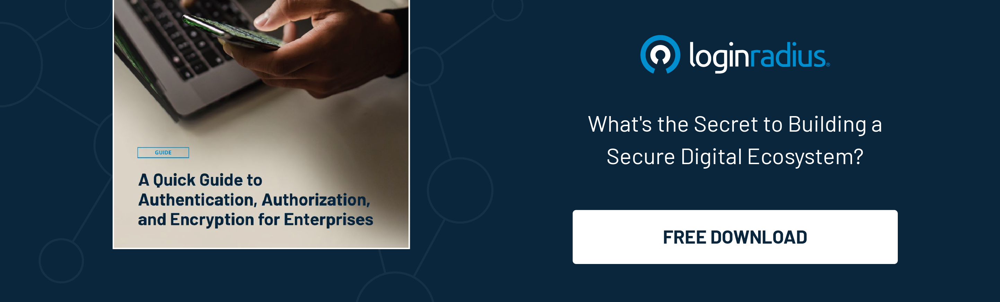

In the ever-evolving landscape of cybersecurity, protecting the kingdom of sensitive data requires a strategic fortress. Enter Privileged Access Management (PAM) – the guardian at the gate, ensuring only the rightful wielders of power can access the throne.

Imagine the internet as a big castle where your important stuff is kept. Now, think of Privileged Access Management (PAM) as the superhero guardian of this castle, making sure only the right people get in. 

Let’s explore the digital castle's secret passages, where PAM isn't just a gatekeeper but a super-smart protector, keeping your data safe from the bad guys. Get ready for a journey through the world of PAM, where it's not just about keys and codes but about keeping your digital treasures secure and sound.

## Understanding the Kingdom: What is PAM?

Privileged Access Management is the linchpin in cybersecurity, focusing on securing access to critical systems and data. Think of it as the keeper of keys, allowing only trusted entities to enter the realm of sensitive information.

### PAM Best Practices Unveiled

**Least Privilege Principle:** Grant access only to what is necessary. Not everyone in the kingdom needs access to the royal treasury, but not every user requires full access privileges.

**Secure Shared Accounts:** Shared accounts can be a vulnerability. PAM ensures that shared access is tightly controlled, with session monitoring and automatic password resets.

**Robust Authentication:** Multi-factor authentication (MFA) is the guardian at the gate, [demanding more than just a password](https://www.loginradius.com/blog/identity/what-is-multi-factor-authentication/). Biometrics, smart cards, or tokens add an extra layer of protection.

**Continuous Monitoring and Auditing:** Vigilance is key. PAM keeps a watchful eye on all activities, logging every movement within the kingdom. Regular audits ensure that any unauthorized access is swiftly dealt with.

**Session Recording and Playback:** In a breach, understanding the sequence of events is crucial. PAM records and archives all sessions, providing a playback feature for forensic analysis.

**Automated Password Management:** Human error is inevitable, especially regarding passwords. PAM automates password changes, reducing the risk of compromised credentials.

### Adapting PAM Strategies

In the ever-evolving cybersecurity landscape, the threats we face are dynamic and sophisticated. PAM, too, must evolve to stay ahead. Regularly updating and adapting PAM strategies is akin to reinforcing the castle walls in response to new siege tactics. 

Stay informed about emerging threats, update software, and conduct regular security assessments to ensure that PAM remains a stalwart defender against the shifting landscape of cyber risks.

### Democratizing Security Awareness: PAM Education for All

While PAM is a powerful tool for cybersecurity professionals, its efficacy can be enhanced through widespread awareness. 

Educating all members of the digital kingdom about the importance of PAM and their role in upholding its principles is paramount. Whether a royal administrator or a foot soldier in the IT ranks, each member must understand their role in preserving the integrity of the digital realm. 

By democratizing security awareness, we empower every user to be a vigilant guardian, strengthening the kingdom's defenses against external threats.

### The Coronation of PAM: Benefits Beyond Security

**Regulatory Compliance:** PAM ensures [adherence to regulatory frameworks,](https://www.loginradius.com/gdpr-and-privacy/) safeguarding the kingdom against legal repercussions.

**Operational Efficiency:** With streamlined access and automated processes, PAM enhances efficiency, allowing the kingdom to function seamlessly.

**Threat Mitigation:** By limiting access and monitoring activities, PAM acts as a proactive shield against potential threats, minimizing the risk of breaches.

### Conclusion

As we navigate the treacherous waters of cybersecurity, Privileged Access Management emerges as the unsung hero. By implementing these best practices, we secure the throne and fortify the entire kingdom against the relentless onslaught of cyber threats.

In digital security, PAM isn't just a choice; it's the sovereign shield protecting our most valuable assets from the shadows that seek to exploit vulnerability. As we unveil the best practices of PAM, let us fortify our defenses and ensure that only the worthy wield the keys to the kingdom.

