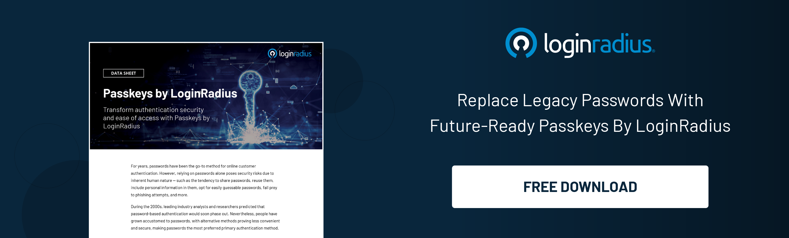

## Introduction

Passwords have long been the preferred method for authenticating customers online. However, they come with significant security risks due to human behavior—such as insecure sharing, reusing passwords, using personal information in passwords, setting easily guessable passwords, and susceptibility to phishing. 

Despite predictions in the 2000s that passwords would soon become obsolete, they remain the primary method for authentication due to a lack of convenient and secure alternatives.

To combat the [security risks and user experience challenges](https://www.loginradius.com/blog/identity/balancing-security-cx/), LoginRadius introduces Passkeys, which reinvents user authentication. 

## Intent Behind the Launch

With the FIDO2 open standard, [passkey authentication](https://www.loginradius.com/passkeys-login-authentication/) has become straightforward and user-friendly. Widely supported across multiple device platforms and web browsers, passkeys eliminate passwords and their associated risks while enhancing customer experience and security. 

LoginRadius is introducing Passkeys to revolutionize the authentication landscape by providing a secure, convenient, and user-friendly alternative to traditional passwords.

Passkeys by LoginRadius addresses various security challenges in conventional password-based authentication without hampering the overall user experience. 

## Key Functions of Passkeys by LoginRadius

1. **Onboarding Existing Customers:** Design workflows to onboard existing customers with passkeys or remind them to opt for passkeys after signing in.

2. **Onboarding New Customers:** Set up customized workflows to onboard new customers with passkeys.

3. **Customer Alerts:** Alert customers via SMS or email when passkeys are configured, updated, or deleted.

4. **Multiple Passkeys:** Allow customers to add various passkeys for the same accounts to enhance accessibility.

5. **Device-bound Passkeys:** Require customers to create a device-bound passkey when they authenticate with a cross-device/synchronized passkey.

6. **Seamless Integration:** Integrate passkey authentication into customer-facing mobile and web applications with SDKs for platforms like Android and iOS; frameworks and languages like React, Java, PHP, Node.js, Python, Ruby, and Golang, among others.

## In Conclusion

Passkeys by LoginRadius revolutionize your customers' authentication experience by enhancing security and simplifying the process. 

Passkeys are the future of secure and user-friendly authentication. They are quick to implement, reliable in performance, and scalable to meet enterprise demands. LoginRadius is setting a new standard in customer identity and access management by eliminating the need for passwords.

