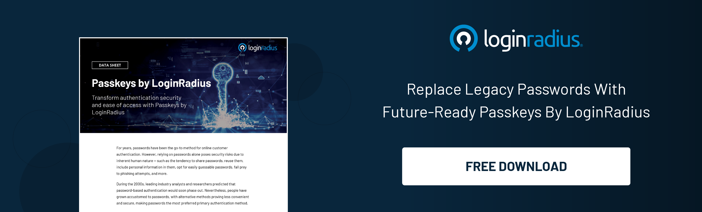

## Introduction

Online shopping has become a staple of modern life, offering unparalleled convenience and variety. However, with its rise comes the increasing need for secure and user-friendly authentication methods. 

Enter [passkeys](https://www.loginradius.com/passkeys-login-authentication/) —a revolutionary way to enhance online shopping by making it simpler, safer, and more convenient. In this blog, we will delve into the three key benefits of using passkeys and how they can transform your digital shopping experience.

### 1. Enhanced Security

Security is paramount when it comes to online shopping. Traditional passwords are often weak, reused across multiple sites, and susceptible to [phishing attacks](https://www.loginradius.com/blog/identity/phishing-for-identity/). Passkeys offer a robust solution to these issues by utilizing cryptographic techniques to ensure secure authentication.

**Key Points:**

* **Phishing Resistance:** Passkeys resist phishing attacks because they don't rely on shared secrets that can be intercepted. Instead, they use public key cryptography, where the private key never leaves your device.

* **No Passwords to Remember:** With passkeys, there's no need to remember complex passwords or worry about password managers, reducing the risk of password-related security breaches.

* **Device-Based Authentication:** Passkeys leverage the security features of modern devices, such as biometric sensors (fingerprint or facial recognition), making unauthorized access nearly impossible.

### 2. Streamlined User Experience

One of the most frustrating aspects of online shopping can be the cumbersome authentication processes. Passkeys significantly simplify this experience, allowing for quick and [seamless logins](https://www.loginradius.com/authentication/).

**Key Points:**

* **Fast and Easy Logins:** Thanks to biometric authentication, logging in with passkeys is as simple as a touch or a glance. This eliminates the need to type long passwords or receive OTPs via SMS.

* **Reduced Login Friction:** A smoother login process means fewer abandoned carts and higher conversion rates for retailers. Shoppers are more likely to complete their purchases when the login experience is hassle-free.

* **Universal Access:** Passkeys work across different devices and platforms, providing a consistent and smooth experience whether you're shopping on your smartphone, tablet, or desktop.

### 3. Greater Convenience

Convenience is a significant factor in user satisfaction. Passkeys offer unparalleled convenience by integrating seamlessly with various devices and services.

**Key Points:**

* **Cross-Platform Compatibility:** Passkeys can be used across multiple platforms and devices, ensuring your authentication method is consistent wherever you shop.

* **Auto-Fill Capabilities:** Many passkey systems come with built-in auto-fill features, streamlining the checkout process by automatically filling in shipping and payment details.

* **Future-Proof:** As more online retailers adopt passkey technology, the [need for traditional passwords will diminish](https://www.loginradius.com/passwordless-login/), paving the way for a more secure and convenient future.

### 4. Improved Privacy

Privacy concerns are at the forefront of online shopping, and passkeys help address these issues by minimizing data exposure.

**Key Points:**

* **Minimal Data Sharing:** Unlike traditional password systems, passkeys do not require sharing sensitive information. Authentication happens locally on your device, ensuring your private data remains secure.

* **Reduced Data Breaches:** Passkeys significantly reduce the risk of large-scale data breaches since there are no central repositories of passwords that can be hacked. This means that even if a website is compromised, your passkey remains safe.

* **Control Over Personal Information:** Passkeys give users [more control over their personal information,](https://www.loginradius.com/customer-privacy/) reducing the need to share unnecessary details with online retailers. This enhances overall privacy and minimizes the risk of data misuse.

### 5. Enhanced Accessibility

Passkeys also improve accessibility, making it easier for people with various needs.

**Key Points:**

* **Simplified Access for All Users:** Passkeys can simplify the login process for individuals with disabilities. For example, those with motor impairments can benefit from [biometric authentication](https://www.loginradius.com/blog/identity/biometric-authentication-mobile-apps/) methods that do not require typing.

* **Multi-Language Support:** Passkey systems often support multiple languages and regional settings, making it easier for non-English speakers to navigate and use the authentication process effectively.

* **Adaptive Technologies:** Passkeys can integrate with adaptive technologies, such as screen readers and voice recognition software, ensuring a more inclusive online shopping experience for everyone.

## Conclusion

Passkeys are poised to revolutionize online shopping by offering enhanced security, a streamlined user experience, and greater convenience. 

By embracing this innovative authentication method, both shoppers and retailers can enjoy a safer, simpler, and more satisfying digital shopping journey. As technology continues to evolve, passkeys represent a significant step forward in the quest for better online security and user experience.

Adopting this technology now can provide immediate benefits and prepare you for a password-free future. Embrace the change and unlock the full potential of your online shopping experience today.

