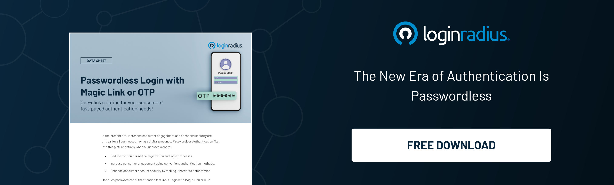

## Introduction

Passwords have become the bane of our online existence. From the constant struggle to remember complex strings of characters to the ever-looming threat of data breaches, users are increasingly abandoning traditional password-based authentication methods in favor of more innovative and secure alternatives. 

This shift marks the dawn of a new era in authentication – one that is defined by the promise of passwordless technologies. 

## #1. Why Users are Dumping Passwords?

The demise of passwords is not without reason. Users are fed up with the limitations and vulnerabilities inherent in traditional password-based authentication systems. The prevalence of [password reuse](https://www.loginradius.com/blog/identity/password-history-expiration-complexity/) across multiple accounts poses a significant security risk, leaving users vulnerable to credential-stuffing attacks. 

Moreover, the complexity requirements imposed by many platforms often result in users resorting to easily guessable or written-down passwords, further compromising security. As data breaches continue to make headlines, the need for a more secure and user-friendly authentication solution has never been more pressing.

## #2. Leveraging the True Potential of Passwordless in 2024 & Beyond

Enter [passwordless authentication](https://www.loginradius.com/passwordless-login/) – a paradigm shift that promises to revolutionize the way we verify our identities online. By eliminating the need for passwords altogether, passwordless authentication offers a seamless and secure user experience. 

Whether through biometric authentication, hardware tokens, or cryptographic keys, passwordless technologies leverage cutting-edge security mechanisms to verify users' identities without the inherent vulnerabilities of traditional passwords. 

As we look to the future, the widespread adoption of passwordless authentication is poised to redefine the authentication landscape, offering both improved security and enhanced user convenience.

## #3. Passwordless Authentication and Regulatory Compliance

In an increasingly regulated environment, the adoption of passwordless authentication can also play a crucial role in ensuring compliance with stringent data protection regulations such as GDPR and CCPA. 

Passwordless authentication helps organizations safeguard sensitive user information and maintain compliance with regulatory requirements by reducing the risk of unauthorized access and data breaches. 

With data privacy becoming an increasingly pressing concern for both consumers and regulators alike, the adoption of passwordless authentication offers a proactive approach to addressing these challenges.

## #4. LoginRadius' Revolutionary Passwordless User Registration and Authentication

At the forefront of this passwordless revolution is LoginRadius – a leading provider of identity and access management solutions. With its innovative passwordless user registration and authentication capabilities, LoginRadius empowers organizations to deliver a secure and frictionless authentication experience to their users. 

LoginRadius has recently introduced a game-changing feature: registration without passwords. This innovation enables passwordless authentication, enhancing user convenience while fortifying security measures. 

With streamlined registration, users can swiftly access their accounts without the hassle of managing passwords. Simultaneously, businesses can ensure compliance with data protection regulations and accommodate diverse registration scenarios, fostering flexibility and trust.

By leveraging advanced authentication methods such as biometrics, magic links, and QR codes, LoginRadius enables organizations to eliminate the reliance on passwords while enhancing security and user convenience.

## #5. Why Choose LoginRadius Passwordless Authentication?

With a proven track record of delivering best-in-class identity and access management solutions, LoginRadius is the preferred choice for organizations embracing passwordless authentication. 

By partnering with LoginRadius, organizations can unlock many benefits, including enhanced security, improved user experience, and [simplified compliance](https://www.loginradius.com/compliances/) with regulatory requirements. With LoginRadius' passwordless authentication solution, organizations can future-proof their authentication infrastructure and stay ahead of the curve in today's rapidly evolving digital landscape.

## To Conclude 

The era of passwords is ending, paving the way for a new era of passwordless authentication. By embracing passwordless technologies, organizations can enhance security, improve user experience, and ensure compliance with regulatory requirements. And with LoginRadius leading the charge, the future of authentication has never looked brighter. 

