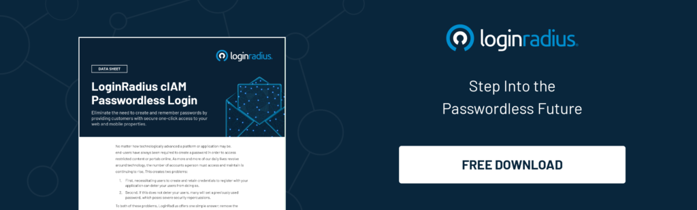

While logging on to your social media account or a bank account online, there are several credentials you tend to feed in before being able to access your account. The process is a tad bit lengthy, and there are even chances of you mismatching or forgetting the passwords for a particular account. But with the help of passwordless magic links, these issues are easily resolved.

## **What is a Passwordless Magic Link?**

A **passwordless magic link** allows you to log in directly with the help of a link that is received through an email. This process is similar to when you receive a one-time-password (OTP) though you might have to physically enter the OTP once you are redirected to the page or application. In the case of passwordless magic links, all you have to do is click on the link sent through an email, allowing you to log in directly.

## **How Magic Links Work?**

Passwordless magic links follow three steps that enable the user a hassle-free login. The three steps are as follows.

*   When a consumer is about to log in/ sign in, they go to the sign-in screen and enter their email address.
*   If the email address entered is a registered type, they will receive the magic link through the email provided.
*   To complete the sign-in process, they have to click on the link received through the entered email.

Optionally, they might be sent a live link during registration, which can be made use of eventually for authentication. 

It is similar to the password reset flow process, where you receive a secret link that allows you to sidestep the password and create a new one. 

The app designers have to follow a process and take out the password and any other approach to resetting protocols. Doing so ensures that you receive a one-time-use **[passwordless magic link](https://www.loginradius.com/passwordless-login/)** at the time of your login.

The app designers or developers can program the link depending on whether the link should be valid for a particular time or for as long as the session is valid. After clicking on the link, the consumer’s information is verified, and a cookie is set up; this ensures that they stay logged in for the entire process of the session.

Even though passwordless magic links display hundreds of password resets, consumers need not remember the password to access the account. Magic links are a user-friendly feature that ensures an inviting user experience without any hardware requirement.

## Pros and Cons of Magic Links

### Pros of Magic Links

1. **Enhanced User Experience**: Magic links offer a seamless login experience, reducing friction and enhancing user satisfaction.

2. **Improved Security**: Magic links mitigate password-related risks like breaches and phishing, providing added security without compromising convenience.

3. **Simplified Onboarding**: Magic links streamline the signup process by eliminating the need for users to create and remember passwords.

4. **Convenient Access**: Users can access their accounts with a single click, making login across devices effortless.

5. **Flexible Implementation**: Magic links can be used across various platforms, making them versatile for applications.

### Cons of Magic Links

1. **Dependency on Email**: Magic links rely on email delivery, which can be problematic if users have limited access or if emails are delayed.

2. **Potential for Email Compromise**: Email account security becomes crucial as magic links are sent via email, posing a risk if the account is compromised.

3. **Lack of Control Over Link Sharing**: Administrators may struggle to monitor and control link sharing, raising concerns about unauthorized access.

4. **Limited Offline Access**: Magic links typically require an internet connection for verification, posing challenges in offline scenarios.

## **How Can Organizations Use Magic Links?**

By opting to add the magic link feature to your mobile apps or email accounts, you are likely trying to make your mobile app or site user-friendly, contributing to a strong security strategy. Here are some reasons for which you can opt passwordless magic links.

*   **Ideal for infrequent login demands:** Passwordless magic link is provided at the beginning of each user session, verifying the user through a single-use basis. This type of magic link login implementation is well suited with mobile apps or the login process of an email account that require single or infrequent authentication, enabling easy access.
*   **Prevent password-based attacks:** Data breaches, hacking, and phishing are ever increasing in today's times. There is a major loss of necessary credentials, and magic link login security ensures the safety of the same by warding off security risks implicating passwords.

## Benefits of Using Magic Links

There are plenty of benefits of using a passwordless magic link. They are as follows -

*   **Easy authentication, deployment, and use:** When the user clicks the magic link, though the flow is similar to that of password reset, **[magic link login implementation](https://www.loginradius.com/blog/identity/2020/10/loginradius-launches-passwordless-login-with-magic-link-or-otp/)** includes some minor changes in the code at no extra cost.

*   **Seamless onboarding:** Earlier, logging into applications used to be more tedious than the present times as you would get a message through email or SMS. Only when the user clicks the required redirecting option would they be able to log in. The most feasible is the magic link alternative, where you need to enter your email address, and by clicking the link, you would be able to register for the app.

*   **Increase app adoption**: Any user would prefer a trouble-free login process. For instance, as soon as the user clicks the magic link, the process is completed. Since magic link login implementation reduces the troubles faced during the login process, it is possible to get a loyal and returning fanbase.

## **What are the Challenges of Using Magic Links?**

Though there are numerous benefits of using a passwordless magic link, there are some challenges that particularly come with security blind spots. Magic links may help secure the transfer of information, ensuring the valid identity of the user. But since the security is tied with the user's account, it is wise that the email account is protected with multi-factor authentication. 

Another challenge you might face with magic link apps is that the admins have no control over link sharing. Regardless of the user, admins are unable to keep track of the confidential or sensitive information shared with others. Apart from these challenges the major one is the increased cyber-attacks with nearly [7K global data breaches ](https://thepaypers.com/thought-leader-insights/goodbye-passwords-passwordless-authentication-is-here-to-stay--1245019)in 2019 that risked about 15 billion user records.

## Examples of When Magic Links Are Used

1. **Mobile Applications**: Productivity tools, social media, and banking apps offer magic link authentication for simplified login.

2. **Email Services**: Some email providers use magic links instead of passwords to enhance email account security.

3. **Online Marketplaces**: E-commerce platforms use magic links for user authentication during registration and login.

4. **Enterprise Applications**: Many organizations adopt magic links for internal systems to streamline access management and enhance security.

## **Why is LoginRadius' Passwordless Magic Link is Preferred Over Others?**

LoginRadius's passwordless magic link enables the user a safe and secure transfer of information. It makes sure that the user's login credentials stay guarded against hacking, phishing, and other fraudulent practices. 

The intent behind the launch of the LoginRadius passwordless magic link is to reduce friction during the registration and login processes. Other business advantages include: 

*   **Consumer experience is streamlined**: One-step registration and login reduce friction for consumers. Furthermore, consumers do not need to create or remember passwords to access their accounts.

*   **Consumers are aware**: This form of authentication is quickly becoming one of the most common trends among consumers. 

*   **Account security is increased**: Since a magic link is created dynamically and sent to the recipient upon request, it removes the risk of password attacks.

*   **Adaptive security is improved**: As an adaptive protection measure for your consumers, you can pre-define the Magic Link expiry period and disable account access after the set period. 

Depending on your business requirements, LoginRadius also supports a variety of implementation and deployment methods.

*   After completing all configurations, you can use the pre-designed Passwordless Login with Magic Link with LoginRadius' **Identity Experience Framework**.

*   Using the LoginRadius **JavaScript Libraries**, you can create an embedded Passwordless Login with Magic Link.

*   You can build on and change the code in the open-source **web and mobile SDKs** to meet your specific needs. 

## Conclusion

Magic links may not be one of the most reliable means of logging in, but it is undoubtedly a convenient means for [users to log in to their accounts](https://www.loginradius.com/blog/identity/2021/04/maintaining-quality-data-security-practices/). In today’s fast-paced times, any sort of validation needs to be done with immense meticulousness, and to cater to this need; a passwordless magic link is the right solution. 

## Frequently Asked Questions (FAQs)

**1.  What is a magic link?**

A magic link is a secure authentication method that allows users to log in by clicking on a unique link sent to their email, eliminating the need for passwords.

**2. How does the magic link work?**

Users enter their email, receive a link, and click to access their account, streamlining the login process and enhancing security.

**3. Are magic links safe?**

Yes, magic links enhance security by mitigating password-related risks like breaches and phishing, offering a secure authentication alternative.

**4. How do you make a magic link?**

Developers program the system to generate a one-time-use magic link upon user request, ensuring secure authentication without passwords.

