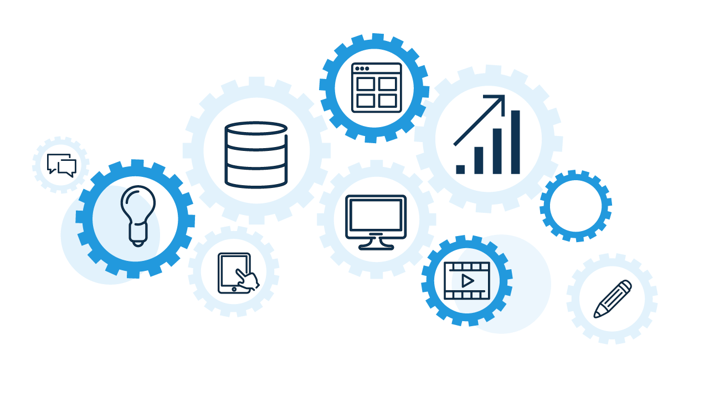
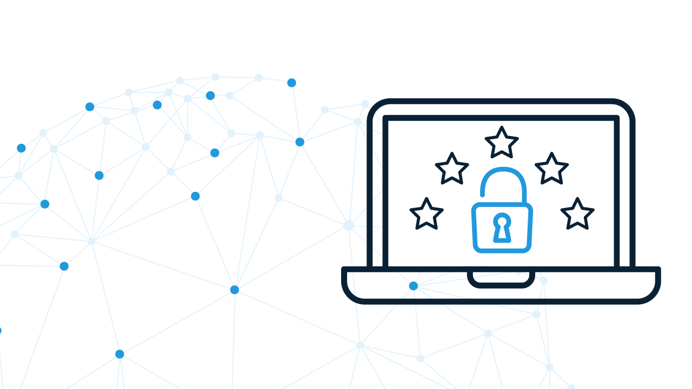
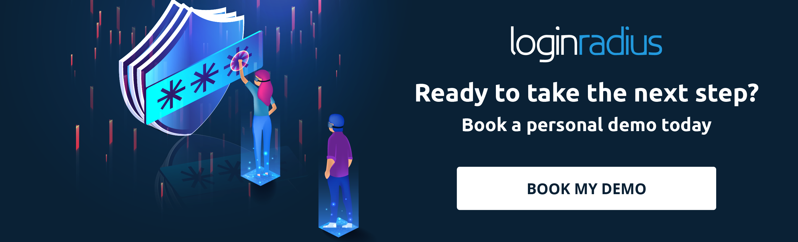

If you aren’t already taking advantage of CIAM (customer identity and access management), you should be. But what components do you need to include if you want to implement the perfect CIAM platform? One that meets all of your organization’s needs, both now and in the future?

The CIAM revolution has taken over the access management landscape in just five years. Winning customer trust by safeguarding their data is becoming a competitive advantage.

[Research from Deloitte](https://www2.deloitte.com/content/dam/insights/us/articles/consumer-data-privacy-strategies/DUP_970-Building-consumer-trust_MASTER.pdf) shows that 70% of consumers are more likely to purchase from consumer product companies that they believe protect their personal information.

Customer identity management goes beyond simply repurposing employee IAM for customers—CIAM’s scalability, scope, and customer focus enable you to go far beyond simple privacy management and access verification. In fact, it forms a [key component](https://www.kuppingercole.com/blog/tolbert/ciam-as-a-key-factor-in-the-digital-transformation) of effective digital transformation.

To succeed in today’s environment, [businesses should consider](https://www.loginradius.com/blog/2018/03/top-5-business-objectives-that-ciam-solves/) an all-in-one CIAM platform that manages people, systems, and devices used throughout their organization. Customers, vendors, partners, and more should all be included in a comprehensive framework if you want to enable true digital transformation.

There are a number of key features that are essential if you want to implement a robust customer identity and access management framework.

### 1\. Advanced Frictionless Security

The initial seed behind CIAM will always be the need to securely manage access, with many of its advanced functions evolving from this essential starting point. Going beyond old-fashioned access methods, a modern customer identity management solution should enable frictionless security. By enabling seamless authentication between people, systems, and things, CIAM can enable low-friction access for all, while still remaining secure.

Frictionless security means easy-to-use security. Your customers are presented with a beautifully integrated access solution that works so well they barely notice it.

### 2\. Strong Privacy Management

[Compliance with local data protection laws](https://en.wikipedia.org/wiki/Information_privacy_law) can be a chore, especially given their constant evolution. A good customer identity platform should enable you to keep up with local laws anywhere in the world that you do business.

With country-specific or regional control over how personal data is stored and managed, you’ll always meet legal requirements, saving you compliance management costs each year.

These aren’t the only potential costs you can save—legal fees can run high when privacy management fails. Presenting customers with easily self-managed privacy choices and a solid privacy policy also shows them that their data is safe and shows your company to be competent and professional in handling these issues.

This reputation will encourage customer loyalty in the long run.

### 3\. Integration with APIs

A perfect CIAM platform needs to be able to integrate more than just people. There are lots of identity-filled business processes and practices, and in the future the number of these is only set to grow.

A well-designed customer identity solution connects all native and third-party applications that handle customer data.

APIs let you quickly integrate systems that need to work together across providers, so the APIs available from your CIAM provider need to work with every system that can benefit from [CIAM integration](https://www.loginradius.com/integrations/).

To make the most of your customer identity and access management solution, it needs to integrate seamlessly with your CRM, business intelligence, analytics, content management, and marketing automation systems. You also need to know that your vendor has the capacity to create effective APIs to let you take advantage of new technology as it comes online.

### 4\. Data Access Control and Aggregation Process

[Customer data needs to be securely protected](https://www.loginradius.com/blog/2018/10/digital-transformation-safeguarding-customer-experience/) at all times, yet at the same time be available to those who should be able to use it. A good CIAM solution will let you develop schemas flexibly so you can get the most out of your systems

Without effective data access control, data governance is useless. You need to know these essentials:

- Where did the data come from?
- Where should it be synchronized?
- Who should have the right and opportunity to access and/or change it?

All of these things need to be manageable across future system updates without fail. At the same time, there should be no need to mess around with schemas that work well.

### 5\. Security Compliance

Your CIAM platform must [meet compliance requirements on a global scale](https://secureprivacy.ai/complete-guide-to-international-data-privacy-laws/), even though many of these requirements are constantly changing and evolving. Currently, here’s what your CIAM platform needs to do:

- Offer redundancy practices for protecting data in transit and at rest.
- Store and manage access to customer data.
- Implement multi-factor and enhanced authorization.
- Be regularly certified by third-party security standards like SOC 2, HIPAA, and ISO.
- Be able to meet industry and location-specific needs wherever you do businesses.

Make sure you aren’t wasting time and money on security compliance—use an up-to-date cloud CIAM system.

### 6\. Customer Analytics

One of the best things about an advanced CIAM solution is the ability to tie in [customer analytics](https://www.loginradius.com/customer-insights/), giving you a much deeper and clearer understanding of each customer. Here’s what this data can be used for:

- Monitor and improve customer experience.
- Feed data back to product development teams.
- Hone sales and marketing functions.
- Deliver targeted content effectively.

CIAM can be used to both extract and store many different data points, feeding them back to your other systems for use.

### 7\. Scalability During High Demand

Your CIAM solution must be not only scalable, but rapidly so, making it possible to meet unexpected demand without faltering. You shouldn’t ever need to worry that a promotion or event could affect the smooth operation of your account features.

### 8\. Better Customer Experience

All told, your CIAM platform needs to boost customer experience in every possible way. A reduced initial entry threshold that [leverages social login](https://www.loginradius.com/blog/2018/11/reconsidering-social-login-security-privacy-angle/) or passwordless login is just the start.

Advanced analytics, effective self-service options, and integration with all of your customer-facing functions should all work to improve the way customers access your systems. And storing everything about one customer in the same place—data, analytics, preferences, and browsing/purchase history—will make it much easier for employees to manage customer accounts.

### Conclusion

The main thing to remember is that customer IAM is all about customer experience and customer trust. More than just an identity platform, and more than just an access management solution, LoginRadius offers a way to go beyond customer expectations.

Today that means you need to offer self-service data management and make use of the additional customer data that CIAM platform can give you. Only then can you improve what you offer customers at virtually every point in their journey.

