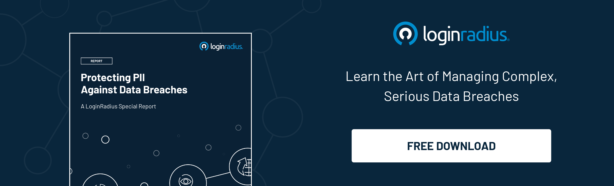

When you visit a website, it may store some basic information about you, such as your IP address, the operating system on your computer, the browser you use, ISP used to connect, location, screen resolution, etc. Some websites store login cookies on your computer, so you don't have to log in every time you visit them. 

But this is not all. When browsing online, you also leave enough breadcrumbs for websites and web applications to identify you. 

We often talk about personally identifiable information (PII), but few users know precisely what it is. 

Besides, there are many ways to manage personal information. Having said that, it is one thing when you [protect your PII from potential exploitation](https://www.loginradius.com/blog/start-with-identity/consumer-data-privacy-security/), and it's entirely different when a third party manages it for you. 

So, let us take a deep dive to discover the term personally identifiable information or PII.

## What is Personally Identifiable Information

Data that helps identify a specific individual is called personally identifiable information, or PII in short. For example, your social security number is a good example of** **PII Compliance because it is unique, and the number itself will lead someone to find you directly.

 In addition to this, your full name, driver's license ID, email address, bank account information, password, or phone number can also be considered personally identifiable information.

PII has a principal role in network security, especially when it comes to data breaches and identity theft. For example, if a company that manages personal information encounters a data breach, its customers will likely suffer personal identity theft because the company-managed data will be stolen.

The information related to this is stored with online marketers and brokers who trade your data to various companies that "want to show you appropriate ads" and provide you with an "improved user experience."

### Key takeaways

* Personally identifiable information (PII) can identify a person when used alone or with other relevant data.
* Confidential identifying information can include your full name, social security number, driver's license, financial information, and medical records.
* Non-confidential personally identifiable information is easily accessible from public sources and may include your zip code, race, gender, and date of birth.

## Importance of PII Compliance

Advanced technology platforms have changed the way companies operate, government legislation, and personal contact. With the help of digital tools such as mobile phones, the Internet, e-commerce, and social media, the supply of all kinds of data has surged.

Such data is collected, analyzed, and processed by enterprises and shared with other companies. The large amount of information enables companies to gain insights into how to better interact with customers.

However, the emergence of big data has also increased the number of data breaches and cyberattacks by entities that realize the value of this information. As a result, people are concerned about how companies handle sensitive information about their customers. Regulators are seeking new laws to protect consumer data, and users are looking for more anonymous ways to stay digital.

## Protection of Personally Identifiable Information

Many countries/regions have adopted multiple data protection laws like the GDPR, CCPA to create guidelines for companies collecting, storing, and sharing customers' personal information. Some basic principles outlined in these laws stipulate that certain sensitive information should not be collected except in extreme circumstances.

In addition, the regulatory guidelines also stipulate that if the data is no longer needed for its intended purpose, it should be deleted, and personal information should not be shared with sources whose protection cannot be guaranteed. Moreover, supervision and protection of personally identifiable information may become a significant issue for individuals, companies, and governments in the coming years.

### Selling the stolen data

Cybercriminals compromise data systems to access PII and then sell it to buyers willing to buy in the underground digital market. For example, the [Internal Revenue Service (IRS) in the US suffered a data breach](https://www.usatoday.com/story/tech/2015/05/26/irs-breach-100000-accounts-get-transcript/27980049/) that resulted in the theft of the personally identifiable information of more than 100,000 taxpayers. Criminals used quasi-information stolen from multiple sources to access the IRS website application by answering personal verification questions that should belong only to taxpayers.

### Adopting PII compliance

Without considering the type or size of any company, all organizations must have some detailed and [comprehensive knowledge of PII compliance](https://www.loginradius.com/blog/start-with-identity/privacy-compliance/) it collects and how it can be utilized. The companies must have legal knowledge about which among the various country and state regulations related to PII is applied to some specific situation related to them. Also, it is important to consider that adopting acceptable use of privacy policies associated with this particular data can be advantageous.

## Conclusion

The security of personal identity and other details is at increasing risk today, with hackers finding new ways to hack into websites. Therefore, enterprises of all sizes must maintain PII compliance to protect the information of the company and its users. With PII compliance, businesses can maintain[ improved data security](https://www.loginradius.com/blog/start-with-identity/data-security-best-practices/). 

