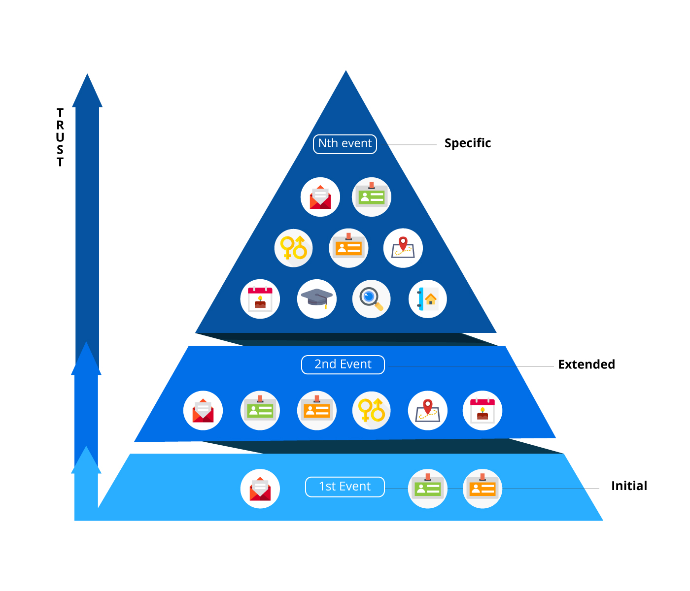
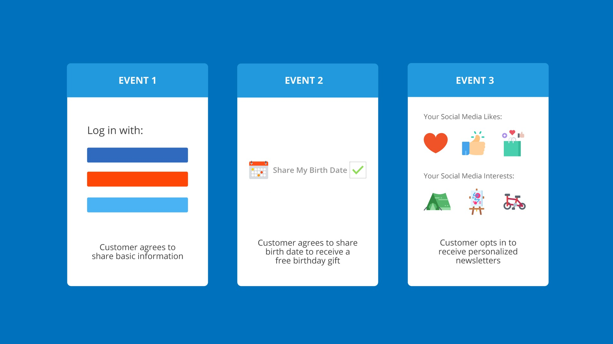

Have you ever had a website ask for personal information that made you say, “Why do you need to know _that_?” Customers may not always understand why certain information is necessary, which can cause a lack of trust between them and the company.

[Progressive profiling](https://www.loginradius.com/progressive-profiling/) is a new feature of the LoginRadius Identity Platform that gradually gathers  data from customers in an automated way.

## The Benefits of Progressive Profiling

The benefit of progressive profiling is that it requests permissions for a customer’s data at various stages of their life cycle rather than all at once. You can establish a greater level of trust with your customers as you only request their personal data when it is needed.

### Progressive Profiling Strategy

When considering whether and how to use progressive profiling with your customers, ask yourself these questions:

- What is the customer journey? What types of interactions do you have with customers over time?
- What customer data and permissions are you requesting now?
- What additional customer data and permissions could you request that would allow you to serve customers better?
- What data and permissions are required upfront, and which ones are more directly related to interactions that are further along in the customer journey?
- Would shorter forms and/or fewer permission requests increase conversion?

A progressive profiling strategy can create a smoother registration experience for customers while also optimizing the customer data and permissions available.

There are two types of progressive profiling: multi-step registration and social accounts.

### Progressive Profiling with Multi-Step Registration

Progressive profiling for customer registration allows you to split a potentially complicated registration process into multiple steps. You can capture a customer’s information upfront and then slowly build out a holistic view of that customer through subsequent actions.

 **As customer trust increases, businesses can request more data**.

The subsequent actions often take the place of secondary registration forms or event-driven calls to action for your customer to supply additional profile metadata. For example, you could request more detailed data only after a customer has logged in a certain number of times or navigated to a certain digital property.

### Progressive Profiling with Social Accounts

Progressive profiling with social accounts is the process of progressively requesting additional OAuth Access permissions from your customers. This process allows you to minimize the access permissions requested and get business-critical access from your customers based on their social providers.

 **An example of progressive profiling with social accounts**

Once the customer interacts more with your platform, you can begin requesting additional permissions from the social provider they are authenticating with. For example, you can ask for basic information, such as name and email, during registration, and then ask for birthdate, likes, and interests from the same customer at a later point.

**To learn more about how LoginRadius can improve customer experience and data collection using Progressive Profiling or other features, Book a demo today.**

