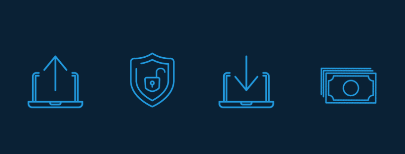
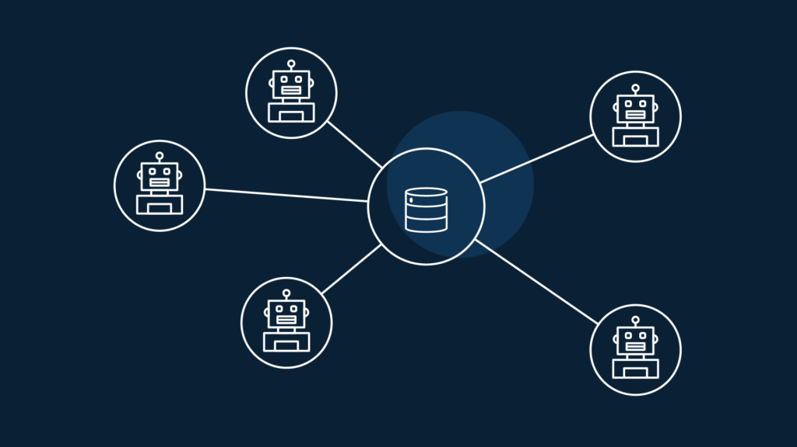
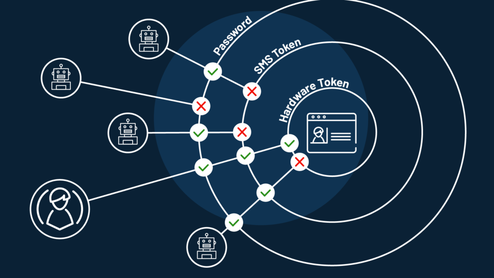
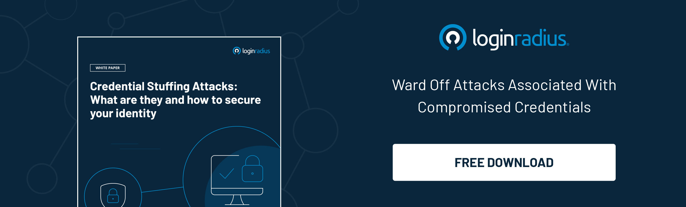

If you have been operating a web application where consumers need to authenticate themselves, the term 'credential stuffing' shouldn't be new to you. 

In case you haven’t heard it before, credential stuffing is a cybersecurity threat where hackers use stolen credentials to attack web infrastructures and take over user accounts. 

Someone or the other is always out there freely distributing breached databases on hacker forums and torrents to help criminals evolve their velocity of attack. 

Their strategy is pretty straightforward.

Hackers use automated bots to stuff those credentials into the login pages across multiple sites to unlock multiple accounts. Also, since people do not change their passwords often, even older credential lists record relative success. 

The threat gets further elevated when hackers use credentials from organizations to login and hijack consumer accounts. Not only the company suffers revenue loss and brand damage, consumers feel the blow too. 

In this blog, we will walk you through the credential stuffing attack lifecycle and discuss the best ways to respond to attacks and [mitigate damage to your business](https://www.loginradius.com/blog/2020/05/cyber-threats-business-risk-covid-19/). 

## Examples of Recent Credential Stuffing Attacks

As new vulnerabilities and exploits are discovered every day, various instances demonstrate that each attack is more sophisticated than the last. Let's look at a few recent examples: 

- According to a [report by CBC Canada](https://www.cbc.ca/news/politics/canada-revenue-agency-cra-cyberattack-1.5688163), the Canada Revenue Agency has confirmed that out of roughly 12 million active GCKey accounts, 9,041 user credentials were acquired fraudulently through credential stuffing. They have temporarily shut down their online services.
- According to an [FBI security advisory](https://www.documentcloud.org/documents/7208239-FBI-PIN-on-credential-stuffing-attacks.html) obtained by ZDNet, between January and August 2020, hackers used a bulk load of credential pairs to conduct more than [$3.5 million fraudulent check withdrawals](https://www.zdnet.com/article/fbi-says-credential-stuffing-attacks-are-behind-some-recent-bank-hacks/) and ACH transfers from a mid-sized financial institution in the US. 
- Another NY-based investment firm reported experiencing credential stuffing attacks between June 2019 and January 2020 against their mobile APIs. Although no fraud was reported, it could have resulted in nearly $2 million in revenue.

## What is Credential Stuffing

Credential stuffing is a kind of identity theft where hackers automatically inject breached username and password credentials to access numerous sites. 

Think of it as a brute force attack that focuses on infiltrating accounts. Once the hacker acquires access into the web application, they crack open a company's database that carries millions of personally identifiable information and exploits them for their own purpose.

## How Credential Stuffing Works

Want to know the methods behind the screen? In a nutshell, here's the hacker's process:

- **Hacker gets stolen data**: Criminals share or sell data on public websites and the Dark Web.
- **Hacker utilizes data**: Using stolen passwords and usernames, hackers attempt website logins.
- **Hacker achieves goal**: After gaining access to a victim's site, hackers get more valuable [information for more attacks](https://www.loginradius.com/blog/2019/10/cybersecurity-attacks-business/) or to sell.

## Effects of Credential Stuffing

As you can see, when a business suffers from stolen credentials, it can cost them dearly. In fact, it's been reported that in the USA, 75% of credential stuffing attacks are programmed at financial institutions. So what happens when you aren't prepared for an attack? 

- It strains the security budget leading to an increase in security cost. 
- There is a noticeable loss of revenue from downtime, alongside losing customers to the competition.
- The cleanup costs can cripple businesses to the core. 
- Customers do not trust businesses that cannot protect their data leading to customers discontinuing their loyalty.  

## How to Detect Credential Stuffing Attacks

Hackers send armies of bots to conduct thousands of commands, resulting in millions of stolen data. But it gets worse. In what is called "the biggest collection of breaches" to date, billions of stolen records are compiled and shared for free on hacker forums. 

So, how can you detect bot attacks? Here are the warning signs. 

- Check for changes in site traffic like multiple login attempts on multiple accounts, within a limited timeframe. 
- Never overlook use cases where you witness a higher-than-usual login failure rate. 
- Be aware of any recorded downtime caused by an increase in site traffic. 

But beware: These credential stuffing bot detection techniques aren't 100% effective. You'll need extra protection—called bot screening—to stop these bots. It is a sophisticated screening technology for detecting malware on your devices. 

It's built to monitor the telltale signs of bot activity such as the number of attempts, the number of failures, access attempts from unusual locations, unusual traffic patterns, and unusual speed. 

Luckily, you'll find bot detection in robust [customer identity and access management solutions](https://www.loginradius.com/blog/2019/06/customer-identity-and-access-management/). A CIAM platform will also provide device authentication and customer data protection.

## A Hacker’s Toolbox

Let's find out how hackers process their share of credential stuffing attacks.

### Step 1: Download a combo list. 

A combo list is a combined list of leaked credentials obtained from corporate data breaches conducted in the past. These are often available for free within hacking communities or listed for sale in underground markets (Darkweb). 

### Step 2: Upload a credential stuffing tool.

Sophisticated hackers develop plugins or tools called account checker tools. These contain custom configurations that can test the lists of username/password pairs (i.e., "credentials") against a target website. Hackers can attack sites either one by one or via tools that hit hundreds of sites at once.

### Step 3: Analyze and access accounts

Hackers use account-checking software to log into financial accounts successfully. 

### Step 4: Export results from accounts.

Match found. What's next? When a match is found, they can easily view a victim's account balance and gain access to cash, reward points, or virtual currencies. 

### Step 5: Steal funds and resell access.

Because hackers use genuine user credentials, they gain undetected access. What follows is a full-fledged [account takeover](https://www.loginradius.com/blog/2020/04/corporate-account-takeover-attacks/). Next, the attacker can drain the account in seconds or resell access to other cybercriminals.  

## How to Prevent Credential Stuffing Attacks

But then, there is good news after all. Preventing these attacks is possible, and you can keep your business and customer safe by following the tips below:

### 1\. Bot detection

One of the most effective ways to differentiate real users from [bots is with captcha](https://www.loginradius.com/engineering/blog/a-bot-protection-overview/). It can provide defense against basic attacks. 

But beware: Solving captcha can also be automated. There are businesses out there that pay people to solve captchas by clicking on those traffic light pictures. To counter, there is reCAPTCHA that is available in three versions:

-  The classic "I'm not a robot" checkbox.
-  An "invisible" box, displayed only for suspicious users.
-  A "V3" that evaluates users on reputation and behavior.

### 2\. Adopt a strong password guide

Set strict [password complexity rules](https://www.loginradius.com/blog/2019/12/worst-passwords-list-2019/) for all your password input fields like length, character, or special character validation. If a customer's password resembles that of a data breach, they should be asked to create new passwords and provide customers with tips on building stronger passwords during their password-creation process.

### 3\. Implement multi-factor authentication

[Multi-factor authentication](https://www.loginradius.com/multi-factor-authentication/) (2FA or MFA) is the new-age method to block hackers using multiple security layers. MFA makes it extremely difficult for hackers to execute credential stuffing attacks. The more obstacles you give a hacker to verify user identities, the safer your site will be.

### 4\. Set up risk-based authentication

Risk-based authentication (RBA) calculates a risk score based on a predefined set of rules. For instance, it can be anything related to a login device, IP reputation, user identity details, geolocation, geo velocity, personal characteristics, data sensitivity, or preset amount of failed attempts. RBA comes handy in case of high-risk scenarios where you want your customers to use customizable password security.

### 5\. Set up passwordless login

Hackers can also deny access to customers' own resources once they break-in. Having passwords as a factor of authentication can leave corporate and business accounts vulnerable to credential stuffing. So, why not remove them altogether? Use [passwordless authentication](https://www.loginradius.com/blog/2019/10/passwordless-authentication-the-future-of-identity-and-security/) as a safer way to authenticate users for more confined access into their accounts.

## Preventing Credential Stuffing With LoginRadius Identity Management

LoginRadius advocates a number of alternative authentication methods to mitigate the risk of credential stuffing. The identity and access management solution provider promotes passwordless practices like social login, single sign-on, email-based passwordless login to address the [vulnerabilities of businesses](https://www.loginradius.com/blog/2019/10/cybersecurity-attacks-business/). 

**Social Login**: Social login is an authentication method that allows users to log in to a third-party platform using their existing social media login credentials. This eliminates the need to create a new account or enter credentials altogether.   

**Single Sign-On**: [Single sign on](https://www.loginradius.com/blog/2019/05/what-is-single-sign-on/) (SSO) minimizes the number of credential stuffing attacks because users need to login once using just one set of credentials, and subsequently logged into other accounts as well. This provides a more robust protective layer to user accounts. 

**Email-Based Passwordless Authentication**: The user is required to enter the associated email address. Upon which a unique code or magic link is created and sent to the email ID. It is valid for a predefined time frame. As soon as the server verifies the code, the user is let in. 

**Multi-factor Authentication**: MFA offers better security by providing additional protection to traditional credentials through multiple layers. They are mostly implemented through security questions, ReCaptcha, and others. Due to extra security checks, LoginRadius assures businesses that customers' data is safe.  

## Conclusion

Credential stuffing is easy to perform, so its popularity with criminals will increase with time. Even if your business isn't affected yet, you must [protect your website](https://www.loginradius.com/blog/identity/digital-privacy-best-practices/) and watch for all the red flags listed in this blog. 

If you're looking for a solution to help prevent credential stuffing, LoginRadius is easy to deploy. It  provides robust security with bot detection and multi-factor authentication, among other safeguards.

