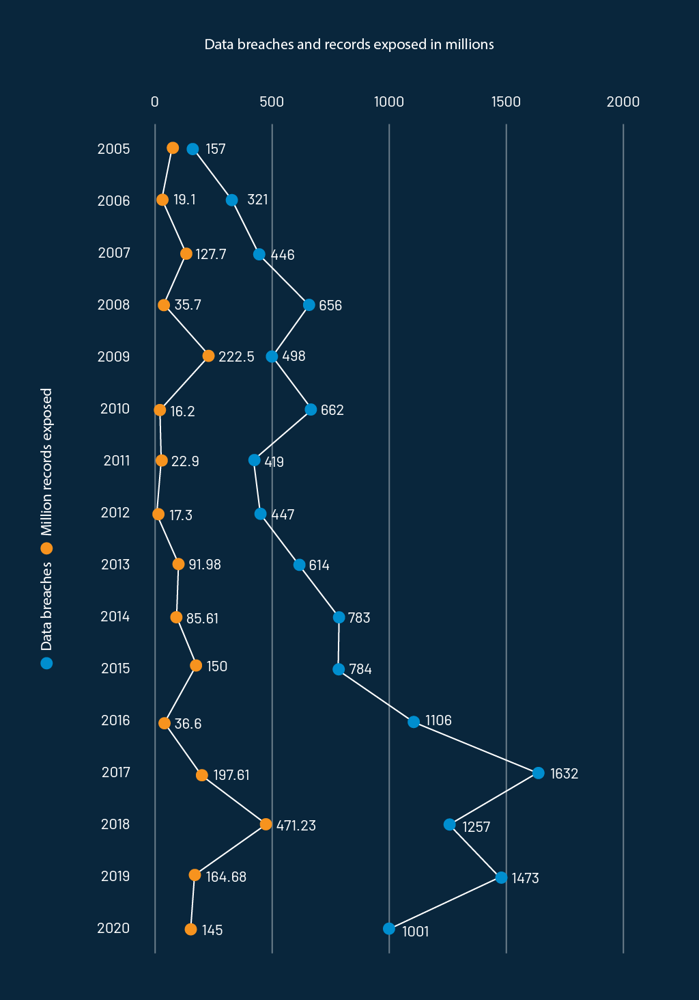
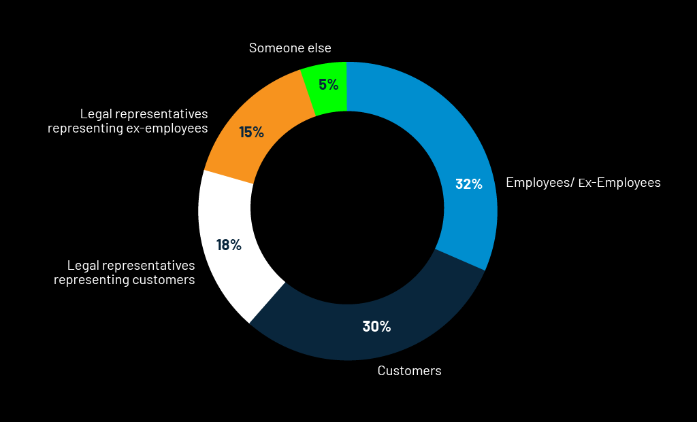
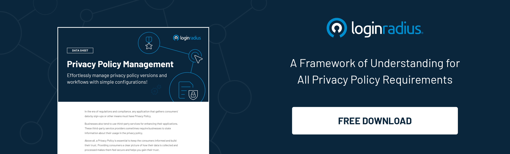

The booming number of data breaches across the globe depicts that privacy compliance is the need of the hour. 

For those who don't know what privacy compliance is—it's an important data security practice that is becoming progressively necessary as data privacy laws like the EU’s GDPR become more stringent.

Here are the stats showcasing total data breaches and exposed records in the US alone from 2005-2020. 

Source: [Statista](https://www.statista.com/statistics/273550/data-breaches-recorded-in-the-united-states-by-number-of-breaches-and-records-exposed/)

Some of the major data breaches over the last couple of years include Marriott, T-Mobile, Quora, British Airways, and recently, Capital One Bank in the US. 

Considering these high-profile leaks, the data protection compliance program in business is now crucial than ever before. 

A business won’t even realize a breach for weeks but all it takes is a minute for a successful data leak. 

## What is Privacy Compliance Law

Privacy compliance law states how organizations (regardless of their industry) meet regulatory and legal requirements for the collection, processing, and maintenance of personal information. 

A breach in data privacy can lead to legal consequences and may be followed by investigations and fines.

But why do organizations need to immediately think about getting privacy compliant?

Well, consumers or employees can respond with civil lawsuits whenever their privacy is compromised while an organization collects and processes personal information. 

## Past and Current Privacy Laws 

Privacy compliance is the line between the legal and the illegal. Privacy laws and regulations help protect consumers in different countries by ensuring data is handled appropriately. 

The EU Data Protection Directive (Directive 95/46/EC), adopted back in 1995, was designed for protecting the privacy and security of personal data. 

According to EUDPD, the data protection rules must be considered whenever personal data related to EU citizens is collected or exchanged for processing. 

Moreover, the General Data Protection Regulation (GDPR), a legal framework approved in 2016, replaces its predecessor EUPD and sets essential guidelines for collecting & processing personal information from the European Union residents. 

For US citizens, the California Consumer Privacy Act (CCPA) is intended to protect unauthorized access to PII (Personally Identifiable Information).

Companies not in compliance with the [GDPR and CCPA](https://www.loginradius.com/blog/start-with-identity/2019/09/ccpa-vs-gdpr-the-compliance-war/) face hefty fines and may end up tarnishing their brand reputation. 

Businesses must consider the fact that these regulations not only apply when the responsible parties are established or operated within the countries but are also applicable when the concerned organizations are operated and located outside the countries but attracting the EU or the US residents. 

## Privacy Compliance Challenges that Organizations Might Face in 2021

*   **Increasing DSARs **

While the world is fighting an uphill battle amidst the COVID-19 pandemic, there’s a significant surge in data subject access requests (DSARs). 

DSAR (Data Subject Access Requests) is a request by an employee or a consumer to an organization regarding the detailed information of processing of their data along with an explanation of the purpose. 

The below-mentioned stats depict the submission of Data Subject Access Requests in the UK in 2020. 

Source: [Statista](https://www.statista.com/statistics/1177143/submitters-of-data-subject-access-requests-uk/)

The overwhelming DSAR requests by consumers demanding to know the type of data that is being collected by a company is perhaps the main reason why organizations must cover their back and have the required compliance policies in place.

Organizations can consider [LoginRadius to handle multiple compliances](https://www.loginradius.com/compliances/) with all major data security and privacy laws.

*   **Increasing Number of Data Breaches**

The paradigm shift in the way people used to work conventionally and adoption of the work from home approach has further increased the risk.

There’s a huge surge in the number of data breaches during the COVID-19 pandemic as cybercriminals are significantly targeting the new vulnerabilities in a company’s overall defense system.

**Also read**: [Protecting Organization from Cyber-Threats: Business at Risk during COVID-19](https://www.loginradius.com/blog/start-with-identity/2020/05/cyber-threats-business-risk-covid-19/)

Meanwhile, it can take up to months for a company to identify a security/data breach as cybercriminals are already focusing on a particular company’s new processes.

So organizations must quickly respond to the current scenario and assess what destruction has been done so far and work on getting adequate safety and compliance.

## Why is Privacy Compliance Important

One of the biggest reasons why organizations must comply with privacy regulations is to avoid heavy fines.

The ones that don’t implement the privacy regulations could be fined up to millions of dollars and can also face penalties for years.

Due to an increase in the number of regulations including the EU’s GDPR and the United States’ CCPA that protects unauthorized access to crucial data, privacy compliance is now crucial for every business.

Since it not only protects consumers’ privacy but eventually improves brand value and offers a competitive advantage; businesses must partner with a reputed CIAM service provider to ensure they’re compliant with the government privacy regulations.

**How organizations can benefit from complying with data privacy**

*   Prevents data breaches
*   Improves and maintains a brand value
*   Strengthens business growth
*   Builds customer trust and loyalty

## How LoginRadius CIAM Solution Helps in Maintaining Data Privacy and Compliance

As a leading GDPR-compliance-ready CIAM platform, LoginRadius works seamlessly for any business model. 

LoginRadius simplifies data privacy compliance by bringing all the consumer data under a single roof, which enables complete profile management of an individual consumer in a single intuitive admin console.

Our platform ensures you remain compliant with GDPR and stay ahead of your competitors when it comes to securing important consumer data.

Need help in getting compliance-ready? [Reach us](https://www.loginradius.com/contact-sales/) for a Free Consultation.

## Conclusion

Protecting consumer data should be the #1 priority of businesses seeking substantial growth in the year 2021 and beyond.

Any security breach leading to personal data theft of consumers could negatively impact the brand reputation of an organization leading to legal consequences.

As discussed earlier, businesses must seek professional help to ensure compliance to stay ahead of the curve.

