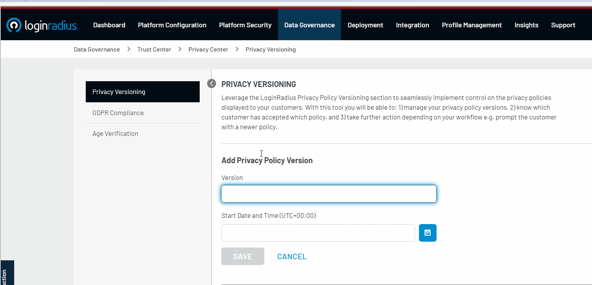

Businesses are accountable to consumers that trust them with their personal data. So, they should not only be protecting it but also should be explaining how they are managing and processing such data. 

Our recently launched Privacy Policy Management serves as the central place where businesses maintain versions of their privacy policy, notify consumers when it changes, or get their acceptance of the newer versions. 

## Intend Behind the Launch

With LoginRadius Privacy Policy Management, we achieve the following benefits for businesses. 

*   **Win consumer trust**: With privacy policy briefing about consumer data collection and usage, businesses can give more clarity around what they're doing to [protect such data](https://www.loginradius.com/security/), and in the process win consumers’ trust.
*   **Easy implementation**: Businesses can easily configure and deploy privacy policy versioning and related workflows from the LoginRadius Admin Console. It significantly saves time and development efforts.
*   **Be compliance-ready**: Businesses can be easily [compliant and audit-ready](https://www.loginradius.com/compliances/) by keeping a record of information like time of issuing a policy version, until when a policy version was effective, who agreed to which policy version, etc.

## Key Features of LoginRadius Privacy Policy Management 

As the global compliance and data protection landscape continue to evolve, LoginRadius offers the following capabilities:

*   **Versions **- Businesses can name the privacy policy version after each update, making it easier to handle versioning.
*   **Timestamps **- Businesses can set and manage the date and time from when a privacy policy version will be effective. They can set the schedule in advance, and the consumers are notified about the new version with a message of their choice to ensure personalization.
*   **Flow Type **- Businesses can choose whether notifying the consumers about the privacy policy change is enough or [consumers should provide acceptance](https://www.loginradius.com/blog/start-with-identity/2020/06/consumer-data-privacy-security/) on the same. LoginRadius handles the notification or the acceptance process on their behalf. 

## Implementation and Deployment 

LoginRadius supports the following implementation and deployment methods for Privacy Policy Management.

*   **JavaScript:** Implementation and deployment using LoginRadiusV2.js automatically populate the privacy policy message on the registration and login pages if the flow type is Strict in the configuration. 
*   **APIs**: LoginRadius offers [API support](https://www.loginradius.com/identity-api/) to prompt consumers to view the privacy policy and allow them to accept it.

## Conclusion 

Businesses cannot escape from maintaining privacy policy versions and workflows for their consumers. Looking forward, LoginRadius' Privacy Policy Management will effortlessly ensure a holistic insight into privacy policies where consumers are notified about new updates, everytime. 

