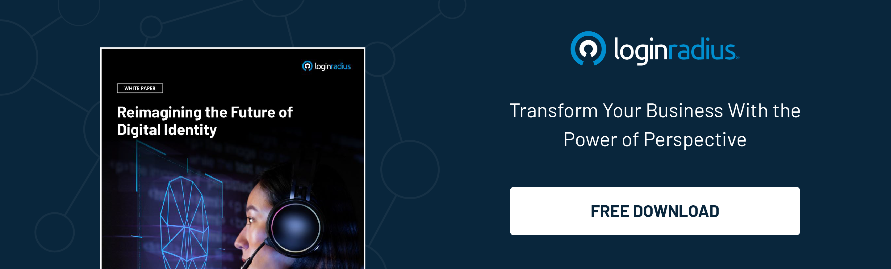

## Introduction

Think about what your purse or wallet looks like today. You probably have many different pieces of identification: driver’s license, work ID, insurance cards, buyer loyalty cards, membership cards, frequent flyer cards, and of course, credit and debit cards. It is time-consuming to sort through them to find the right one, and the risk of dropping one is ever-present.

Things get even more complex when you add digital identities. With a new username and password for nearly every site or application you use, it is easy to build a huge list of identities. Indeed, <a rel="nofollow" href="https://tech.co/password-managers/how-many-passwords-average-person"> the average person has more than 100 passwords </a>, and business employees have nearly 200. 

Keeping track of all these identities is cumbersome and leads many users to adopt risky practices (e.g., duplicating passwords) just so they can remember them. There must be a better way, right?

The answer lies in reusable digital identities.

## What is a Reusable Digital Identity?

Reusable digital identities are verified credentials that a person can use both online and offline any time they need to authenticate who they are. These digital IDs may include a range of identifying information from unique ID numbers to birthdates, [biometrics](https://www.loginradius.com/blog/identity/what-is-mob-biometric-authentication/), citizenship information, and more. And, importantly for today’s post-COVID world, they can also include health information such as vaccination status.

Governments and companies worldwide are investing heavily in reusable digital IDs, with countries across the globe launching electronic ID initiatives. For example, India now has over <a rel="nofollow" href="https://www.thalesgroup.com/en/markets/digital-identity-and-security/government/identity/digital-identity-services/trends"> 1.3 billion electronic IDs </a> for its citizens (over 99% of all adults). 

The adoption rate is also increasing rapidly. According to one study, the global reusable identification market will grow seven times larger in just the next five years, from just over $32 billion to nearly $270 billion.

## Reusable Digital Identities Offer Tremendous Benefits

Individuals, businesses, and governments alike can benefit from reusable digital identities. And as technology matures, the upsides will only increase.

* Standardization

The contents and requirements for different IDs vary widely. Reusable digital IDs offer an opportunity to standardize requirements, simplify information sharing and allow any organization, from national governments to small businesses, to work with a single identity.

Governments and international organizations are already pursuing standardization efforts. In late 2021, the International Organization for Standardization and the International Electrotechnical Commission published <a rel="nofollow" href="https://www.iso.org/standard/69084.html"> standards for a common mobile driver's license </a> (ISO/IEC 18013-5:2021). In the U.S., the National Institute of Standards and Technology recently updated its Digital Identity Guideline SP 800-63-4. And more work is ongoing.

* Convenience for users

Naturally, one driving force behind a single digital ID is convenience. Even with the widespread availability of password managers, many people struggle to keep track of all their identities. Surveys indicate that [33% of users have forgotten a password](https://www.loginradius.com/resource/consumer-digital-identity-trend-report-2022) and tried to recover it. Having a single, trusted ID would offer individuals a much simpler, more streamlined experience.

* Enhanced privacy protections

Information security and data privacy are a constant concern in today’s increasingly digital world, especially for highly sensitive personal information like healthcare status and financial data. A single verified ID decreases the need for people to constantly transfer their personal data to service providers, thereby exposing that data to hackers. 

With proper standards in place, individuals can also feel more secure that providers only receive necessary information. You may need to share one set of information when applying for <a rel="nofollow" href="https://www.policyme.com/blog/types-of-life-insurance"> different types of life insurance policies </a> and very different information for a new bank account. Standards for reusable digital IDs can ensure appropriate restrictions on information sharing.

* Simplified compliance regimes for providers

Businesses must [navigate a complex web of laws and regulations](https://www.loginradius.com/blog/identity/data-governance-best-practices/) when it comes to consumer data protections. From HIPAA restrictions to the European General Data Protection Regulation to mobile payment security regimes like PCI-DSS when using mobile invoicing and payments, these often conflicting mandates can make compliance a difficult task.

Reusable digital IDs will simplify compliance efforts by building in privacy-by-design. They will also simplify ongoing compliance by allowing for easier updates as laws evolve.

## But There are Some Downsides Too

Of course, there are still some concerns and issues with reusable digital IDs - concerns that must be adequately addressed to ensure widespread adoption.

* Access issues

Making reusable digital IDs generally accessible poses quite a challenge. Many people still lack access to the necessary technology. Focusing digital IDs on smartphones is one way to make them more accessible, as <a rel="nofollow" href="https://www.bankmycell.com/blog/how-many-phones-are-in-the-world"> over 80% of the world's population </a> has a smartphone.

But technology is only one side of the issue. Verifying IDs also remains problematic, as the UK experienced when launching its ID verification platform. The UK government projected a 90% verification success rate but managed only about half that after four years. Organizations must apply reasonable verification standards to drive adoption. 

* Security concerns

A single, consolidated ID will naturally be an attractive target for cybercriminals. Already, hackers are effectively faking digital IDs, so robust security protocols must exist to protect reusable digital IDs. 

There will be questions about federating so much crucial data in one location, just as there has been debate about using password managers. But the overall benefits, especially with proper security provisions in place (not just encryption and multifactor authentication methods, but also strong passphrase requirements, much like those used by cryptocurrency wallets), will far outweigh the risks.

* Lack of trust

Over the years, consumers have grown skeptical about effective interoperability between systems, providers, governments, and applications. So, in addition to general security concerns, there is a level of distrust that a single ID will actually work. Reusable digital ID proponents must show that they can work and work well to reach a critical mass of users.

## Conclusion

Consumers, businesses, and governments alike need an easier way to deal with ID verification. Reusable digital identities are the next stage in the [evolution of authentication](https://www.loginradius.com/blog/growth/authentication-evolution-to-passwordless/), providing a better customer experience and simplifying business compliance efforts as well as overall ID administration needs. Their use will grow substantially in the coming years to everyone’s benefit. 

