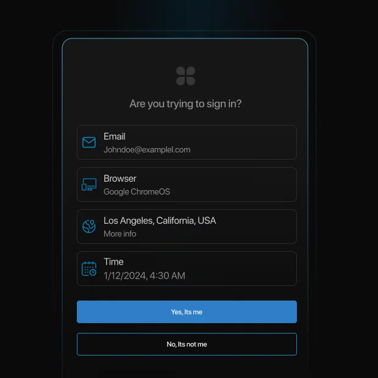
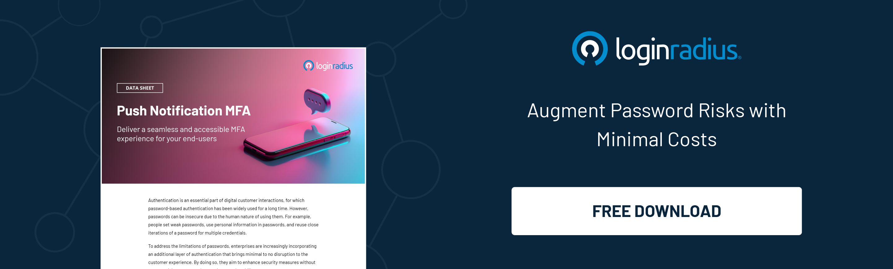
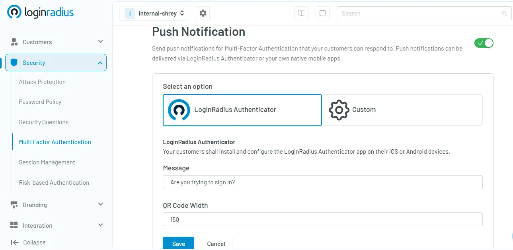

## Introduction

With increasing cyber threats, traditional authentication methods like passwords and one-time passwords (OTPs) are no longer sufficient. Push notification authentication, aka push authentication, provides a more secure and seamless authentication experience by leveraging mobile devices to verify user identities. 

This method enhances security while offering a frictionless user experience. In this blog, we'll explore what push notification authentication is, how it works, its advantages, and how you can integrate it into your applications.

## What is Push Notification Authentication?

Push notification authentication is a method of verifying a user’s identity by sending a push notification to their registered mobile device. Instead of entering passwords or OTPs, users can see the details about the login attempt and simply approve or deny authentication requests with a single tap. 

This method combines device possession (something the user has) with user interaction (something the user does) to significantly enhance security.

Push authentication is widely used in multi-factor authentication (MFA) solutions, adding an extra layer of protection against unauthorized access. It is commonly implemented by banking services, corporate security systems, and cloud-based applications to prevent fraudulent logins. It is also implemented by other industries as part of their [adaptive MFA](https://www.loginradius.com/blog/identity/adaptive-authentication/) strategy. 

## How Does Push Authentication Work?

Push authentication follows a straightforward and user-friendly process:

1. **User Initiates Login:** The user attempts to log into an application or access a protected resource.
2. **Server Sends a Push Message:** The authentication server generates a push request and sends notifications to the user’s registered device.
3. **User Reviews the Request:** The push alert notification contains details such as login location, device information, and time.
4. **User Approves or Denies:** The user can approve the authentication request if it is legitimate or deny it if it appears suspicious.
5. **Access is Granted or Denied:** If approved, access is granted; if denied, the login attempt is blocked.

## What Are the Advantages and Challenges of Push Authentication? 

### Advantages of Push Notification Authentication

* **Enhanced Security:** Since push authentication requires both device possession and user approval, it is more secure than passwords or OTPs.
* **Seamless User Experience:** Users do not need to memorize passwords or enter codes manually, reducing friction during authentication.
* **Real-Time Alerts:** Users receive immediate notifications of any login attempts, enabling them to take quick action against unauthorized access.
* **Phishing Resistance:** Unlike traditional authentication methods, push authentication minimizes the risk of phishing attacks by eliminating the need to enter credentials.
* **Cost-Effective:** Reduces reliance on SMS-based OTPs, lowering operational costs and improving authentication efficiency.

### Challenges of Push Notification Authentication

* **Dependence on Mobile Devices:** If the user does not have immediate access to their registered device, then this authentication method can become difficult.
* **Internet Connectivity:** Push notifications require an active internet connection to function, which may not always be available.
* **Device Compatibility:** The authentication system must support various mobile operating systems and devices.

## Where Is Push Authentication Used?

Push authentication is widely used across various industries, including:

* **Financial Services:** Banks and financial institutions use push authentication to verify transactions and secure customer accounts.
* **Enterprise Security:** Companies implement push authentication to protect corporate resources, employee logins, and sensitive data.
* **E-commerce:** Online shopping platforms use push authentication to verify user logins and high-value transactions.
* **Healthcare:** Healthcare providers use push notifications to secure access to electronic medical records (EMRs) and patient data.
* **Government Services:** Public sector organizations implement push authentication for secure access to citizen services and portals.

## How to Add Push Notification Authentication to Your Apps with LoginRadius?

Integrating push message notification authentication into your applications is seamless with LoginRadius. Our platform provides a robust and scalable solution to implement push authentication efficiently.

### Steps to Enable Push Authentication with LoginRadius:

1. **Sign Up for LoginRadius:** [Create an account on the LoginRadius platform ](https://accounts.loginradius.com/auth.aspx?return_url=https://console.loginradius.com/login&action=register)and access the Admin Console.
2. **Enable Multi-Factor Authentication (MFA):** Navigate to **“Security” **settings and choose and enable multi-factor authentication. 
3. **Choose Push Notification as an MFA Factor:** Select **“Push Notifications”** as an MFA factor to integrate push authentication into your application.
4. **Test and Deploy:** Verify the setup by testing push notifications and deploy them into your production environment.

For a detailed implementation guide, refer to our **[developer documentation](https://www.loginradius.com/docs/security/customer-security/multi-factor-authentication/overview/)**. 

## Push Notifications vs. Other MFA Factors

<table>
  <tr>
   <td><strong>MFA Factor</strong>
   </td>
   <td><strong>Security Level</strong>
   </td>
   <td><strong>User Experience</strong>
   </td>
   <td><strong>Dependency</strong>
   </td>
  </tr>
  <tr>
   <td>Push Notifications
   </td>
   <td>High
   </td>
   <td>Seamless
   </td>
   <td>Requires Mobile Device & Internet
   </td>
  </tr>
  <tr>
   <td>OTP via SMS/Email
   </td>
   <td>Medium
   </td>
   <td>Moderate
   </td>
   <td>Relies on Network Operators
   </td>
  </tr>
  <tr>
   <td>Biometric Authentication
   </td>
   <td>Very High
   </td>
   <td>Seamless
   </td>
   <td>Requires Biometric Hardware
   </td>
  </tr>
  <tr>
   <td>Hardware Security Keys
   </td>
   <td>Very High
   </td>
   <td>Moderate
   </td>
   <td>Physical Key Dependency
   </td>
  </tr>
</table>

Push notifications provide a balance between security and user convenience, making them a preferred choice for modern authentication.

## The Growing Need For Push Authentication in Cybersecurity

With the rise in credential-based attacks and data breaches, organizations are increasingly adopting push authentication as a key security measure. Since push notifications require an active user response, they offer a higher level of assurance compared to traditional authentication methods. 

Additionally, organizations can integrate adaptive authentication mechanisms, such as analyzing device fingerprinting and login patterns, to further enhance security while keeping the user experience seamless.

## Future Trends in Push Notification Authentication

As technology evolves, push notification authentication is expected to become even more sophisticated. Artificial Intelligence (AI) and machine learning (ML) will play a crucial role in detecting anomalies and preventing fraud. 

Future advancements may also integrate biometrics with push authentication, creating a multi-layered security approach that is nearly impossible to bypass. Furthermore, enterprises are looking to implement decentralized identity solutions, ensuring greater user privacy and security across digital ecosystems.

## Conclusion 

Push notification authentication is a powerful and secure method of user verification. It enhances security while providing a frictionless user experience. By integrating push authentication with LoginRadius, businesses can efficiently safeguard their applications against unauthorized access.

Ready to implement push authentication? [Book a free trial](https://accounts.loginradius.com/auth.aspx?return_url=https://console.loginradius.com/login&action=register) today!

## FAQs

1. **What is an example of a push notification?**

A push notification is an alert sent to a mobile device to approve authentication, such as "Login attempt detected from New York. Approve or Deny?"

2. **Are push notifications encrypted?**

Yes, push notifications are encrypted during transmission to ensure security and prevent unauthorized access.

3. **Is push notification better than an OTP?**

Yes, push notifications are more secure and user-friendly than OTPs, as they eliminate the risk of phishing and SIM-swapping attacks.

4. **How do I enable push notifications?**

To enable push notifications, Navigate to [“Security” settings](https://accounts.loginradius.com/auth.aspx?return_url=https://console.loginradius.com/login&action=register) in your LoginRadius console and choose and enable multi-factor authentication. Choose Push Notification as an MFA Factor: Select “Push Notifications” as an MFA factor to integrate push authentication into your application.

