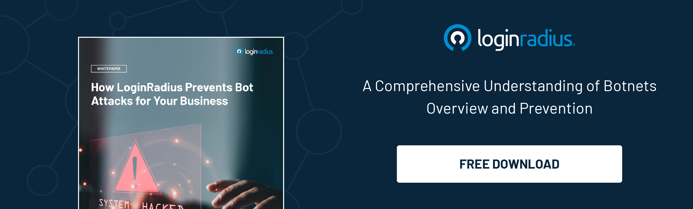

## Introduction

In today's digital landscape, where cyber threats continue to evolve, [phishing](https://www.loginradius.com/blog/identity/phishing-for-identity/) is one of the most pervasive and damaging attacks. 

Real-time phishing attacks pose a significant risk to individuals and organizations alike as they attempt to deceive users into disclosing sensitive information such as passwords, credit card details, or personal data. 

However, with the advancement of technology and the implementation of real-time techniques, it is possible to bolster security measures and effectively detect and combat these malicious schemes. This blog will explore the importance of real-time methods in detecting phishing attacks and how they can enhance overall security.

## Understanding Real-Time Phishing Attacks

Real-time phishing attacks refer to those that occur instantly, exploiting vulnerabilities in systems or leveraging [social engineering techniques](https://www.loginradius.com/blog/identity/social-engineering-attacks/) to trick users into divulging confidential information. These attacks often target unsuspecting individuals through emails, text messages, or fake websites that mimic legitimate ones. 

Detecting such attacks in real time is crucial for preventing data breaches, identity theft, and financial losses.

## 5 Real-Time Techniques That Block Potential Phishing Threats

Detecting phishing attacks in real time allows for immediate response and mitigation, minimizing the potential damage caused. Traditional security measures, such as static blocklisting or periodic scanning, must be revised to combat phishing attacks' rapidly evolving nature. 

Real-time detection techniques provide the ability to monitor incoming traffic, identify suspicious patterns, and analyze various indicators to identify and block potential threats swiftly.

### 1. Behavior-based Analysis

Behavior-based analysis is a powerful technique employed in real-time phishing attack detection. Security systems can establish a baseline of normal user activities by continuously monitoring user behavior, such as browsing patterns, mouse movements, and keystrokes. 

Any deviation from this baseline can be flagged as a potential phishing attempt. For example, suppose a user suddenly receives an email with a suspicious link and immediately clicks on it without hesitation. In that case, the system can recognize this as abnormal behavior and trigger an alert. 

By analyzing behavior in real-time, security systems become more adept at identifying sophisticated phishing attacks that try to mimic actual user actions.

### 2. Machine Learning and Artificial Intelligence

Machine learning (ML) and artificial intelligence (AI) are pivotal in enhancing real-time phishing attack detection. ML algorithms can analyze large volumes of data, including email content, website characteristics, and user interactions, to identify patterns and trends associated with phishing attacks. 

By training these algorithms on historical phishing data, they can learn to recognize common phishing indicators and adapt to new and emerging attack techniques. Through continuous learning, ML-powered systems improve their accuracy in detecting real-time phishing attacks while reducing false positives, ensuring more effective protection against evolving threats.

### 3. URL and Domain Reputation Analysis

Real-time detection systems employ URL and domain reputation analysis to identify potentially malicious links and websites. These systems compare URLs against known phishing databases and blocklists, assessing their reputation and trustworthiness. Suspicious links that match known phishing patterns are immediately flagged, preventing users from accessing them. 

Additionally, real-time systems can employ machine learning models to analyze the structure of URLs, looking for telltale signs of phishing attempts, such as slight misspellings or extra characters in domain names. By scrutinizing URLs in real time, security systems can thwart phishing attacks before users unknowingly interact with dangerous websites.

### 4. Email and Content Analysis

Real-time analysis of email content is a critical component of detecting phishing attacks. Security systems scan incoming emails and assess elements, such as email headers, attachments, and embedded links, to identify potential threats. 

Advanced algorithms analyze email content for phishing indicators, including suspicious keywords, misspelled domains, grammar errors, or requests for sensitive information. By examining emails in real-time, security systems can promptly flag suspicious messages and prevent users from falling victim to phishing attempts. 

Additionally, analyzing attachments and embedded links allows systems to identify malicious files or redirect attempts, safeguarding users from potential malware infections.

### 5. Collaboration and Threat Intelligence Sharing

Real-time detection systems thrive on collaboration and the sharing of threat intelligence. By actively participating in threat intelligence networks and leveraging information from other security platforms, these systems gain access to a vast pool of real-time threat data. 

This collaborative approach enhances their ability to detect emerging phishing attack vectors and stay current with the latest techniques cybercriminals use. By sharing insights, indicators, and patterns of real-time phishing attacks, security platforms collectively contribute to a more robust defense against these threats. 

This collaborative intelligence sharing ensures that organizations can proactively protect their users from evolving phishing attacks, further bolstering their security posture.

## Conclusion

As real-time phishing attacks continue to pose a significant threat, adopting proactive security measures that leverage advanced techniques is crucial. By embracing real-time detection methods such as behavior-based analysis, machine learning, URL and domain reputation analysis, email and content analysis, and collaboration with threat intelligence platforms, organizations can enhance their security posture and protect against the ever-evolving landscape of phishing attacks. 

Prioritizing real-time detection empowers individuals and organizations to stay one step ahead of cybercriminals, safeguarding their valuable information and maintaining a robust defense against real-time phishing attacks.

