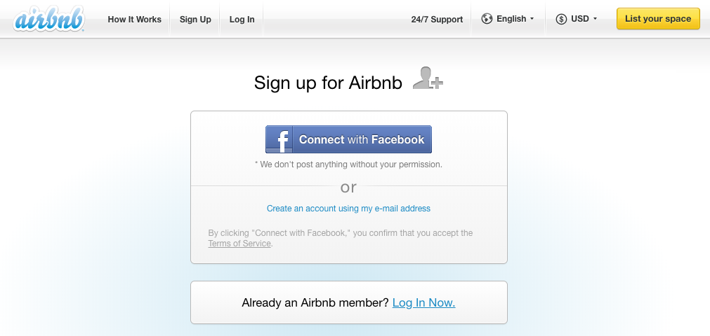
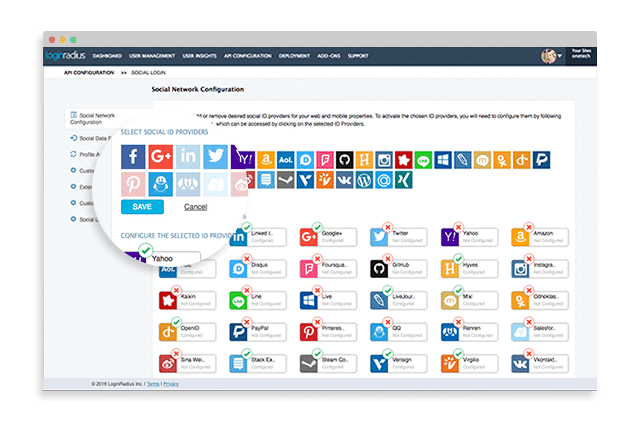
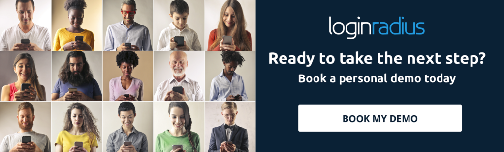

**Login methods may come and go, but customer identity is here to stay.**

In the aftermath of two massive data exposures at Facebook and Google+ that were amplified by social login, I want to talk about the implications for B2C enterprises.

Are the privacy and security risks of [social login](https://www.loginradius.com/social-login/) still worth the convenience? And what steps should companies take to protect customer data and maintain public trust?

Let’s start with some history.

## Social login has been around for about a decade.

Facebook came out with its first identity service, Facebook Connect, in 2008. Users started logging in with Twitter in 2009 and with LinkedIn in 2010. Google+ launched in 2011 and added its social login to the mix.

**Throwback to the Airbnb login page in March 2012**

LoginRadius got its start in 2012 by giving businesses a simple way to implement one or more social login methods on their digital properties. We saw a significant increase in sign-up rates for B2C websites with low-risk accounts that used our social login tools. Small, medium, and mid-market businesses were quick to adopt the LoginRadius solution.

**LoginRadius supports 40+ social login providers**

By 2015, social login had became a very popular login method. It appeared to be a win-win-win for all involved. Users liked the convenience, third parties liked the conversion rates and social data, and social networks liked off-site tracking for ad targeting.

### But as more businesses and customers used social login, its associated privacy issues hit the public consciousness.

Customers started to notice that companies were collecting many data points from their social accounts, including check-ins, likes, and friend data. They realized that they were trading their private information to get the convenience of social login, and they weren’t happy with the trade-off.

**So social networks started to cut back the functionality of social login.** They made it more difficult to get permissions for collecting social data and publishing on users’ social accounts.

Businesses in turn cut down their requests for read and publish permissions because they were harder to get and were a turnoff for customers. The Equifax breach in 2017 further sensitized businesses and users to the dangers of personal data leaks.

**The massive scale of social data collection and third-party publishing dropped down to basic data and authentication by 2018**, and social login reached an equilibrium between customer experience and respect for privacy.

LoginRadius saw this shift coming. That’s why our company isn’t called SocialLoginRadius.

### We knew that social login would never be sufficient for the identity needs of B2C enterprises.

**From the beginning, LoginRadius had a complete identity product roadmap that started with social login and progressed to a full customer identity platform.**

In 2016 we launched our customer identity and access management solution with multiple login methods and the ability to integrate with any ID provider.

The LoginRadius Customer Identity Platform still includes social login as an add-on, but it also has these more secure, robust, and specialized login options:

- **Standard Login** is the traditional login process, where a user creates an account and logs in with a unique ID (email or username) and password.
- **Phone Login** uses a customer's phone number as a unique ID.
- **Passwordless Login uses a customer’s email address or phone number to send them a one-time link or one-time passcode that they click to log in.**
- **One-Touch Login** allows the user to register or log in using a generated link sent to their email address or a one-time password sent to their phone. The user does not need to be an existing user in the system. No credentials are submitted.
- **Smart Login** is a login method that allows customers to log in to a device that can’t be accessed as a standard web or mobile device. It takes the authentication process for smartphone apps, smart TVs, gaming consoles, and other IoT devices and delegates the authentication process to another device that is easier and more secure for entering and managing passwords.

Most of our current customers offer social login for ease of customer experience, but they only collect basic profile information such as name and email address.

### LoginRadius can make social login more secure for businesses.

Until now, the market has mainly talked about the advantages of social login but hasn’t been as vocal about the risks. LoginRadius is taking a leadership role in advocating for social login practices that protect businesses and their customers better. Our experience facilitating social login for thousands of companies and hundreds of millions of customers over six years has given us expert insight on this login method.

**LoginRadius strongly recommends that Fortune 1000 businesses adopt extra security and privacy measures around social login.**

Our white paper, [Social Login Reconsidered](https://www.loginradius.com/resource/social-login-reconsidered/), puts forward four use cases for social login. These use cases cut the risks of illegitimate access and exposure while maintaining the ease of customer experience.

The right use case for your business depends on the business model, the target audience, and the level of risk for customer accounts.

### The LoginRadius mission is much larger than a single login method.

Our mission is to empower businesses to provide secure, delightful experiences for their customers using the most innovative customer identity platform.

And we will continue to develop and revisit our entire solution, as we have done for social login, to make sure we are fulfilling that mission.

