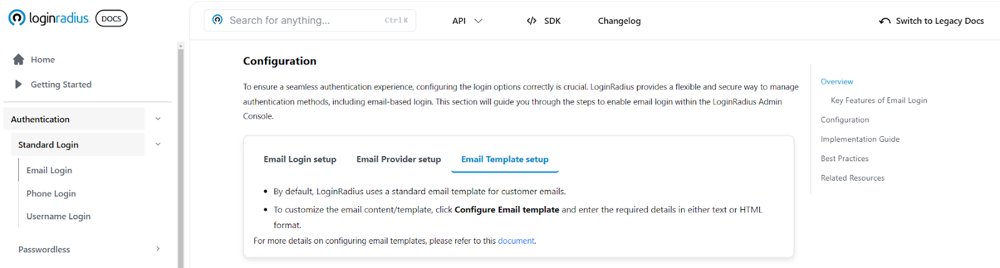
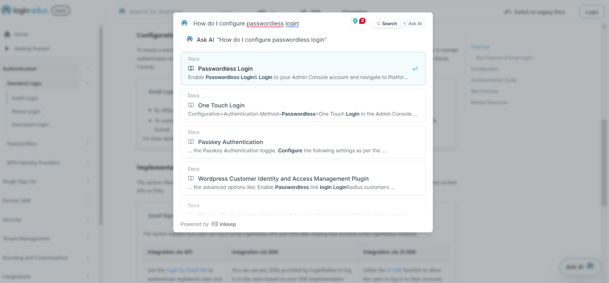

Every developer knows the feeling: you're in the zone, solving problems and bringing your vision to life, when suddenly you hit a wall. You need to integrate authentication into your application, but the documentation is confusing, scattered, or incomplete. Your momentum grinds to a halt as you spend hours searching for answers that should take minutes to find.

At LoginRadius, we've always believed that identity management shouldn't be a roadblock to innovation. It should be a seamless part of your development process—one that empowers rather than hinders. That's why we're thrilled to announce the complete transformation of our developer documentation into an intuitive, comprehensive, and AI-powered resource designed with one goal in mind: to help you spend less time searching and more time building.

This isn't just a visual refresh or minor update. We've rebuilt our documentation from the ground up, rethinking every aspect of how developers interact with our resources. We've leveraged cutting-edge AI technology, applied best practices in technical documentation, and incorporated years of feedback from our developer community to create what we believe is the most developer-friendly identity management documentation available today.

Let's explore how our new documentation portal will transform your development experience with LoginRadius.

## What Did We Do?

We rebuilt our docs from the ground up with a developer-first mindset. We didn’t just clean things up—we reworked how information flows.

Now, navigation feels seamless, content follows a logical step-by-step approach, and jumping between topics feels effortless. Need to configure authentication? Dig right into our API references. Troubleshooting an issue? It’s right there. No detours, no frustration, you can just stay focused on building.

Let’s start by exploring the [new documentation structure](https://www.loginradius.com/docs/) and how it improves your workflow.

## A Streamlined Documentation

We know that time matters when you’re developing, and our goal is to help you find the right information faster. The revamped documentation is designed to be clear, structured, and easy to explore.

<iframe src="https://player.vimeo.com/video/1062768219" width="640" height="360" frameborder="0" allowfullscreen></iframe>

-   Concise and well-structured content: Instructions are now clear and easy to follow, helping developers quickly find the information they need.
    
-   Step-by-step navigation: We introduced a tabbed structure that logically organizes steps in sequence. Developers can navigate through each step in a structured manner.
    

## Aligning Documentation with Real Implementation Journeys

Developers aren’t just looking for how-to guides to do one or two activities; they need a clear, sequential roadmap that mirrors the actual implementation journey. So, we took a developer-first approach and restructured our new documentation around these real-world journeys.

-   Logical flow in tabs: Imagine you’re setting up authentication. You’d typically start with email login setup, then configure your email provider, and finally customize the email template. That’s exactly how we’ve structured our new documentation, following the natural flow of implementation. Now, instead of jumping between sections or searching for the next step, everything is laid out together and in the right order, making the process smoother and easier to follow.
    

## AI-Powered Search and Chatbot

Finding the right information quickly is essential for developers. That’s why we’ve introduced an AI-powered search and chatbot to make accessing information faster and more intuitive.

Now, developers can get instant, relevant answers and navigate complex integration steps with ease. All of this while maintaining a conversational style just as if you are talking to a human (with an AI expert).

-   AI-Powered Search: Imagine you’re deep in development and need an answer—fast. But you’re not sure of the exact keyword or where to look. Instead of digging through multiple sections, you can now simply ask in natural language using our Ask AI feature.
    

-   Need to configure passwordless login? Just ask: “How do I set up passwordless login?”
    
-   Looking for API details? Try: “What are the API endpoints for passwordless authentication?”
    

The AI-powered search instantly delivers the most relevant results, helping you get answers without breaking your flow. Now, finding the right information feels as effortless as having a quick chat.

## OpenAPI-Based Documentation and an Improved Playground

Exploring and testing APIs should feel effortless—that’s exactly what we’ve focused on with our improved API documentation and playground.

<iframe src="https://player.vimeo.com/video/1062768098" width="640" height="360" frameborder="0" allowfullscreen></iframe>

-   **OpenAPI-based structure:** Our new API documentation is now built on OpenAPI schema, making it easier to read, explore, and interact with.
    
-   **A hands-on API playground:** You now get a more simplified, easy-to-use playground where you can:

	-   Test API requests directly
	-   View real-time responses
	-   Copy auto-generated code snippets for multiple programming languages
    
-   **Simplified technical terms:** Every detail is structured to be straightforward and developer-friendly, so you can focus on building, not deciphering complex technical jargon.
    

## More to Come

Rebuilding our documentation has been an exciting journey, shaped by countless hours of work from our team, all with one goal in mind—making it easier for developers to build with LoginRadius. We’re excited to finally share this with you.

But this is just the beginning. We’re constantly refining, improving, and adding new features to make your experience even better.

Check out the [new LoginRadius documentation](https://www.loginradius.com/docs/) here, and let us know what you think—we’d love to hear your feedback!