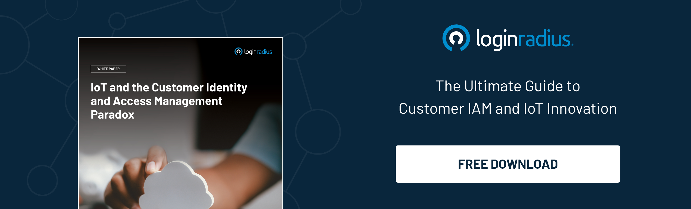

## Introduction

We’re all surrounded by an invisible aura of numerous interconnected devices consistently improving our lifestyles.  

However, when we see things through the lens of information security experts, the IoT landscape is one of the most vulnerable networks on cybercriminals' radar. 

In a network, more often than not, IoT devices exchange data for a specific purpose. It could be in emails or transferred files, or even instructions and commands exchanged between connected devices. 

And to facilitate this communication between devices and carry out their required instructions, the network's different components need to recognize each other and [authorize access](https://www.loginradius.com/provisioning/). Also, they need to detect any attempt at unauthorized access or malicious intrusion by hackers trying to steal personal information such as credit card details, user identities, or traffic data.

Hence, [customer identity & access management](https://www.loginradius.com/blog/identity/customer-identity-and-access-management/) (CIAM) has become a necessary component of infrastructure protection and services because of the increasing malware attacks on connected IoT devices. 

You might have read about high-profile security breaches involving millions of internet-connected devices. And with this increase in IoT security concerns,  a CIAM has become a necessary component of infrastructure protection and services because of the growing malware attacks. 

Let’s understand how a CIAM helps IoT networks and devices offer a seamless and secure experience. 

## Understanding The Risks of Internet-Of-Things

The IoT landscape is quite vulnerable to various security threats. Many times cybercriminals gain access to user accounts by bypassing poor authentication mechanisms. 

The physical devices are connected to the internet and can be controlled remotely from a web browser or another application. Here, we only include devices that users directly use, not those used for communications between machines. 

There are huge security risks well documented in the cyber world that affect various interconnected systems and networked things—the corresponding set of IoT devices forms networks or groups to complete tasks. The internet of things landscape is vulnerable to several security threats due to poor authentication implementation, insufficient isolation, lack of data encryption, insecure remote access protocols, weak configuration management, etc.

And what’s worrisome is the fact that the [machine-to-machine communication](https://www.loginradius.com/blog/identity/rise-of-machine-identity-m2m-authorization-role/) and authentication in the IoT landscape isn’t secure and can be easily compromised by cybercriminals. Hence, a more robust authentication is required, and brands can’t rely on conventional methods.

Here’s where the critical role of a reliable CIAM comes into play. Let’s understand how CIAM paves the way for a secure IoT environment. 

## How CIAM is Securing the Internet of Things?

### 1. Secure machine-to-machine communication

One of the most significant advantages of leveraging a CIAM solution for IoT networks is that it ensures seamless, secure, and quick authentication between multiple apps, devices, and humans. 

Once a CIAM is incorporated into an IoT system, it reinforces authentication through multi-factor authentication and risk-based authentication, even between apps and machines. 

Hence, businesses developing IoT devices and applications or serving as IoT vendors can ensure their overall security posture once they incorporate CIAM. 

### 2. Compliance with data privacy and security regulations

Another benefit of incorporating a CIAM for your IoT applications/devices is compliance with data and privacy regulations, including the GDPR and CCPA. 

Most businesses dealing in the IoT landscape aren’t aware of the basic regulations and privacy laws they must comply with. And this could be pretty fatal, mainly when they collect a vast amount of customer details. 

With a reliable CIAM, businesses need not worry about compliance since cloud-based CIAMs like [LoginRadius offer compliance](https://www.loginradius.com/compliances/) with CCPA, GDPR, and other regulations. 

Organizations need to incorporate the CIAM and forget the rest, as it helps secure billions of identities, including that of humans and machines. 

## Final Thoughts 

While businesses offer users a great experience and convenience, ignoring the security aspects could be the worst. 

Businesses need to understand that IoT environments are always on the radar of cybercriminals, and a little loophole could cause financial and reputational losses.  And getting a CIAM is the best way to ensure secure and seamless authentication and authorization that mitigates security risks up to a great extent. 

