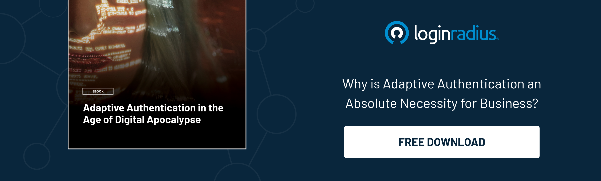

## Introduction

Businesses have adopted cloud-based SaaS applications in droves in the last ten years. The benefits of automation, mobility, continuous delivery, and paying per consumption are too good to resist. 

Unfortunately, that also means more users, applications, and data going into the cloud — all of which must be adequately secured. 

With the increasing global threat vectors, updating cybersecurity hygiene is quickly becoming the need of the hour, mainly for SaaS providers. 

Since organizations today have thousands and even millions of users logging simultaneously into their accounts, ensuring security at every end-point becomes an uphill battle. Hence, a robust [identity and access management](https://blog.loginradius.com/identity/what-is-iam/) system becomes more crucial than ever. 

No matter how many security experts you have in your enterprise, you will always be vulnerable to hackers. Enterprises today have millions of users that are accessing thousands of applications. 

Apart from this, IAM governance is becoming crucial since global regulations, including the GDPR and CCPA, are becoming more stringent. 

Hence, corporate security by meeting data and privacy compliances becomes necessarily crucial. Along with network monitoring and intrusion detection systems, strong identity and access management (IAM) governance is part of a fundamental enterprise security strategy.

Let’s glance at some aspects of securing SaaS environments by incorporating a robust identity and access management solution. 

## What is Identity and Access Management (IAM) Governance? Why is it Important? 

Identity and access management governance enable the infosec team to act upon arising issues by consistently monitoring the company's SaaS Security posture and access control implementation. 

This is important because it allows the infosec team to identify gaps in the organization's IAM program and make changes to prevent breaches.

By building an IAM governance framework, you can help your organization make better security decisions, including:

* how to implement effective policies for identity and access management
* how to enforce these policies
* how to determine what resources each employee needs to do their job effectively

## How Does A Robust Identity and Access Management (IAM) Help Reinforcing IAM Governance and Global Regulations?

In today's world, identity and access management (IAM) are vital to any business. An IAM solution can help you meet all your business objectives by making it easy to connect with customers and ensuring that employees can access the correct data.

But what makes an IAM solution genuinely effective?

For starters, it should allow you to authenticate users securely through multi-factor and adaptive authentication. Your customers and employees will never have to worry about having their credentials stolen or compromised.

Also, the cutting-edge CIAM system like [LoginRadius](https://www.loginradius.com/) helps meet all the necessary global compliances like CCPA and GDPR to ensure businesses need not worry about hefty fines and regulations while serving their customers in parts of the world. 

## Benefits of Incorporating a Robust CIAM like LoginRadius

### 1. Highest Level of Security for Data and Accounts

A standard CIAM system provides essential security features that safeguard data and account access. For example, with risk-based authentication, each customer’s usage and login patterns are monitored, making it easy to spot unusual (and, therefore, potentially fraudulent) activity.

For use cases where you need an extra layer of security, you can enable multi-factor authentication (MFA), which verifies a customer’s identity by requiring a second step, such as entering an SMS code or clicking an email link.

Apart from this, LoginRadius CIAM offers [risk-based authentication](https://blog.loginradius.com/identity/risk-based-authentication/) (RBA) that ensures maximum authentication security for high-risk situations. 

Your secure login procedures reassure customers that they are safe using your services—essential with the number of public data breaches reaching the news.

### 2.  Compliance With Privacy Regulations

Privacy compliance is critical for any company handling customer data and an essential part of any online business. 

The EU’s GDPR and the recently rolled out California’s CCPA are just a few examples of privacy laws that have a global reach, affecting any data flowing into or out of the EU.

Most western countries have similar regulations or are enacting similar laws, and the rest of the world is rapidly catching up.

If you have an online business that you want to keep viable in 2023 or beyond, you must maintain compliance with these regulations. And LoginRadius helps you meet these [global compliances](https://www.loginradius.com/compliances/) like a breeze. 

### 3. Streamlined Customer Experience

A streamlined customer experience delivered by an organization reflects that it’s up-to-date and concerned about providing the most accessible login possible.

By providing a smooth login experience for your applications and services, you encourage customers to try out more of your digital offerings. The result is a customer more embedded in your digital ecosystem without extra effort.

For example, implementing a single sign-on through a LoginRadius means a customer only needs one account for all your digital touchpoints. 

Whether your customers are signing in from a browser or a mobile device, they’ll benefit from not having to sign in repeatedly to different services again and again—encouraging repeat use of your apps and services.

## In Conclude 

Consequently, whether they know it or not, SaaS businesses will have to address the identity and access management gap. 

As a solution provider of IAM solutions for SaaS companies, LoginRadius’s team understands the issues at hand related to compliance and performance. 

We are keenly aware of the needs of SaaS enterprises, and we will continue to provide advanced identity management solutions that deliver the performance needed for any business to grow in this market.

