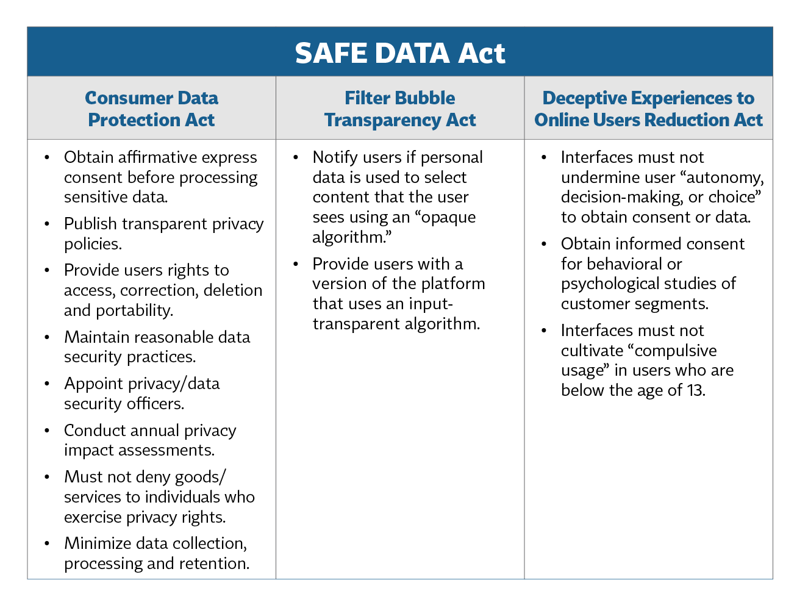
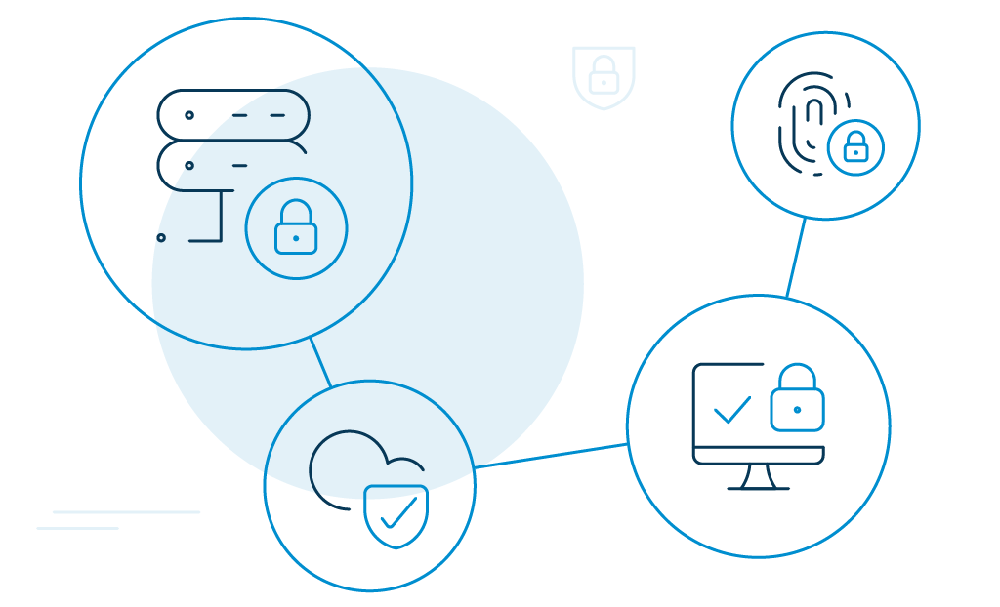

In September 2020, the Republican members of the Senate Commerce Committee, Science, and Transportation (“the Committee”) introduced the Setting an American Framework to Ensure Data Access, Transparency, and Accountability Act ("**the Safe Data Act**"). The committee was chaired by Roger Wicker and co-sponsored by several other Republicans in the Senate.

Senator Wicker had a working staff discussion draft version called the United States Consumer Data Privacy Act of 2019 last November. The Safe Data Act follows the footprints of the 2019 draft but makes a few essential improvements regarding the privacy, cybersecurity, and compliance risks of citizens in the United States. 

So, let's help you catch up on this new federal privacy law—what it covers and what businesses have to do to stay compliant.

## What is the Safe Data Act

The Safe Data Act combines three previously introduced privacy protection bills viz. 

*   The discussion draft of the U.S. Consumer Data Protection Act. 
*   Filter Bubble Transparency Act.
*   Deceptive Experiences To Online Users Reduction Act.

Americans would have a greater choice of control over their data. In particular, the law would create rights to transparency, access, deletion, correction, and portability for consumers. Additionally, businesses would require to make a baseline level of data security, including opt-in consent for the process and transfer of sensitive data. 

Image source: [iapp]

Needless-to-say, you must understand the risk profile of any partner before you allow them near your sensitive consumer data. 

If passed, the Federal Trade Commission would enforce the Safe Data Act by prioritizing it over existing state privacy laws such as the CCPA. It is expected to pass through the 117th Congress in January 2021.

## Key Provisions of the Safe Data Act: The Secret to Staying Safe

The Safe Data Act resembles two of the most stringent existing privacy regulations to date, the [E.U.'s GDPR and California's CCPA](https://www.loginradius.com/blog/2019/09/ccpa-vs-gdpr-the-compliance-war/). 

Some key provisions include: 

*   Businesses must obtain consent before processing or transferring consumer's sensitive data.
*   Consumers have the right to opt-out of the collection, processing, or transfer of personal data.
*   Consumers have the right to access, correct, delete, or transfer their sensitive data without any discrimination.
*   Businesses must publish transparent privacy policies for consumers by including what type of data they intend to collect, why they are collecting such data, their data retention policies, and consumer rights. 
*   Businesses must appoint data privacy and security officers to maintain security policies and practices.
*   Businesses cannot deceive consumers into obtaining consent. 

Moving on, when a new legislation is about to come into force, the first step every business should take is to establish a compliance checklist that covers the requirements of that particular law. 

Here's how you can adopt the best risk management practices to ensure that your business is ready for compliance. 

## 4 Ways to Strengthen Your Compliance and Risk Management Practices

1. **The right combination of tools and technology**: An excellent way to manage the risk of compliance failure is to use the right combination of tools and technologies that can extract data from your system and then tell you about the areas you are falling short of.

2. **Customizable framework to manage compliance risk**: You can also build a comprehensive and customizable framework to access the underlying compliance risk.

3. **Increased collaboration with the team**: You should increase your collaboration with those involved in the compliance and risk management teams. 

4. **Approach an already compliant identity provider**: Another way to look at this is to get the job done by onboarding providers who are already big names in the industry for their compliance-adherence standards, like LoginRadius. It takes [consumer data privacy](https://www.loginradius.com/blog/2020/06/consumer-data-privacy-security/) very seriously and is compliant with major regulations like the CCPA and the GDPR.

## Protect Your Consumer Privacy With the LoginRadius Identity Platform 

In a bid to ensure businesses the highest level of protection, the LoginRadius consumer identity and access management (CIAM) platform adheres to the major regulatory and privacy regulations around the world. 

*   **General Data Protection Regulation** (GDPR): Focuses on the [privacy rights of the citizens](https://www.loginradius.com/gdpr-and-privacy/) of the European Union and the European Economic Area.
*   **California Consumer Privacy** Act (CCPA): Focuses on the privacy rights of the citizens of California.
*   **ISO/IEC 27018:2019**: Secures consumer data in the public cloud computing environment.
*   **U.S. Privacy Shield**: Helps US-based organizations to benefit from the adequacy determinations.

## Conclusion 

It is in your businesses' best interest to comply with privacy regulations, like the Safe Data Act. Not only does it help you dodge off data breaches and [cyber attacks](https://www.loginradius.com/blog/identity/cybersecurity-attacks-business/), but it also confirms businesses that they can trust you with their confidential consumer data—and that's priceless! 

