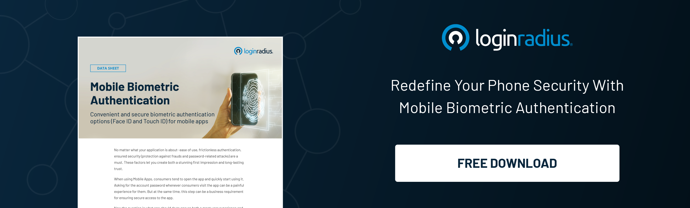

## Introduction

The world has been through many changes in the last few years. We've gone from analog to digital, brick-and-mortar to online retail, and face-to-face interactions to social media. 

And although this evolution of our everyday life has made it easier for us, it's also made things more complicated for businesses and organizations that handle private information and data daily. 

Data leaks from big organizations have become common, but not because we need the tools to prevent them. We have better technology and identity management tools, but the problem is that conventional identity management tools aren’t potent enough to shield modern threat vectors. 

There’s a need for a [robust identity management solution](https://www.loginradius.com/) that combines existing authentication strategies such as two-factor authentication, biometric authentication, one-time passwords, and password rotation policies to help secure an organization's infrastructure.

Let’s uncover the aspects of leveraging identity authentication and why businesses must put their best foot forward in adopting robust identity and access management solutions combining multiple authentication mechanisms. 

## Flaws in the Conventional Password-Based Authentication Systems

The current password-based authentication system isn't keeping end users and businesses safe against malicious cyber attacks. 

Despite the popularity of password-based authentication systems, researchers have pointed out that these systems pose a significant threat to security. 

Several significant security breaches have recently raised the alarm about the vulnerability of such systems and the risk brought in by password-based authentication. But are we any closer to finding better replacements?

Cybercriminals can quickly access confidential information stored on servers by stealing passwords from database servers or accessing web applications, such as password management tools. 

There's another way, a better way, to protect your organization's customer data. It's called [multi-factor authentication](https://www.loginradius.com/multi-factor-authentication/) (MFA). It's an authentication mechanism that provides additional security by requiring a user to provide multiple layers of authentication before granting access.

However, the way businesses leverage MFA makes all the difference. Let’s understand how businesses can get the best out of their MFA mechanisms. 

## Multi-Factor Authentication (MFA) - The Key to Secure Digital Identities 

There are many ways you can keep your accounts secure, but there's one thing that's always a significant first step: multi-factor authentication.

Multi-factor authentication (MFA) ensures that even if someone gets your password and tries to log into your account, they still won't be able to because they'll need another layer of authentication before they can access it.

There are many different ways you can do this—from security questions to one-time passwords—but whatever method you choose, MFA is always a great way to provide secure access by verifying user identities.

However, adding biometric authentication through facial recognition or fingerprint authentication could do wonders regarding reinforcing security. 

Every individual has a unique biometric identity, so using it for authentication mitigates the chances of a data breach. 

Hence, adding biometric authentication in the multi-factor authentication could help organizations secure their sensitive business information since the chances of data breaches or account takeover decrease significantly. 

## Why is Multi-factor authentication an Essential Component of Infrastructure Security?

### #1. Secures consumer identities 

MFA is an essential tool for protecting consumer data from identity theft. By implementing this measure, the security of the traditional username and password login is supplemented by an additional layer of protection. 

Cybercriminals will have difficulty cracking OTP since it is sent via SMS or an automated phone call. A consumer needs two pieces of information to access their resource. MFA adds a sense of mindfulness to authentication.

### #2. Helps meet regulatory compliance

Implementing multi-factor authentication can be crucial when complying with specific industry regulations. 

For example, PCI-DSS requires MFA to be implemented in certain situations to prevent unauthorized users from accessing systems. So, even when application updates lead to unknown and unattended consequences, MFA compliance ensures that it remains virtually non-intrusive.

### #3. Builds customer trust 

Another great benefit of leveraging MFA is that it helps build long-lasting relationships with customers. 

Since MFA offers excellent security and helps businesses adhere to global compliances, it helps build trust in present customers and potential clients. Therefore, businesses that [build customer trust](https://blog.loginradius.com/identity/loginradius-creates-trusted-digital-experience/) shouldn’t forget to incorporate MFA into their platforms. 

## Final Thoughts

The modern threat landscape has increased the challenges for businesses to reinforce their cybersecurity posture, especially when brands think of securing digital identities. 

And adding robust layers of multi-factor authentication through biometric authentication can help minimize the risks as it mitigates the chances of account takeover and sensitive data breach. 

