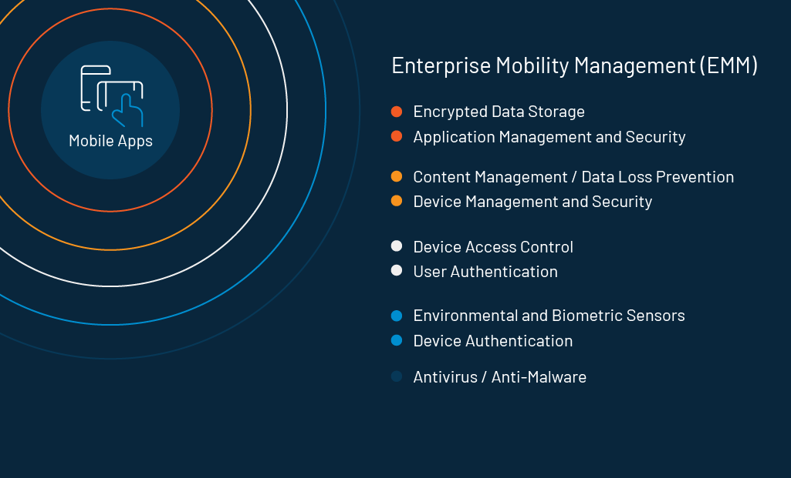

If enterprise mobile apps are the future of businesses, we are already living in the future. With the growing popularity of technologies like 5G, blockchain, AI, and machine language, more and more companies are integrating their corporate processes with mobile platforms.

Some of these primary capabilities include the management of security, IT infrastructure, content, salesforce, human resource, business intelligence (BI), billing system, and product catalogs.

No doubt, mobile applications are gradually becoming a staple in enterprises. 

With all the good that's going around, it is crucial that we flip and try to see through the other side of the scenario.

## Latest Threats in the Enterprise Mobile App Security

Mobile will take over the enterprise software universe very soon. Almost [three-quarters of internet users](https://www.warc.com/content/paywall/article/warc-datapoints/almost_three_quarters_of_internet_users_will_be_mobileonly_by_2025/124845) (that sums up to 72.6 percent) will use mobile to access the web by 2025. 

No wonder, businesses of all sizes are making the shift towards enterprise mobile apps.

What could go wrong? It turns out, a lot. Even a well-established enterprise can fail spectacularly—with respect to _security_—when they take on mobile.

Zimperium's [2019 State of Enterprise Mobile Security](https://get.zimperium.com/threat-report-2019-h1/) findings below highlights the nuances:

- 32% of enterprise mobile endpoints encountered risky networks.
- 27% of enterprise mobile endpoints were exposed to device threats.
- 7% of enterprise mobile endpoints were exposed to network attacks.
- Almost one out of 10 were exposed to network attacks.
- Man-in-the-middle (MITM) attacks were 93% of network threats and 86% of all risks.
- Apple patched 54% more vulnerabilities than the same timeframe last year.

## Mobile App Security Threats That You Should Take Seriously in 2020 

Mobile security is at the epicenter of an enterprise's concern today. After all, nearly all employees now regularly access corporate data on mobile. You need to keep confidential information out of the wrong hands, and that's an intricate puzzle in itself.

Following are the major threats security teams need to deal with:

**Improper Session Handling**: Most applications use tokens to allow users to perform multiple actions without re-authenticating their identity every time. Improper session handling happens when apps involuntarily exchange session tokens (for example, with the bad guys), they can [exploit the website and the corporate network](https://www.loginradius.com/blog/2020/04/corporate-account-takeover-attacks/), altogether.

**Insecure data storage**: There are many vulnerable places in an application where data can be stored: binary data stores, SQL databases, and cookie stores are a few. Majority of these vulnerabilities are triggered by the OS, frameworks, and compilers involved. Often, the poor storage of data results from inadequate processes to manage device gallery and data cache.

**Improper encryption**: Encryption is the method of translating data into an unreadable code that is only usable with the secret key after it has been re-translated. Therefore, it is important to evaluate how easy or difficult it might be to crack your application's secret code. This is a common vulnerability that hackers exploit with code and intellectual property theft, leading to [privacy violations](https://www.loginradius.com/blog/2019/12/digital-privacy-best-practices/), and damage to reputation.

**Mobile ad fraud**: With the amount of revenue generated by mobile advertising every year, it is no surprise that cybercriminals are after all the cash that can be duped from mobile ad revenue streams. One of the most common types of ad fraud is using malware to generate fraudulent clicks on ads that appear to come from real uses. Ad fraud malware often runs in the background and can overheat the battery, incur high data charges, and make users lose millions of dollars.

**Human error from remote workers**: Human error is perhaps one of the most commonly observed [cybersecurity threats](https://www.loginradius.com/blog/2019/10/cybersecurity-attacks-business/). Despite the steady rise in mass media reporting of cybersecurity accidents, the non-technical population still lacks basic security knowledge. Your responsibility as an enterprise owner is to educate employees on mobile security threats and prevent cybercriminals from accessing a device or network.

## Features of a Secured Enterprise Mobile Application

A holistic approach to security for mobile devices is regarded as an essential part of a security ecosystem. Keeping data storage and application management at the center, here's what the entire ecosystem looks like.

## Securing Mobile Apps Using LoginRadius' Secured Platform

LoginRadius, a [consumer identity and access management](https://www.loginradius.com/blog/2019/06/customer-identity-and-access-management/) (CIAM) solution, offers a comprehensive approach to protecting enterprise mobile applications. While human error is unavoidable, the platform is an all-in-one solution for all mobile security needs. Some of the features include:

### Identity management 

The most efficient mobile security involves intelligent device identification. This describes the emergence and development of identity and access management services like LoginRadius, which offers a host of advantages: 

- It simplifies the process of access management related to mobile devices.
- It forces device authorization based on the pre-defined metrics. 
- It eliminates human errors to quite an extent.
- It abides by international [data regulatory compliances](https://www.loginradius.com/compliances/). 

### Multi-factor authentication (MFA)

MFA is ideally a [kind of authentication](https://www.loginradius.com/blog/2019/06/what-is-multi-factor-authentication/) granted on the server-side and is available after successful authorization. LoginRadius ensures that all user data is encrypted and accessed only after all credentials are successfully validated. Moreover, it creates different authentication tokens for different devices.

### Adaptive mobile security

LoginRadius takes an integrated approach when it comes to [responding to mobile threats](https://www.loginradius.com/web-and-mobile-sso/). It offers a thread of risk management and information security features to prevent cyberattacks or upcoming mobile app vulnerabilities from happening.

### Data security

LoginRadius defends user data by profoundly analyzing the issue that may exist and produces defense strategies accordingly. It keeps you well-informed about how different operating systems, [external APIs](https://www.loginradius.com/identity-api/), platforms, and enterprise mobile frameworks store and transfer their data. 

## Conclusion 

Sadly, very few companies have a well-secured management policy, while still a lot of others lack absolute power.  

Enterprise mobile app security is the need of the hour. Businesses must consider the changing state of cybersecurity and mobility when implementing the above-mentioned [protection tips](https://www.loginradius.com/blog/2019/10/cybersecurity-best-practices-for-enterprises/) to secure their devices. 

