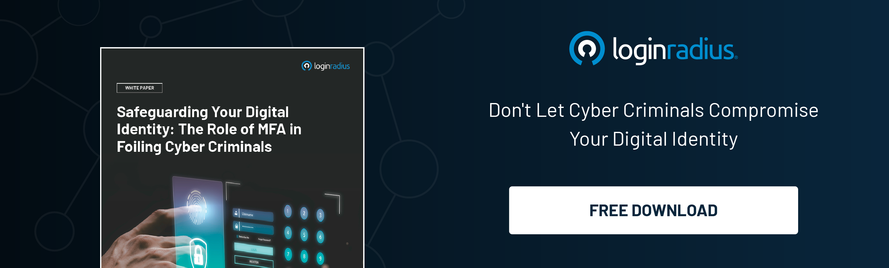

## Introduction

Generative AI (GenAI) is transforming the enterprise landscape, offering unparalleled capabilities in automation, creativity, and decision-making in today’s modern digital landscape. However, with great power comes great responsibility, especially in terms of security. 

Yes, security is often an overlooked aspect when it comes to leveraging the true potential of GenAI, and here’s where enterprises need to put their best foot forward in reassuring security. 

One effective method to secure GenAI is by implementing [Role-Based Access Control (RBAC)](https://www.loginradius.com/role-management/). This article explores how enterprises can leverage RBAC to safeguard their GenAI systems, ensuring that only authorized personnel have access to critical functions and data.

## Understanding GenAI and Its Security Challenges

Generative AI refers to AI systems capable of creating content, such as text, images, and even software code. While these systems can boost productivity and innovation, they also introduce new security challenges:

* **Data Privacy:** GenAI systems often require access to large datasets, which may contain sensitive information.

* **Access Control:** Without proper access controls, unauthorized users may exploit GenAI systems, leading to data breaches or misuse.

* **Auditability:** Ensuring transparency and traceability in GenAI operations is crucial for compliance and [data governance](https://www.loginradius.com/data-governance/).

## What is Role-Based Access Control (RBAC)?

RBAC is a security paradigm that restricts system access based on the roles of individual users within an organization. In RBAC, permissions to perform certain operations are assigned to specific roles rather than to individual users. 

This approach simplifies user permissions management and enhances security by ensuring that users only have access to the resources necessary for their roles.

## Implementing RBAC to Secure GenAI

Implementing RBAC in the context of GenAI involves several key steps:

### 1. Define Roles and Responsibilities

Begin by identifying all the roles within your organization that will interact with the GenAI system. Common roles might include:

* **Data Scientists:** Responsible for training and fine-tuning GenAI models.

* **Developers:** Implement GenAI models into applications.

* **Administrators:** Oversee system configuration and maintenance.

* **Business Analysts:** Use GenAI outputs for decision-making.

Each role should have a clear set of responsibilities and required permissions.

### 2. Map Permissions to Roles

Next, map specific permissions to each role. For example:

* **Data Scientists:** Access to raw data, model training environments, and performance metrics.

* **Developers:** Access to model APIs, integration tools, and deployment scripts.

* **Administrators:** Full access to system configuration, user management, and security settings.

* **Business Analysts:** Read-only access to GenAI outputs and analytics dashboards.

This mapping ensures that users only have access to the functions and data necessary for their roles.

### 3. Implement Access Controls

With roles and permissions defined, the next step is to implement access controls within your GenAI system. This can be achieved through:

* **Authentication:** Ensure all users are authenticated before accessing the system. Use multi-factor authentication (MFA) for added security.

* **Authorization:** Implement authorization mechanisms to enforce RBAC policies. Use customer identity and access management (CIAM) tools to manage user roles and permissions.

* **Audit Logging:** Enable audit logging to track user activities and detect unauthorized access or anomalies.

### 4. Regularly Review and Update RBAC Policies

RBAC is not a set-it-and-forget-it solution. Regularly review and update your RBAC policies to reflect changes in your organization, such as new roles, changing responsibilities, or evolving security threats. Conduct periodic audits to ensure compliance and identify potential security gaps.

## Benefits of RBAC for Securing GenAI

Implementing RBAC offers several benefits for securing GenAI systems:

* **Enhanced Security:** By restricting access based on roles, RBAC minimizes the risk of unauthorized access and data breaches.

* **Simplified Management:** RBAC simplifies the management of user permissions, reducing administrative overhead.

* **Improved Compliance:** RBAC helps ensure compliance with regulatory requirements by providing a clear audit trail of user activities.

* **Scalability:** As your organization grows, RBAC can easily [scale to accommodate new users ](https://www.loginradius.com/scalability/)and roles.

## Conclusion

Securing GenAI in the enterprise is paramount to harnessing its full potential while mitigating risks. Implementing RBAC provides a robust framework for controlling access to GenAI systems, ensuring that only authorized users can interact with sensitive data and functionalities. 

By defining roles and responsibilities, mapping permissions, implementing access controls, and regularly reviewing policies, enterprises can create a secure environment for their GenAI initiatives. 

By embracing RBAC, organizations not only protect their valuable data but also build a foundation of trust and accountability, paving the way for innovative and secure AI-driven solutions.

