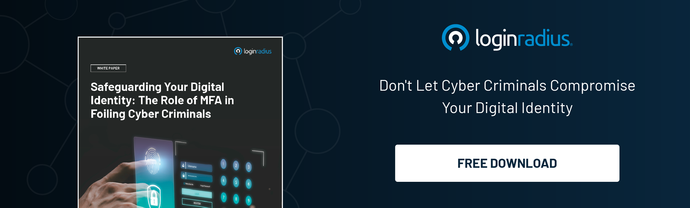

## Introduction

In the interconnected world of digital transactions and online interactions, security vulnerabilities pose significant risks to sensitive data and user privacy. 

Among these vulnerabilities, the Silver SAML (Security Assertion Markup Language) vulnerability has emerged as a pressing concern for organizations relying on SAML for authentication and authorization. 

Let’s understand the intricacies of the Silver SAML vulnerability, exploring its implications and offering guidance on fortifying digital identity protection.

## Understanding the Silver SAML Vulnerability

### SAML Essentials

To comprehend the Silver SAML vulnerability, it's crucial to grasp the fundamentals of the Security Assertion Markup Language. 

SAML facilitates secure communication between identity providers (IdPs) and service providers (SPs), allowing for [seamless authentication and authorization](https://www.loginradius.com/authentication/) processes in federated identity environments.

### Exploring Silver SAML

Silver SAML represents a vulnerability in SAML implementations that enables attackers to manipulate SAML responses, potentially bypassing authentication controls and gaining unauthorized access to resources. 

This exploitation can lead to identity spoofing, session hijacking, and data breaches, posing significant threats to organizational security.

## Implications of the Silver SAML Vulnerability

### Industry Impact

The Silver SAML vulnerability reverberates across industries, from finance and healthcare to government and beyond. 

Organizations across sectors must confront the risk of compromised user identities and sensitive data, necessitating proactive security measures and compliance with regulatory standards.

### Regulatory Compliance

Non-compliance with regulatory frameworks such as GDPR, HIPAA, and PCI DSS amplifies the consequences of Silver SAML vulnerabilities. 

Data breaches resulting from exploiting this vulnerability can incur hefty fines, damage reputations, and erode consumer trust, underscoring the imperative of robust security practices.

## Mitigating the Risks

### Patch Management

Timely application of security patches and updates to SAML implementations is essential for addressing known vulnerabilities, including those associated with Silver SAML. 

Organizations must establish effective patch management protocols to mitigate the risk of exploitation by threat actors.

### Enhanced Authentication

Implementing [multi-factor authentication](https://www.loginradius.com/multi-factor-authentication/) (MFA) strengthens user authentication processes, reducing the likelihood of successful Silver SAML attacks. 

By incorporating additional layers of verification, such as biometric data or one-time passcodes, organizations can enhance security posture and safeguard against unauthorized access.

### User Education

It is paramount to raise users' awareness of the dangers of phishing attacks, [social engineering tactics](https://www.loginradius.com/blog/identity/social-engineering-attacks/), and SAML vulnerabilities. 

Comprehensive security awareness training empowers individuals to recognize and report suspicious activities, bolstering the collective defense against cyber threats.

## Emerging Threat Landscape

### Continuous Monitoring

In addition to proactive measures, organizations must adopt a strategy of continuous monitoring to detect and respond to evolving threats. 

Real-time monitoring of SAML transactions and anomaly detection can help identify suspicious activities indicative of Silver SAML exploitation, enabling swift intervention to mitigate potential damage.

### Collaborative Defense

Fostering collaboration within the cybersecurity community is crucial for staying ahead of emerging threats like Silver SAML. 

Sharing threat intelligence, best practices, and remediation strategies through information-sharing platforms and industry alliances strengthens the collective defense against cyber adversaries, enhancing resilience across interconnected ecosystems.

## Conclusion

As digital transformation accelerates and reliance on federated identity systems grows, addressing vulnerabilities like Silver SAML becomes imperative for safeguarding digital identities and preserving trust in online ecosystems. 

By understanding the nuances of this vulnerability, implementing proactive security measures, and fostering a culture of vigilance, organizations can navigate the complexities of the modern cybersecurity landscape with resilience and confidence. Together, let us forge a path towards a safer, more secure digital future.
 
