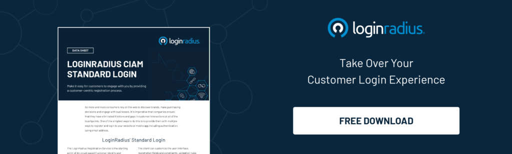
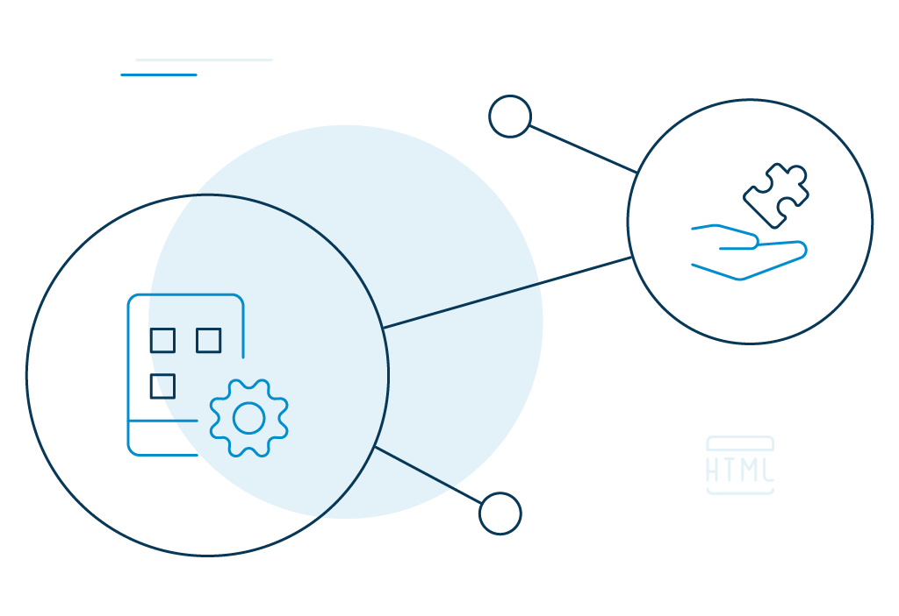

Single-page applications, or SPAs, are web applications that load a single HTML page and update it by dynamically rendering the browser's information as (and when) a user interacts with the app.

The loading mechanism of SPAs is different from traditional page loads where the server had to re-render the entire webpage with every click and send it back to the browser—making the process time-consuming.

Today, with a [new breed of users who expect data](https://www.loginradius.com/single-page-deployment/) to be available instantly and accessible everywhere, developers use JavaScript libraries and tools like Jquery, Angular to create single, responsive HTML pages. Such pages can be broken down into smaller sections, and the JavaScript code running on the web browser calls the required APIs on a server that returns the data.

Advantages..?

Well, Single-Page Applications make users' experience incredibly engaging and unique. The "bits and pieces" methodology makes load time much faster and fluid for users. Also, because the amount of information a server has to send back is a lot less, the application becomes cost-effective. 

## Examples of Single-Page Application 

A classic example of single-page applications is Gmail. They have mastered SPA-approach. You may notice that we do not generally need to refresh Gmail when a new email comes; we are notified instantly. It's obviously communicating with the server, but the JavaScript code hides the inbox and brings the message body on the same screen. 

Other notable examples of Single-Page Applications include: 

- Google Maps
- Google Drive
- Facebook
- Twitter
- Airbnb
- Paypal

## Advantages of Single-Page Applications

According to Google's research, every time a page load goes from 1 sec to 3 sec, the probability of [bounce rate increases by 32%](https://www.thinkwithgoogle.com/marketing-resources/data-measurement/mobile-page-speed-new-industry-benchmarks/). For 10 sec, the chance rises to a whopping 123%. 

No matter what, _faster's always better._ 

One of the major benefits of single-page applications is velocity. The majority of the resources that SPAs need—viz.HTML, CSS, and Scripts are loaded along with the application. They don't need to be reloaded throughout the entire session. 

Data is the only entity that is oscillated between the server and the webpage. This makes the application efficient and incredibly responsive to any query. 

### From the business perspective 

**Fast and responsive**: Probably by now, that's a given. With SPAs, businesses can increase the loading speed of their webpages significantly. Because they only reload content requests asked by the user, the server load is much lighter. It is, in fact, half of the server load compared to multi-page applications.

**Better cache capabilities**: Another advantage of single-page applications is that it can cache local data with utmost precision. It only takes one request to a server, and single-page applications effectively store all the data it receives. In the event of loss internet, this data can be put to use for seamless operation. 

**Frictionless user experience**: If you are planning to build a single-page web application, rest assured, you will be offering [frictionless user experiences](https://www.loginradius.com/customer-experience-solutions/)  to your consumers. Since it only loads the requested data, there is a significant improvement in performance as well. 

### From the consumer perspective 

Speaking from the consumers' end, the apparent advantages of exposing them to single-page websites is the speed and ability to work with no connectivity. 

These applications offer continuous user experiences, meaning they are easy to explore. In addition, when businesses add options like parallax scrolling and transitions to the picture, they make the customer journey even better.

Single-page applications can be the best bet for mobile users too. Users spend most of the time scrolling feeds on Facebook and Instagram. They can sit back, relax, and enjoy the show.

## Security Challenges With Single-Page Applications

Although there isn't much speculation around the fact that Single-Page Applications provide better experiences for developers and consumers, they have their own set of security shortcomings. For instance, SPAs cannot be adequately scanned by traditional scanners. This gives [cybercriminals a broader scope for attack](https://www.loginradius.com/blog/2020/05/cyber-threats-business-risk-covid-19/).

Other common security issues include:

### Authentication and Session Tracking

Usually, browsers that run in single-page applications interact with two different systems- 

- The first takes care of loading one or multiple HTML web pages. Additionally, it provides images, JavaScript libraries, and other assets.
- The other serves the API calls that carry the business logic and data.

In some instances, web server sessions protect the APIs behind a single page application, but this means that all business APIs should be proxied by a web server. That typically involves session cookies which are quite vulnerable to [cyber attacks.](https://www.loginradius.com/blog/2019/10/cybersecurity-attacks-business/)

### Cross-Site Request Forgery (CSRF)

CSRF or XSRF, or sea-surfing is one of the oldest web application attacks. Usually, CSRFs are performed through social engineering, for example, via forged emails or links that fool the user into sending a fake request to the server.

It happens when a malicious website has a link that connects to another website that the user has already signed in to. The bad actors authenticate the unaware user, so it is nearly impossible to distinguish a legitimate request from a fake one. 

Here's an instance of how a CSRF can take place:

- You log in to your bank account. 
- But after you are done with your activities, you forget to log out.
- Meanwhile, you receive an email from your friend with a link that says, "See Happy Puppies."
- The moment you click on the link, it will connect back to your bank's already opened website, and the attacker will perform financial transactions without your knowledge. 

## Securing Single-Page Applications with LoginRadius

Now the questions arise, how do you safely [authorize and authenticate](https://www.loginradius.com/blog/2020/06/authentication-vs-authorization-infographic/#:~:text=Though%20both%20the%20terms%20sound,to%20perform%20a%20specific%20function.) your Single Page (SPA) users? Here, we are being particular about JavaScript web applications that run on the same domain as the API.

LoginRadius offers two options to cope up with the cybersecurity-related shortcomings. 

- Federated SSO
- Web SSO

### Federated SSO

LoginRadius uses popular token-based protocols like OAuth2 and OpenID Connect for [federated logins](https://www.loginradius.com/federated-sso/). Examples include Login with Facebook, Google, or any other third-party sites.

Unlike the older SAML 2.0, which could be used only once as proof of identity, these new protocols can be used over and over again to access protected API resources. 

**OAuth 2.0**: OAuth2 is an industry-standard protocol for token-based authentication and authorization. It supports multiple grant types, which means users can grant access to their resources from one application to another without exposing their credentials, every time.

It functions by giving short-lived access tokens to the Single-Page Application, which in turn authorizes the SPA so it can access the protected API services. It is often conducted on behalf of the logged-in user.

**OpenID Connect**: LoginRadius also supports standard [OpenID Connect](https://www.loginradius.com/compliance-list/openid/), which is an identity layer on top of the OAuth 2.0 protocol. It is used to verify user identity depending on the authentication performed by an Authorization Server. With OpenID Connect, you can also retrieve basic profile information about the user.

### Web SSO

Web SSO is browser-based session management that uses cookies to manage sessions between applications. Cookies are created by the server and contain information that a browser sends to the server on request. LoginRadius IDX uses a centralized domain to perform the authentication and, when requested, shares the session with authorized applications.

It helps users [log into multiple applications](https://www.loginradius.com/blog/2019/11/benefits-single-sign-on-sso/), irrespective of the platform or domain, provided they are logged in to one application in the first place. 

## Conclusion 

Cybersecurity issues aren't unique to Single-Page Applications. The users make requests and not JavaScript. Also, the result is produced in HTML and not in JSON or any other format. 

Unlike the traditional non-SPAs where you had to secure individual pages on the server, all you need is to secure the data endpoints in single-page applications. Going by the options above, [dodging cybercriminals](https://www.loginradius.com/blog/2019/12/digital-privacy-best-practices/) should not be a big deal.

