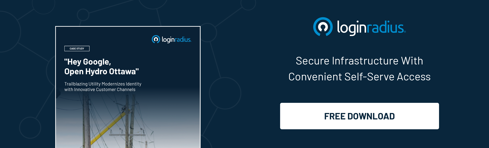

Every country is progressively inching towards diverse smart city projects that eventually become the new driving force behind a state’s overall development. 

However, the key aspect determining whether these projects are a failure or a success is the involvement of civilians living and working in that city. 

Undoubtedly, civilian engagement is a significant factor that can offer valuable insights to enhance the current services that pave the path for the region’s overall development. 

But the big question is how to enhance civilian engagement?

Well, delivering a flawless user experience and online services can help increase civilian engagement. 

The key lies in leveraging a robust [identity management solution](https://www.loginradius.com/b2b-identity/) that delivers a great user experience to citizens across multiple platforms and devices and ensures adequate security and privacy. 

Let’s understand the role of digital identity for smart cities in improving civilians’ digital experience through unified identity.

## The Role of Digital Identity for Smart Cities

With population growth and the expansion of public services, cities need to be innovative about providing services to all people without compromising service quality. There is a need for a single platform where all facilities are centralized, and customer experience is considered.

Digital identity is a great way to get started as it can prove a citizen’s identity through diverse government channels and is crucial for citizens to avail government services. 

As the government invokes the potential of secure digital identities, citizens would access core services and resources without any hassle. 

Moreover, every citizen requires some kind of public service, and that’s why handling a unique number of identities securely becomes a tough nut to crack for the government. Here’s where the need for digital identity management comes into play. 

A smart CIAM (consumer identity and access management) solution like LoginRadius helps public sector organizations manage heaps of identities efficiently without hampering user experience. 

Let’s learn how a CIAM solution like LoginRadius can deliver a flawless digital experience to civilians that pushes overall development reinforced by adequate security.

## Centralized Online Services

Cities need one unified self-service portal so that their constituents have a seamless, efficient experience as they access the services they need. The LoginRadius Identity Platform enables cities to centralize their customer-facing digital applications into one portal. 

This portal enables a frictionless experience across multiple services that improve user experience and [enhance user engagement](https://www.loginradius.com/customer-experience-solutions/). 

 \
This single locus of access delivers a connected experience across multiple touchpoints and channels. LoginRadius has supported applications such as Account Summary, Customer Profile, Permit Applications, and Bill Payment. 

## Maintaining One Digital Identity Across All Customer Service

What good is a centralized portal if citizens create multiple identities for individual web and mobile applications? Operating in this way creates identity silos that prevent a thorough view of the customer’s journey and preferences, which means the customer experience can’t be optimized for each individual.

Without a seamless user experience, engagement rates drop. But with [LoginRadius Single Sign-on (SSO),](https://www.loginradius.com/single-sign-on/) cities and companies can allow customers to access all applications within their platform with a single set of unified credentials, rather than having to register and log in to each service separately. 

## Integrating with Third-Party Applications

Many public sector organizations have a hard time using customer data to improve the digital experience. 

The LoginRadius Identity Platform offers pre-built integrations with over 150 third-party applications such as CRM, email marketing tools, online communities, payment systems, and more.

This enables organizations to use that customer data to understand their customers better, offer more useful information and deliver that information more directly.

## How LoginRadius Helped Hydro Ottawa in Creating a Solid Architectural Foundation 

Hydro Ottawa is a regulated electricity local distribution company in eastern Ontario. 

As the third-largest municipally-owned electric utility in Ontario, Hydro Ottawa maintains one of the safest, most reliable, and most cost-effective electricity distribution systems in the province.  They serve about 332,000 residential and commercial customers across 1,116 square kilometers.

### Client Requirements 

The Hydro Ottawa team wanted to create a solid architectural foundation for digital growth and innovation. They decided that the core of this new system would be a [customer identity solution](https://www.loginradius.com/)  that centralizes and unifies customer identity data.

With the launch of their mobile app and a revamp of their customer web portal underway, Hydro Ottawa needed an SSO solution to log in with a single profile that included social media validation.

### Result

* By implementing the LoginRadius customer identity solution, Hydro Ottawa now offers their customers a secure, streamlined login and registration system. 
* Single sign-on (SSO) capabilities removed the previous accessibility barriers. With SSO, customers can move seamlessly through different Hydro Ottawa web applications without signing up or logging in again. 
* Customers can easily access their accounts online to see their electricity usage and billing activities.
* By leveraging the identity solution and digital infrastructure already in place, Hydro Ottawa was able to release an award-winning mobile application. It’s the first app in North America that lets customers track their household’s electricity usage and costs, access their billing information, and find out about current power outages using a single tool.

## Final Thoughts 

Digital identity is paving the path for a rich unified experience for citizens that require public services in daily routines. 

Robust consumer identity and access management solutions like [LoginRadius](https://www.loginradius.com/contact-sales/) can help public sectors deliver great experiences tacked by adequate security to their civilians, reinforcing different smart city projects. 

