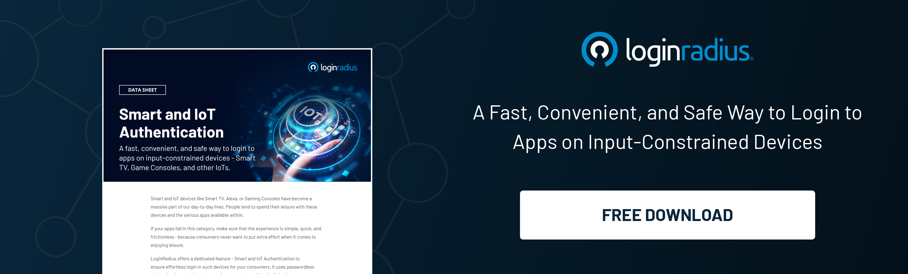

## Introduction

Credentials are the cornerstone of our identities. They prove who we are, what we know, and what we can do. And as technology evolves, so does the way we verify credentials.

In the past, you had to carry around a physical piece of paper to prove your identity and skills—a photo ID or a degree certificate. But with the rise of smart technology, [verifying a credential](https://www.loginradius.com/authentication/) has never been easier or more convenient for both employees and consumers.

In this blog post, we'll talk about why smart credentials are so important in an increasingly digital world and how they're rewriting the rules for physical verification.

## What are Smart Credentials?

Smart credentials are a new way for businesses to verify the identity of their customers. They work by scanning the unique biometric markers on an individual's body, such as fingerprints or retinal patterns. This allows businesses to verify the identity of their customers in order to prevent fraud and protect their brand reputation.

These credentials can be accessed through a smartphone app or a computer, making it possible to use them anywhere in the world. It also means that no one needs to check your physical documents or cards anymore.

## How Smart Credentials Will Change The Way We Do Things?

We are getting closer and closer to a world where everything is connected and can be accessed from anywhere at any time—and in order for that to happen, we have to rethink how we use technology and which devices we use for what. Rather than carrying around a separate device for each type of information (like credit cards), people are moving toward using smart devices that can hold everything for them.

Smart credentials are already being used by some companies around the world—for everything from employee badges to medical records—and they could change the way we do things forever!

## How Portable Smart Credentials Can Prevent Identity Theft?

[Data breaches](https://blog.loginradius.com/identity/data-breaches-common-mistakes/) happen all the time. Sometimes they are the result of a hack, and other times it's just a case of human error. In either case, your personal information, viz. your Social Security number (SSN), address, and other personally identifiable information (PII) is compromised.

That's why smart credentials are such a game-changer. They are portable, reusable digital identification that minimizes the risk of data breaches because it minimizes the number of times you give out your data. You don't have to show anyone your driver's license or disclose your SSN, address, and other PII. You present a smart credential that lets the organization in question verify your identity via. a trusted exchange network.

## Benefits Of Smart Credentials For Any Organization

1. Employers are looking for ways to connect more effectively with their potential employees, and credentials are one way they can do that. Credentials help employers connect the right people with the right job by providing a way to vet prospective candidate’s skills and abilities before hiring them. 

2. Credentials are also useful for displaying information about an individual's past work experience or education. This makes it easier for potential employers to find qualified applicants without relying on resumes alone.

3. By using smart credentials, organizations can increase their efficiency and make it easier to verify employee information from anywhere in the world. 

4. The use of smart credentials also reduces the risk of being hacked because they are stored offline instead of on a computer or phone, which could be compromised. Smart credentials are an effective way to manage the day-to-day operations of your organization, but they can also help increase the visibility of your organization. 

5. Smart credentials provide a way for employees to showcase their skills and achievements in a digital format that can be shared with potential employers, colleagues, clients, and other stakeholders. This is especially useful for organizations that require high levels of expertise in specialized fields or professions.

## Conclusion

The reason we should all have an interest in smart credentials is simple. [Digital identity verification](https://blog.loginradius.com/identity/what-is-identity-verification/) and control are the future. The ability to take our credentials with us securely, wherever and whenever we go, will prove to be a boon in matters large and small. 

We will only be dependent on a physical card that might never be accepted where we want it to be. We will increasingly have greater control over protecting our identities by ensuring that sensitive personal information is not disseminated unnecessarily. 

