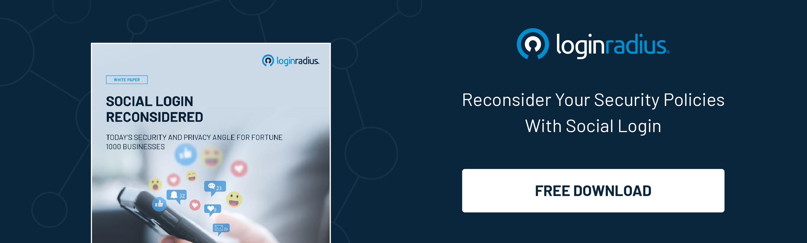

## Introduction

Privacy is a growing concern for many private board users. While there is no such thing as “complete privacy” or “true anonymity” — especially in a digital world where websites and social platforms keep track of what we do online — there is plenty you can do to protect your personal data and secure your important privates accounts against unlawful entry and theft.

Unfortunately, though, security risks are becoming more prevalent on social media and other digital platforms. From the scammers that are trying to [get a hold of your email address](https://www.loginradius.com/blog/identity/stop-scammers-getting-email-address/) to the social media trackers, identity theft, and automated bots, there’s a very real chance that someone is trying to steal your data on social media.

Now, if you are a business leader, it is imperative that you’re able to protect all business and consumer data that might be passing through your social media accounts. That said, it’s equally important to leverage the cybersecurity best practices to educate your employees and your audience on how they can [protect their data and identities online](https://www.loginradius.com/blog/identity/purpose-identity-security-2021/).

Let’s take a look at most pressing social media privacy threats and what you can do to minimize risk.

### Ads and popups that know too much

Advertisers are pouring a lot of money into their ad campaigns on social media, so it’s only natural that they should want to target their ideal customers as accurately as possible. Social networks like Facebook and Instagram provide specialized advertisement tools, solutions, and dashboards that allow marketers to maximize their advertising dollars as much as possible.

This kind of hyper-targeting has its benefits and drawbacks, of course. For one, customers are increasingly using ad blockers to counteract intrusive ads and popups. The same goes for the mobile audience, as customers are encouraged more and more to use an <a rel="nofollow" href="https://adlock.com/adlock-for-android/"> ad blocker </a> for android or a similar solution for iOS devices to prevent intrusive ads from popping up on every website.

This doesn’t mean that you shouldn’t invest in social media ads, but you need to keep in mind that running too many campaigns can backfire easily. If your chosen social networks are increasingly mining data to boost your ad campaigns, it’s important that you educate your audience on how they can opt out of third-party cookies and protect their data.

Yes, it is important to target the right people, but you don’t want your ads to turn your followers against you - after all, people don’t like ads that seem to “know” too much.

### Identity theft and impersonation

Another very real privacy threat on social media nowadays is identity theft and impersonation. Securing consumer identity is paramount for modern businesses, and that also means educating your audience on how to stay safe online and [avoid identity theft](https://www.loginradius.com/blog/identity/identity-theft-frauds/). This is especially important for companies operating in high-risk industries where identity theft or impersonation might be a more common occurrence.

If you don’t have a reason to educate your audience, then you should focus on educating your employees on how to protect themselves on social platforms - in order to protect your business. For example, someone might try to steal their image to impersonate them, either for personal purposes or with malicious intent, which can lead to data breaches.

Make sure to help your employees avoid identity theft by boosting their social media security, leveraging safe logins, and educating them on phishing scams, suspicious links, and more.

By the way, bad actors can steal your company’s product photos as well in an attempt to impersonate your brand. This related theft often violates copyright laws, so it benefits you to learn about the rules for <a rel="nofollow" href="https://cherrydeck.com/blog/2021/08/27/copyrights-is-it-legal-to-take-photos-from-the-internet/"> taking photos from the internet </a>. You want to protect your brand as well as your customers and employees. 

### Unsecure logins via social media

Nowadays, many websites allow you to log in or create an account simply by connecting your social media account, which is convenient, but it can create various security risks. What companies can do here to keep their customers safe and offer a seamless experience is to use a tool like [social Login](https://www.loginradius.com/social-login/) to provide a safe login with a social media ID. This will also allow you to seamlessly gather profile data without exposing the user to any risk.

Enabling users to connect with your website, app, or software solution via their social accounts is a great way to boost your social media marketing strategy as a whole, but it is imperative to do it through a unified social API in order to ensure data security and privacy protection. This also allows you to instill trust in your social followers by showing them that logging in with their social accounts is safer than ever before.

### Data mining and IP tracking

Social networks are notorious for their attempts to mine data and sell it to third-party companies. Every time you create an account on a social network, you willingly relinquish some of your personal data, such as your name, address, occupation, and more. However, companies also tend to mine for more specific data, such as behavioral trends, social contacts and interactions, and various personal interests.

If you want to elevate your privacy and prevent companies from tracking you around the web, you might want to secure your business with a VPN. There’s no denying that antivirus and VPNs can dramatically improve your security in the online world, and a [VPN for Android](https://cybernews.com/best-vpn/free-vpn-for-android/) or iOS can ensure your privacy while shopping, banking, and surfing online.

These tools are great for companies as well as individuals, particularly on dubious social networks like Facebook that have already come under fire for their data mining and data reselling activities over the years.

### Bots and botnet attacks

Bots are automated social media accounts used to spam people, send out malicious links, and perform all kinds of malicious activities. When these bots are grouped together, they become a bot network, or a botnet, which can launch DDoS attacks and enable cyber criminals to access accounts and devices.

It should go without saying that this can be disastrous for your company, which is why it’s important to leverage [consumer authentication](https://www.loginradius.com/blog/fuel/future-customer-authentication-market-needs/) and other advanced security solutions to protect your employees and customers on social media. Bots and botnets will continue to operate on social networks, but you can use cybersecurity solutions and built-in security features on social media to keep your accounts safe.

Make sure to:

* Use two-factor authentication
* Use account authentication
* Use strong passwords
* Use a social media management platform
* Delete old and unused accounts
* Conduct security audits
* Manage access for all employees

## Conclusion

Securing your sensitive data on social media and minimizing cybersecurity risks should be a top priority for companies and consumers in 2022. Make sure to keep these privacy threats in mind and use these tips to keep your business, your employees, and your customers safe in an increasingly dangerous online world.

