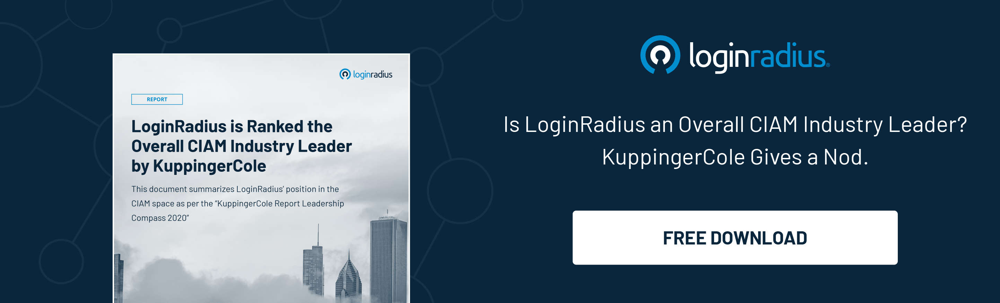

Delivering rich consumer experiences isn’t a luxury anymore; it’s the necessary fuel that keeps businesses up and running in the most competitive digital ecosystem. 

Moreover, the entire e-commerce industry’s success largely depends on how they make their consumers feel whenever they land on their website or mobile application. 

Whether it’s the personalized greeting or a suggestion of a product based on a buyer’s search history, online vendors can deliver rich consumer experiences that not only enhance sales but ensure returning customers. 

However, when we talk about loyalty platforms, things aren’t that smooth as they should be. In other words, consumers can’t indulge in a seamless experience when they connect with a loyalty platform for potential benefits. 

Stats reveal that approximately [75B U.S. dollars](https://www.statista.com/statistics/1239203/business-spending-on-customer-loyalty-world/) were spent on loyalty management back in 2019. 

Businesses are spending a good amount of money and time offering loyalty to their consumers, which eventually brings good returns on investment. But not everyone can yield good profits.  

Buyers cannot redeem benefits as cash points or discounts on e-commerce platforms since the most significant barrier, i.e., identity verification, hampers user experience. This leads to poor conversions and eventually a decline in the number of visitors on loyalty platforms. 

This post helps you understand the biggest challenge for loyalty platforms and how Single Sign-On (SSO) integration for consumer loyalty platforms can be the game-changer. 

## The Biggest Challenge for Consumer Loyalty Platforms 

As discussed earlier, consumer experience is essential for any online business; the same goes for loyalty platforms. 

Consumers today are always on a hunt for a seamless experience as they already interact with brands like Amazon, Microsoft, and Apple. They know what a great user experience means, and they’re expecting at least something closer to it. 

However, when they interact with platforms offering [loyalty for third-party websites](https://www.forbes.com/sites/bryanpearson/2019/02/21/amazons-new-loyalty-program-5-reasons-amazon-moments-will-change-how-you-shop/?sh=6fae2a873acd), including Amazon, they cannot find that sophisticated and seamless experience. 

A little friction during the authentication process can lead to a poor experience for consumers that further impacts overall sales. 

Authenticating and authorizing a user by the loyalty provider for an e-commerce vendor through its unique identity should be a matter of seconds. 

Unfortunately, it isn’t. 

Users may face several challenges while expecting discount benefits or redeeming cash points because their loyalty provider lacks a robust identity management partner. 

Let’s understand this issue further in detail. 

## Consequences of a Bad Identity Management System for Loyalty Platforms

[Managing the consumer journey](https://www.loginradius.com/blog/fuel/consumer-journey-from-sign-up-to-purchase/) in the business landscape can be challenging for any organization, especially if they’re dealing with multiple parties. 

The same goes for accessing electronic records and loyalty vendors handling multiple identities of consumers seeking benefits and their regular clients and employees. 

Poor identity management impacts sales and affects recurring consumers since users demand rich experiences, and when it’s about rewards, they cannot compromise.  Moreover, the market is flooded with several loyalty providers, and consumers are just a click away to switch. 

Hence, loyalty vendors must quickly put their best effort into enhancing user experience, especially when they’re handling third-party users seeking benefits in terms of rewards and discounts that eventually build trust and lasting relationships. 

Furthermore, securing consumer accounts is yet another tough nut to crack for enterprises delivering loyalty benefits since attacks and fraud reward platforms are always looking for ways to sneak into a network and exploit consumer identities. 

This raises the demand for a robust mechanism that handles consumer identities securely and manages consumer onboarding from third-party websites like a breeze. 

Here’s where a consumer identity and access management (CIAM) solution like LoginRadius comes into play. 

Let’s understand how industry-leading CIAM like LoginRadius pave the path for a flawless user onboarding experience coupled with robust security for loyalty platforms using cutting-edge SSO integration. 

## Why is LoginRadius’ Single Sign-On (SSO)  the Need of the Hour for Loyalty Platforms?

Single Sign-on (or SSO) is a unique authentication method that allows users to access multiple applications with a single set of credentials, like a username and password. 

[LoginRadius SSO](https://www.loginradius.com/single-sign-on/) is designed to simplify the verification process and create a seamless environment when accessing multiple apps, portals, and servers.

Simply put, LoginRadius SSO has entirely removed the need for users to enter their login credentials for individual applications.  Alternatively, users sign in once, and the interface sends the necessary credentials to the assigned systems through various proxies and agents. 

## LoginRadius’ SSO Capabilities 

LoginRadius [Single Sign-On](https://www.loginradius.com/blog/2019/05/what-is-single-sign-on/) is the perfect fit for organizations that want to reduce their data protection vulnerabilities, improve consumer experiences, and streamline processes for identity management and log in.

What else makes LoginRadius single sign-on the best choice for your enterprise? Let's find out.

### SSO offers robust security

According to a [survey by Google](http://services.google.com/fh/files/blogs/google_security_infographic.pdf), 53% of users still reuse the same password for multiple accounts. Therefore, reducing login to a single set of credentials is a good start in reducing the attackers' surface area. Because users log in only once, there are fewer opportunities for mistakes. 

Enterprises can also go the extra mile with two-factor authentication (2FA) and multifactor authentication (MFA) techniques. 

### SSO helps with regulatory compliance

Regulations like HIPAA require users to authenticate before they can access electronic records along with options like automatic log-off and audit controls to track user access. 

LoginRadius SSO makes these requirements around data access and control at the granular level. It also allows enterprises and developers to comply with regulations that require provisioning and deprovisioning users. 

### SSO saves time 

Because users need not remember multiple credentials for multiple logins anymore, it saves time and improves productivity.

Also, remembering one password instead of many miraculously [reduces password fatigue](https://www.loginradius.com/resource/infographic/death-of-passwords). More so, it gives users the perfect opportunity to come up with even stronger passwords. 

### SSO lowers IT costs

This one is interlinked. When there are fewer passwords to remember, there will be even lesser chances of users forgetting them—leading to a reduced number of reset help tickets. This will reduce the need for IT involvement and lower IT costs.

## Why LoginRadius is the Right Choice in 2021 and Beyond

LoginRadius’ cutting-edge CIAM goes beyond a single sign-on solution with its broader consumer identity and access management functions, but it is an excellent platform for SSO nonetheless. 

With its simple-to-use one-click access, it works great for small to large-scale, consumer-facing deployment. The added 2FA/MFA security protects data—both in-house and consumers.

The LoginRadius Identity Platform offers SSO in the following ways:

* **Web SSO:** LoginRadius offers browser-based session management when the SSO is required between two or more web applications. It uses localStorage, cookies, and similar storage mechanisms to maintain the user's session across applications. To execute the authentication, a centralized domain operated by LoginRadius IDX is used.
* **Mobile SSO:** After logging into an application, the user can log in across multiple apps without the need for multiple passwords. It works by storing the LoginRadius access token in a shared session. It enables you to identify a currently active session and utilize the data to configure the user account in successive applications. 
* **Federated SSO:** Login also helps you implement SSO with third-party applications. It is done through [federated SSO](https://www.loginradius.com/federated-sso/). LoginRadius Identity Platform supports all major industry single sign-on protocols like SAML, JWT, OAuth, and OpenID SSO protocols for interaction with various third-party web applications.
* **Custom IDPs:** Consider this as Social Login. Custom IDPs are used to configure a Social Login provider that is not available in the default list of providers by LoginRadius. You can use any external database to authenticate your application users. 

## Other Good Reasons to Rely on LoginRadius

* Reinforced Security with Stronger Authentication
* Reduced Help Desk Costs
* Auto Scalable Infrastructure
* Scalability
* Globally Compliant 

## Final Thoughts 

In the digital era, every business is leveraging a consumer identity and access management solution that can help them enhance growth without compromising user experience and security. 

Loyalty platforms need to understand the crucial role of a CIAM solution that delivers a flawless user experience through SSO and enhances security through MFA. 

Single Sign-On improves consumer experience and boosts productivity by a considerable margin for loyalty businesses. 

By implementing the benefits of the LoginRadius SSO as a unified solution, you increase business agility, security, convenient and streamlined experience for your business and consumers alike. [Contact us](https://www.loginradius.com/contact-sales) today. 

