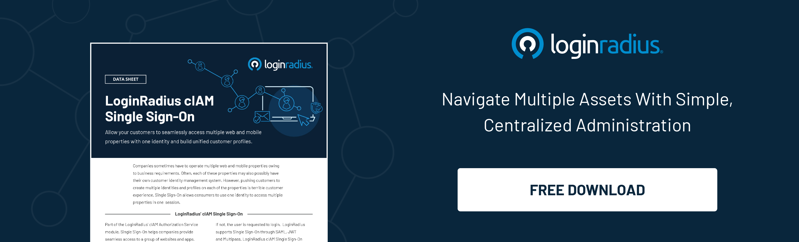
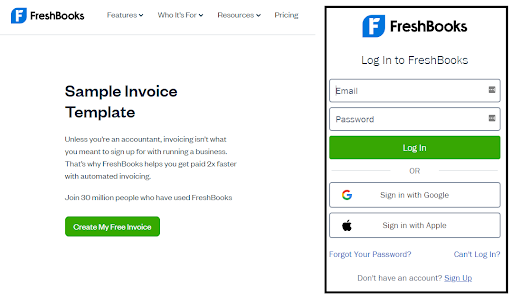

## Introduction 

In this digital age, data is more critical than ever before. Businesses rely on the right data to make decisions, understand customers, and improve their products and services. 

But collecting accurate and reliable data can be challenging, especially if you have a large customer base across multiple platforms and devices. Single sign-on (SSO) can be a helpful tool as it allows customers to use one set of credentials to access multiple applications.

This article will discuss all you need to know about SSO and how it can benefit your data collection efforts. Let's get started.

## What is Single Sign-On?

[Single sign-on](https://www.loginradius.com/blog/identity/what-is-single-sign-on/) (SSO) is an authentication method that allows users to access multiple applications with one set of credentials.

Meaning, with SSO, users can sign in once with their username and password to gain access to all the applications they have permission to use. This eliminates the need to remember multiple credentials and makes it easier to access the applications they need.

SSO can be used to authenticate users across a variety of devices, including laptops, smartphones, and tablets.

There are two types of SSO:

1. **Internal SSO:** Internal SSO allows employees to access multiple applications with a single credential. This is often used in businesses where employees need to access various applications, such as email, file sharing, and customer relationship management (CRM) systems.
2. **External SSO:** External SSO allows customers to access multiple applications with one set of credentials. This is often used by businesses that offer a suite of online services, such as social media, e-commerce, and webmail.

In general, SSO can also provide a[ more secure and frictionless user experience](https://www.loginradius.com/blog/growth/4-tips-secure-frictionless-ux/). If you have different applications, it can be difficult for users to set and remember passwords for all of them. With SSO, users would only have to remember one set of credentials. This would make it easier for them to access the applications they need and reduce the chance of forgetting their password.

## The Importance of SSO Tokens

An SSO token is a piece of data that allows a user to be authenticated across multiple applications. The token is typically generated by an identity provider (IdP), and then passed to the application the user is trying to access.

The application will use the information in the token to verify the user's identity and then allow them access to the application.

## How Data Collection Fits in With SSO?

Data collection is essential to any business, and leveraging SSO can help make the process more efficient. By using SSO, companies can reduce the number of login credentials that need to be managed, making it easier to collect and store data. 

Some common methods for collecting data include:

* **Logging**: This method involves recording events that occur within the system, such as login attempts, resource accesses, and so on. Log data can be used to track user behavior and identify trends.
* **Auditing**: This method involves tracking changes made to data within the system. Audit logs can be used to investigate suspicious activity or track down errors.
* **Reporting**: This method generates reports on system usage, performance, etc. Reports can be used to monitor trends and identify areas for improvement.

## SSO Use Cases in Data Collection

An interesting benefit of  SSO is that it can be combined with various <a rel="nofollow" href="https://www.mikevestil.com/data-collection-tools/"> data collection tools </a>. Here are some use cases of a well-implemented SSO system for data collection.

* **Monitoring user behavior:** When you have SSO in place, it becomes relatively easier to monitor the behavior of users. This is because all the activities of a user are logged into a central location. You can use this data to see which resources are being accessed the most, identify patterns in user behavior, and so on.
* **Detecting anomalies:** Anomaly detection is another great use case for an SSO system. By monitoring the activity logs, you can easily detect any unusual behavior that might indicate a security breach. For example, if you see a sudden spike in failed login attempts from a particular IP address, it could indicate someone is trying to [brute force](https://www.loginradius.com/blog/identity/brute-force-lockout/) their way into the system.
* **Improving security:** Security is always a top priority for businesses, and an SSO system can help enhance security in various ways. For example, by monitoring user behavior, you can more easily identify malicious activity and take steps to prevent it. Additionally, using robust authentication methods, such as [two-factor authentication](https://www.loginradius.com/blog/identity/how-to-setup-2fa-in-online-accounts/), makes it more difficult for unauthorized users to gain access to your resources.

## Advantages of Using SSO for Data Collection

Let's consider a few advantages of using SSO for data collection.

### 1. It is a more efficient and secure way for customers to access systems.

With SSO, the customer only has to remember one credential – their SSO login, which can also be associated with another account they most commonly use. This would make it more convenient for them to access their account and reduce the chance of forgetting their password.

This applies to any website that provides services that require a login. 

Let's say customers need to log in to access a sample invoice template and other accounting resources on one's site. 

If we assume the template is in a PDF format and is behind a paywall, the customer must input their account details to access the content.

Without an SSO system, the customer would have to remember their username and password for your site. If they can't recall their login credentials, they'll have to go through the process of resetting their password. 

Since such a company deals with financial data, it's also essential to have a secure way of handling customer login information.

### 2. Less chance of password fatigue.

This is also a great point to consider regarding your employees. With employee productivity statistics showing that employees do as much as 3.4 hours of multitasking daily, it can be easy for employees to get complacent at work.

If they have to remember multiple passwords for different systems, it can lead to password fatigue, which leads to them using the same password for multiple accounts or writing down their passwords. Both of these scenarios pose serious security risks.

With SSO, your employees only have to remember one set of credentials. This can reduce the risk of password fatigue and improve employee productivity.

### 3. Reduced support costs.

Another business advantage of SSO is that it can help reduce support costs.

This is because customers will no longer need to contact customer support often to reset their passwords or troubleshoot login issues. Additionally, employees can resolve their password issues without contacting IT for assistance.

### 4. Improved security.

Since an SSO system uses a central database of user credentials, it's easier to implement robust authentication methods, such as [multi-factor authentication](https://www.loginradius.com/multi-factor-authentication/).

This can help reduce the risk of unauthorized users gaining access to your systems and sensitive data. Additionally, you can more easily identify and prevent malicious activity by monitoring user activity.

## Conclusion

Overall, using SSO for data collection can offer many benefits for businesses. It can simplify the login process for customers and employees, reduce support costs, and improve security - all while following current protocols that are used by both small businesses and large enterprises. 

If you're looking for a more efficient and secure way to collect data, consider implementing an SSO system in your business.

