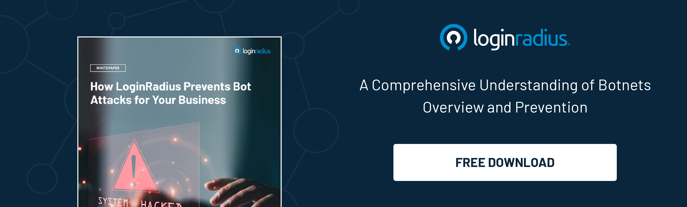

## Introduction

Have you ever wondered how email scammers get your private email address? Scammers are always looking for ways to collect data—from phishing emails to fake login pages. We want you to be on your guard and learn what they’ll do to try and get your personal information.

For example, you know the kind of scam messages that try to trick you into clicking on a link to see photos of cute kittens? Scammers use your social media accounts to learn your name and other identifying information, which they use to send emails that look like they’re from a friend.

In this article, we’ll tell you exactly how they do it and what you can do to stop them.

## What Are Phishing Email Scams

[Phishing emails](https://www.loginradius.com/blog/identity/phishing-for-identity/) are not just innocent spam. They are criminal attempts to fraudulently acquire private information from unsuspecting users. Some people, however, allow their greed to get the best of them and fall for these scams. Even though some of these emails are quite easy to see through, millions of people every year still fall prey to phishing scams.

It's no secret that cybercriminals attack their targets by sending out sophisticated phishing email scams. These scams resemble emails from legitimate banks, government agencies, credit card companies, social networking sites, online payment websites, or multiple online stores. These usually begin with an approach where the sender asks recipients to click on a link that redirects them to an ad page where they need to specify and confirm personal data, account information, etc.

These phishing email spams usually include:

* Advertisement spams such as online shopping, pharmacy purchases, gambling
* Work-from-home job offers and schemes
* Hoax charity appeals and virus threats

Once hackers have obtained the necessary information, they create new user credentials or install malware into your system to steal sensitive information.

## How Do Spammers Obtain Your Email Address

Spammers—people who send spam e-mail messages—use many different methods to collect e-mail addresses. We have list below some of the most common ones: 

### 1. By using harvesting programs

Spammers and cybercriminals engage in phishing email scams by using harvesting software to steal and gather email addresses from the internet. Professional spammers [rely on bots](https://www.loginradius.com/blog/identity/bot-attacks/) that crawl millions of websites and scrape addresses from pages. Other spammers get email addresses by approaching sellers on underground cybercrime forums, or in open-air markets where addresses are found in mailing lists, websites, chat rooms, and domain contact points.

### 2. By using random alphanumeric combinations 

Scammers use [brute force attacks](https://www.loginradius.com/blog/identity/brute-force-lockout/) to generate various alphanumeric combinations of email addresses in a sequential manner by automatically entering random letters, numbers, and symbols until they get any one of those right. 

### 3. By using CC email

Phishing email scams can often result when anyone uses carbon copy (CC) while addressing an email to a group of people. This results in forwarding the same email repetitively, thereby exposing the email addresses of all the people concerned.

## How to Prevent Phishing Email Scams  

With scammers attempting to get you to give out personal information to an untrustworthy source, here's how to fight back.

### 1. Avoid public posts

Everyone has easy access to the internet via mobile phones, laptops, and computers. This puts your public posts at constant risk of being hacked by professional spammers and cybercriminals. To prevent spammers from knowing your personal and financial information, you should avoid posting your email addresses and other sensitive content in public.

### 2. Learn to spot the spams 

Even if your email has fallen into the wrong hands, you can still prevent your personal content and financial information from getting leaked by identifying spam and not responding to them.

Some warnings or indications are:

* The email received lacks legitimate content.
* The sender is unknown or anonymous.
* The received email may contain misspelled words and sentences purposely designed to fool spam filters such as IndiAgo for Indigo, Adidos for Adidas, etc.
* The received email may contain offers that seem too good to be true.
* The received email may contain urgent end dates like offering discounts for shopping within the due schedule.
* The received email may contain requests such as to forward certain messages to a large number of people in the name of offering money for doing so.
* The received email may contain links that redirect you to other ad pages containing malware.

### 3. Use two-factor authentication (2FA)

[Two-factor authentication (2FA)](https://www.loginradius.com/developers/) is an extra layer of security on top of your password login. It's commonly used in online applications, especially to protect accounts that can be accessed from anywhere and have high-value personal data. 

### 4. Integrate graphics to your emails

Email addresses can be implemented as graphic features, making it complicated to harvest programs and dictionary features to recognize them. This can ensure security and privacy as such texts cannot be copied or linked with malware. 

### 5. Obfuscate

You can obfuscate, or scramble, your email address by using HTML and JavaScript in emails. Obfuscation also makes it harder for hackers to see the real email address you are using.

## Conclusion 

As email addresses have become ubiquitous and the messaging process more interactive, scammers have evolved to follow suit. The best way to protect yourself is to be mindful of how you use your address and how you share it with others. 

By taking simple precautions, including checking the source of the message and even flagging suspicious emails as spam, you can keep the scammers away, and remain in control of your inbox.
 

