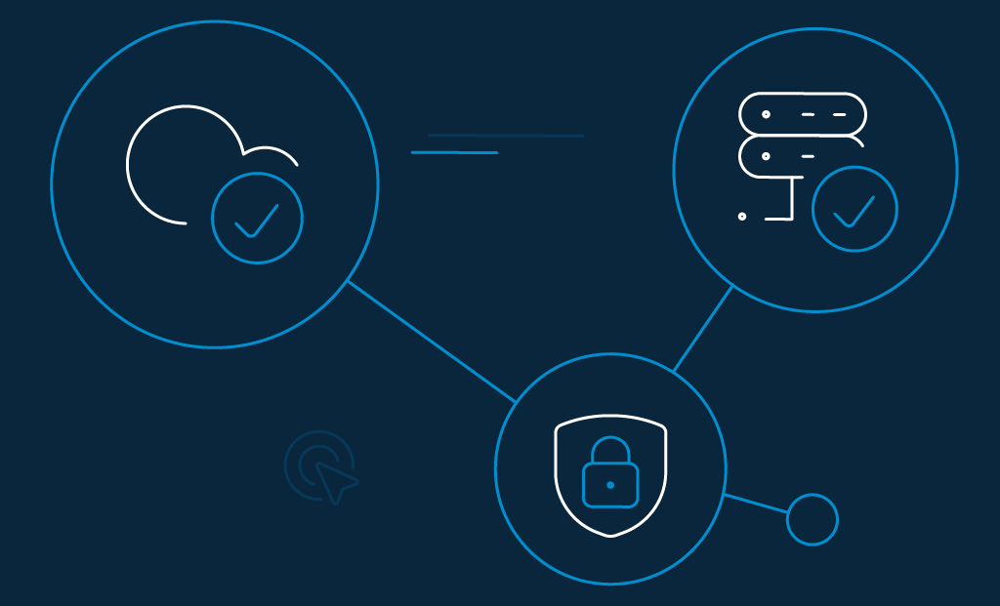

Cloud security consists of controls, processes, technologies, and policies combined to protect the cloud-based systems, infrastructure, and data. Cloud Security is called a subdomain of computer security and, more predominantly, information security. 

All strategies are implemented to protect data, adhere to regulatory compliances, and protect consumers' privacy. The aim is to protect businesses from financial, legal, and reputational hassles of data loss and data breaches.

In this article, we'll discuss a few strategies needed to secure your cloud operations from cyber threats.

## What is Cloud Security

Cloud security is one of the best practices by IT experts designed to prevent unauthorized access to applications and keep data secure in the cloud. It deals with the technology and procedures that secure your cloud operations against internal and external cybersecurity threats. 

According to[ Grand View Research](https://www.grandviewresearch.com/industry-analysis/cyber-security-market), the global cybersecurity market size was valued at US$156.5 billion in 2019 and is expected to increase at a CAGR (compound annual growth rate) of 10.0% from 2020 through 2027.

## How to Improve Cloud Security

One of the most important steps for successful cloud operations is to keep your cloud environment safe and secure. Generally, businesses are eager to adopt cloud solutions, but the primary factor that keeps enterprises on their toes is their security issues. 

Every business has a huge amount of sensitive data on the cloud. We have listed a few strategies on how you can improve and secure your cloud operations using the best policies and tools: 

### 1. Real-time monitoring

Real-time monitoring permits IT admins to monitor any suspicious threats that may arise on the site in real-time. According to IBM, the global average [total cost of a data breach](https://www.ibm.com/security/digital-assets/cost-data-breach-report/#/) in 2020 was $3.45M. 

Considering the magnitude of these losses, you must secure your network from cyber-attacks using real-time monitoring in the cloud. It gives you total visibility into your network systems and helps you understand your security better.

### 2. Multi-Factor Authentication (MFA)

Using a traditional username and a password is not sufficient for protecting consumer accounts from hackers. One of the main ways hackers get access to your online business data and applications is through the stolen credentials.

The most effective security method to keep the hackers at bay and prevent them from accessing your cloud application is through MFA (Multi-Factor Authentication). Hackers can hardly move past the second layer of security. This can prevent [99.9% of account compromise attacks](https://www.microsoft.com/security/blog/2019/08/20/one-simple-action-you-can-take-to-prevent-99-9-percent-of-account-attacks/#:~:text=By%20providing%20an%20extra%20barrier,be%20enough%20to%20gain%20access.) and avoid a data breach.

### 3. Identity and Access Management

Data that is not stored in the private server or unprotected data can be prone to large-scale data breaches and may lead to financial losses, reputation damage, and expose sensitive client information. 

You need to set proper levels of authorization by using an IAM (identity and access management). Assigning access control not only prevents an employee from accidentally editing information that they are not authorized to access, but also protects the businesses from hackers.

### 4. Cloud-to-cloud backup solutions

You could lose data because of the cloud provider's mistake. Therefore, having a cloud-to-cloud backup solution always helps. Backup solutions are a must for organizations that depend on software-as-a-service (SaaS) applications such as Box, Microsoft Office 365, and Zendesk. 

Organizations using SaaS applications as well as a cloud-to-cloud backup are on the rise. This technology offers advanced data protection above the basics provided by SaaS applications.

### 5. Create a systematic off-boarding process

According to a [survey conducted by Cyberark,](https://arstechnica.com/information-technology/2008/09/the-bofh-lives-88-of-it-workers-would-steal-data-if-fired/) "88% of IT workers would take sensitive data with them or abscond with company passwords if they were fired". In [another survey](https://www.darkreading.com/vulnerabilities---threats/50--of-ex-employees-can-still-access-corporate-apps/d/d-id/1329672), it was found that "50% of ex-employees can still access corporate apps."  

Make sure you deprovision your employees when they leave the company. Make sure that they can no longer access your systems, data, cloud storage, intellectual properties, and consumer information. 

You need to have a systematic off-boarding process and make sure all the departing employee's access rights are revoked immediately.

### 6. Offering anti-phishing training

Verizon's [2019 Data Breach Investigations Report](https://enterprise.verizon.com/resources/reports/dbir/) shows that 32% of the data breaches in 2018 involved phishing activities. Further, "phishing was present in 78% of Cyber-Espionage incidents and the installation and use of backdoors." 

Hackers can gain access to securing information by stealing the employee's login credentials or by using social engineering techniques like fake websites, phishing, and duplicate social media accounts. 

Offering anti-phishing training can prevent employees from falling victim to these scams without compromising your company's sensitive data.

## How Secure is Cloud Computing

Security breaches are not caused by weak cloud data security; instead, they are caused by human errors. 

Accidental deletions, stolen login credentials, dissatisfied employees, unsecured Wi-Fi connections, and employee mishaps are some of the reasons that your cloud data might be at risk. 

Mass adoption of cloud technology with ever-increasing sophistication and volume can pave the way for cyber threats that drive the need to implement cybersecurity. 

Here a few tips about how you can improvise on the security of data on the cloud –

1. Enforcing reliable passwords
2. Using encryption
3. Testing your security continuously
4. Ensuring local backup
5. Additional security measures
6. Avoiding storage of sensitive data

## Why is Cloud Security Important

Organizations migrate their sensitive data and applications to the cloud to protect highly sensitive business data from hackers. 

Here are a few more reasons that elaborate on the fundamentals of cloud security: 

### Control access

Access control in cloud security enables an organization to monitor and regulate access or permissions of the company's data. It is done by formulating policies that the organization chooses. 

Similarly, access control in cloud security helps organizations gain macro-level visibility into their user behavior and data. Cloud management and configuration tools offer end users strong role-based access, flexibility, and autonomy. 

### Encrypting sensitive data

Data spillage and data breaches are inevitable; you can protect the data through techniques using encryption. 

You can use multiple keys to minimize the impact of compromised keys. These keys should regularly rotate with a strong access and control policy.

### Using automation

You can use automation to minimize human errors and misconfiguration. According to[ Gartner's research](https://www.gartner.com/smarterwithgartner/is-the-cloud-secure/), "Through 2025, 99% of cloud security failures will be the customer's fault". 

Using automation with audited and pretested configurations makes sure that the infrastructure is configured and deployed the right way. 

Several IT organizations use cloud automation tools that run along with the virtualized environment. It is used to streamline repetitive tasks like defining everyday configuration items, provisioning virtual resources, and establishing infrastructure as code.

### Extend vulnerability management tools

Vulnerability management tools are security applications that scan the organization's networks to identify threats or weaknesses that intruders can exploit. These tools are designed for managing attacks on the network. 

When a scan identifies a threat on the network, this software suggests remedies, action, thereby minimizing the prospect of network attack. 

Compared with conventional firewalls, anti-spy software or antivirus, intrusion detection systems, vulnerability management tools search for potential threats and fix them to mitigate future attacks.

### Implementing enhancements

According to [McAfee's Cloud Adoption and Risk Report 2019](https://www.mcafee.com/enterprise/en-us/assets/reports/restricted/rp-cloud-adoption-risk.pdf), "among all the files hosted on the cloud, 21% have sensitive data included in them". You can implement enhancements throughout the entire operations life cycle. 

In the beginning, only initial implementation takes place. When the apps are introduced to the public, the team should make continual enhancements throughout the journey to safeguard against threats.

### Deploying multi-factor authentication (MFA)

MFA (Multi-factor Authentication) has rapidly gained adoption to increase the security and authentication for enterprise web and mobile applications. 

As per recent statistics, 63% of data breaches are connected with reused or weak passwords due to ineffective strategies used by several organizations. 

Deploying MFA (Multi-factor Authentication) is considered the cheapest and the most effective security control to protect your business from hackers trying to access your cloud applications. 

By protecting your cloud users with multi-factor authentication, only authorized personnel will be given permission to access cloud apps and your sensitive business data.

## Why Should Businesses Rely Completely on the LoginRadius Cloud IAM Solution

If you intend to build a Cloud IAM solution either in-house or through a third-party service on your servers, then you should be aware of its limitations too.  There is a time-consuming factor in hardware, software, security, and privacy. 

In comparison, LoginRadius takes care of upgrades, maintenance, data management, infrastructure management, compliance, security, and privacy. 

With the LoginRadius cloud infrastructure, you can automatically scale to accommodate the changing data storage requirements, peak loads, consumer authentication, account creation, the addition of new applications, and more. 

## Final Words

There is no doubt that cloud computing is the future. And it would be best if you secure your cloud operations now! 

You need to think more carefully regarding the cloud security controls to ensure total security. Using the best industry practices and managing your cloud services will help you secure your cloud operations, thereby protecting sensitive data. 

