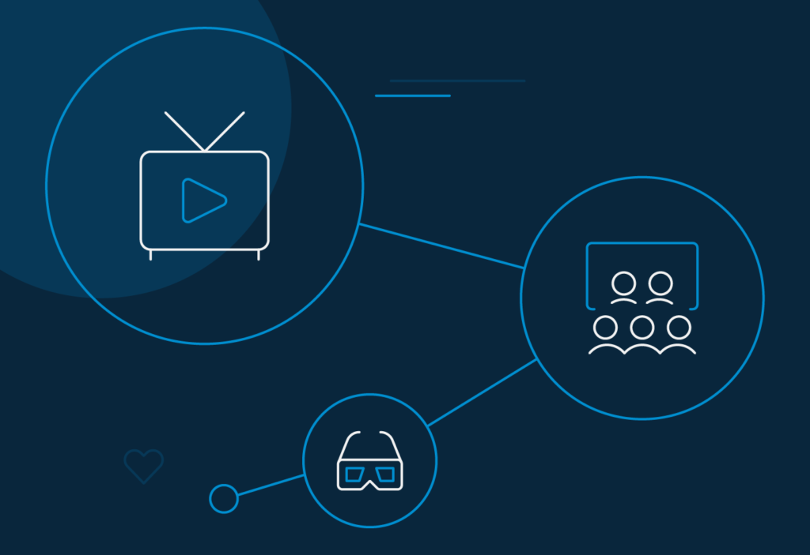
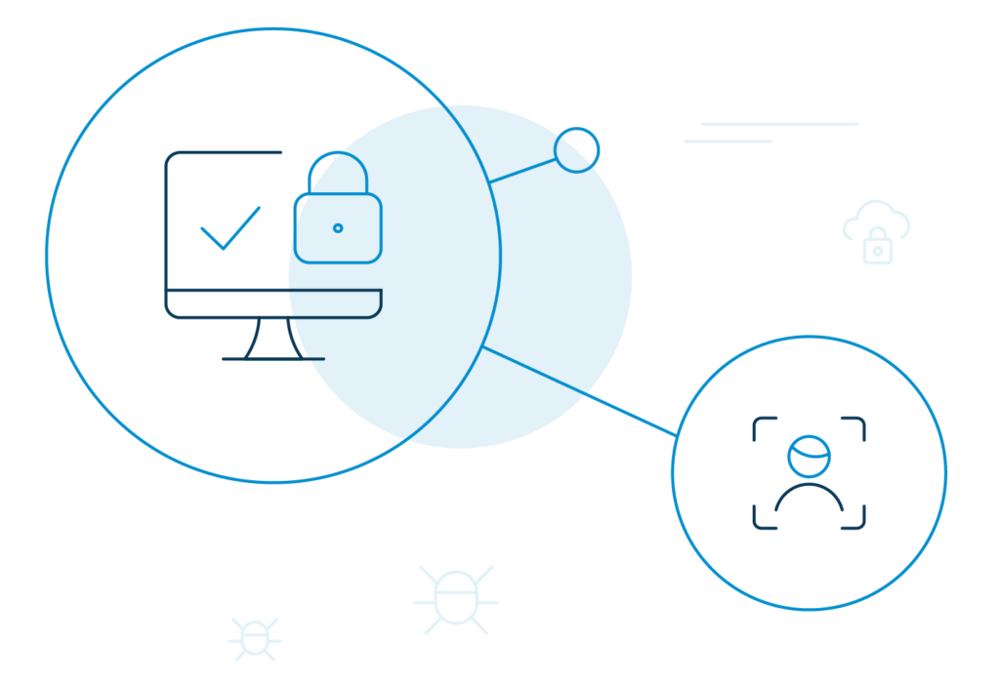
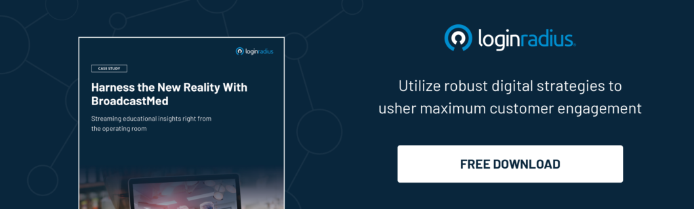

_If a couple of years ago, streaming apps were the future, then the future is here._

As social isolation continues to be the new normal amidst work-from-home and social distancing measures, the popularity of over-the-top (OTT) streaming apps – both video and audio has jumped exponentially to meet the [growing entertainment demands](https://www.loginradius.com/blog/2020/02/customer-experience-media-entertainment-industry/) of viewers.

A recent study by Animoto suggests, [70% of businesses](https://animoto.com/blog/news/social-video-trends-consumers-2020) are investing in videos compared to the same time last year.

With no new content for channels to run (because they are unable to shoot due to the pandemic), viewers are gravitating towards OTT streaming apps like Netflix, Disney Hotstar, Amazon Prime to watch fresh content.

_But what about data security amidst the volatile digital identity theft environment?_

With the boom in streaming applications, OTT services are a hotbed for sensitive credit card data and [personally identifiable information](https://www.loginradius.com/resource/pii-data-breach-report/).

But sadly, it is not an uncommon occurrence that people share passwords on-the-go or use the same passwords across the plethora of streaming app premium subscriptions they own.

Cybercriminals can easily monetize such mistakes and sell access credentials for data theft and identity fraud.

## Recent Cyber Attacks in the Video and Music Streaming Industry

- Popular streaming service, Disney+ indicated credential stuffing [cyberattack on their application](https://www.cpomagazine.com/cyber-security/new-disney-plus-streaming-service-hit-by-credential-stuffing-cyber-attack/) where hackers used stolen login credentials and then applied the brute force method to hack into accounts.
- Irdeto Piracy Trends [Report revealed](https://www.aol.com/article/finance/2018/08/13/hundreds-of-stolen-passwords-for-netflix-hbo-hulu-and-more-discovered-for-sale-on-dark-web/23501424/) that it discovered 854 listings of OTT credentials from 69 unique sellers in the dark web. What's more disturbing was the list included 42 popular streaming services, including Netflix, HBO, and Hulu.
- According to Proofpoint [threat analysts](https://www.proofpoint.com/uk/resources/threat-reports/state-of-phish), cybercriminals steal valid credentials from thousands of Netflix, Disney+ streaming accounts, and sell them online at a discounted price.
- The online music streaming service provider, Mixcloud was compromised by AWS hackers who gained unauthorized access to their systems and tried to [sell more than 20 million user data](https://www.cisomag.com/aws-hacker-attacks-online-music-service-mixcloud/) on the dark web. 

It has become imperative for content streaming players to fight back. In fact, using automated bot detection and low-friction authentication like social and passwordless login can go a long way in [securing digital identities](https://www.loginradius.com/blog/2019/10/digital-identity-management/).

## Cyber Threats Faced by Video and Music Streaming Apps

When it comes to entertainment-based streaming applications, security often takes the backseat. For customers, keeping Netflix or Amazon Prime's account credentials secure isn't much of a concern. They won't treat them the same way as they would their bank accounts.

The lack of awareness is what hackers take advantage of. Some of the common ways attackers gain access to customer account include:

### Phishing Attack

Phishing is a kind of social engineering attack where imposters dupe victims into opening an email link, instant message, or genuine looking sites to steal login credentials and credit card numbers.

As the worldwide lockdown is forcing people to rely a lot more on streaming applications like Netflix, Disney+, Hulu, YouTube TV, fraudsters are seeing this as an opportunity to pose threats to users.

According to a report by [The Guardian](https://www.theguardian.com/media/2020/apr/19/hackers-exploit-coronavirus-lockdown-with-fake-netflix-and-disney-pages), more than 700 lookalike websites resembling Netflix and Disney+ signup pages have been created by hackers to take advantage of the pandemic streaming boom.

These fake websites entice users with their free subscriptions to steal names, IDs, personal and financial information.

### Credential Stuffing Attack

[Credential stuffing](https://www.loginradius.com/blog/2019/09/prevent-credential-stuffing-attacks/) is a kind of cyberattack where hackers use large databases of stolen credentials via automated bots to gain access to user accounts.

One of the biggest loopholes that result in a credential stuffing attack include consumers using the same login and password for multiple applications services.

Streaming apps are the perfect victim of such attacks. Often, hackers know when there is a worldwide demand for a particular service, for example, during the premiere of a popular series. They know users will be sharing login credentials with others. That's precisely the kind of opportunity hackers look for.

### Brute Force Attack

A brute force attack is a kind of hacking attempt that hackers use to target login pages through trial and error. The bad actors use automated bots to attempt as many guesses as possible until they are able to crack open an account with the right combination.

One of the biggest examples of brute force attacks on streaming apps is that they are relatively simple to perform. Also, the lack of mitigation strategy in the systems' security level makes it a [popular form of cyberattack](https://www.loginradius.com/blog/2019/10/cybersecurity-attacks-business/).

### Account Takeover Attack

It seems like [account takeover attacks](https://www.loginradius.com/blog/2020/04/corporate-account-takeover-attacks/) are the new normal for content streaming applications today. Fraudsters have an intensive criminal ecosystem that often leverages a large database of previously stolen credentials to hack into OTT delivery models.

They use bot infrastructure to attempt logging in with the hope that at least 1%-2% of these account owners will re-use their credentials. And when consumers do that, bam! Hackers take over those accounts and exploit them for financial gain.

### Man-in-the-Middle (MitM) Attack

Consider MitM attacks as cyber eavesdropping where attackers secretly place them between communication end-points and tamper data through a compromised, yet trusted system.

Man-in-the-middle attacks can be easily automated, and hence, repercussions can be quite severe. Its negative brand publicity can cost businesses in millions, and customers can be ripped off money.

Detecting MitM attacks is difficult, but they can be prevented through cybersecurity measures like multi-factor authentication and maximizing network control.

## OTT (Over-The-Top) Streaming Services and Apps

Streaming entertainment giants are completely [aware of the cyber threats](https://www.loginradius.com/blog/2020/05/cyber-threats-business-risk-covid-19/) - a reason why the media landscape is rapidly evolving to accommodate the growing security concerns.

Some of the OTT (over-the-top) video streaming services and apps that stand out in the volatile environment include:

### OTT Video Streaming Services and Apps

1. **Netflix**

Content is king, and catalog is everything when it comes to a video streaming service's success. Netflix ticks both the checkboxes. With over 182.8 million subscribers, it is one of the biggest video-distribution networks in the world today.

To accommodate the security of the vast customer base, Netflix takes a [risk-based approach to content security](https://partnerhelp.netflixstudios.com/hc/en-us/articles/360001937528-Netflix-Content-Security-Best-Practices). 

Some of the measures include regular risk assessment, strong authentication protections via MFA, security training and awareness program, business continuity plan, and ensuring that only persons working on client projects can access the content.

2. **Amazon Prime Video** 

Another streaming giant, Amazon Prime, handles cybersecurity by following the best possible practices.

Some of them include the use of SSL to encrypt web traffic, use of secure cookies to prevent client malware from hacking customers and email and DNS protection to verify the authenticity of the email and web addresses. They also have their headers obscured.

3. **Disney +**

One of the world's largest independent media conglomerates, the Walt Disney Company, or simply Disney+ offers enhanced security measures to keep the data of its millions of subscribers safe.

Who does it do it? Disney uses a robust SSL algorithm for data encryption. Furthermore, it also ensures that the ASP.NET version header is not exposed, so it is harder for hackers to hack into their systems.

4. **Voot**

Voot is Viacom18's Premium video on demand (SVOD) service for the Indian audience. It's the latest offering, Voot Select is launched with an extensive digital portfolio.

The platform offers 32 original shows with edgy and disruptive stories, four international channels, and the best network content 24 hours before the episodes air on TV.

5. **Alt Balaji**

Alt Balaji, one of the leading OTT players, is a homegrown streaming platform for Indian consumers. With a variety of new options in the original web-series category, it lets you stream Indian content at a minimal cost.

Speaking of its cybersecurity adjustments, they undertake robust internal control measures to limit the access of information and also offer strong [security policies against phishing](https://www.altbalaji.com/privacy-policy) to protect consumer data from identity theft.

6. **BritBox** 

BritBox is a UK-based digital video subscription service, which is a joint venture between ITV and the BBC. It serves the consumers in the United Kingdom, the United States, and Canada.

The platform offers an ensemble of the massively popular British TV content along with fresh series of a mixture of genres. BritBox has chosen LoginRadius as the [sole provider of its managed identity platform](https://www.loginradius.com/press/loginradius-powers-britbox-launch-high-performance-ciam/).

7. **Hulu**

Hulu is a very popular American video streaming application co-owned by The Walt Disney Company and Comcast. It streams newer TV shows in the US and Japan.

With an extensive library, Hulu majorly focuses on original content, documentaries, blockbuster, and independent films and other popular shows from popular network broadcasters across the globe.

8. **Zee 5**

Zee 5 is another popular video streaming app for Indian consumers from entertainment network Zee Entertainment Enterprises Limited (ZEEL). The online OTT platform offers entertainment through hyper-personalization in their content developing strategies.

Zee 5 offers Live TV, TV shows, originals, international shows, and premium movies in 11 navigational and 12 featured languages to cater to the ever-evolving viewership pattern of users.

9. **HBO Go**

HBO GO is a streaming service that is offered for free along with an existing HBO subscription. Consumers can enjoy unlimited access to the best HBO shows, movies, sports, and documentaries.

10. **SonyLIV**

SonyLIV is another popular OTT service that streams quality content by Sony Pictures Networks India Private Limited (SPN) for Indian users. Launched in 2013, it is the first premium video-on-demand service that offers multi-screen engagement, a massively popular concept these days.

With secured digitization taking over the streaming platform, consumers are swamped with choices – FuboTV, Tubi, Philo, Youtube TV, Sling TV, Crunchyroll, Apple TV Plus, Sony Crackle, Hotstar, Erosnow, Viu, Jio Cinema, Zengatv and more.

### OTT Audio Streaming Services and Apps

1. **Apple Music**

Apple Music is one of the most loved music streaming apps that features more than 30 million songs and a 24/7 live radio. Music lovers can enjoy both commercial and local hits and options to upload their own music and stream to their devices.

2. **Deezer** 

Deezer is another popular music streaming app for music fanatics in the United States. It claims to offer the best quality music streaming service with an infinite collection of songs with automated recommendations.

3. **iHeartRadio**

iHeartRadio is one of the personal favorites of listeners who love to enjoy music from curated playlists. The premium on-demand music service houses millions of tracks, and there are radio stations that are offered for free.

4. **Pandora**

For music lovers looking for the most reliable online radio station, Pandora is the first choice. While there's a lot to enjoy in the free plan, listeners can enjoy unlimited skips with the premium account, along with a diverse collection of personalized radio stations.

5. **SoundCloud**

SoundCloud is a community-driven music streaming app and a popular choice for global indie creators. Listeners are exposed to millions of popular tracks, and they can also upload their own music.

6. **Google Play Music**

Google Play Music is undoubtedly one of the most popular audio streaming sites among music lovers. It is a perfect choice for on-demand music access with a tidy interface compared to other popular streaming sites.

7. **Spotify** 

Spotify has it all - from millions of songs, curated radio stations, playlists, podcasts, and even some video content. It is one of the most recognizable streaming music apps after Google Play Music.

8. **Tidal** 

Tidal is unquestionably a popular music streaming site that supports High Fidelity music. It offers a collection of over 50 million soundtracks and is available to dozens of countries worldwide. Tidal recommends users to access through Google Chrome to enjoy a HiFi music experience.

Among its popular features include Android TV support, over 130,000 high definition music videos, expertly curated playlists, and a music blog.

9. **YouTube Music**

YouTube Music is the video service's most popular and recognizable music streaming offering. Like other music apps, users can enjoy millions of songs on the platform with the unique differentiation that it sources the YouTube channel.

10. **Gaana**

Gaana is an incredibly popular music streaming app among Indian audiences, mostly because of its selection of curated playlists and lively looking interface.

With other popular options like TuneIn Radio, Wynk, JioSaavn, Amazon Prime Music, IDAGIO, PrimePhonic, and the likes, there is no shortage of music apps.

Now, think of it this way. If nearly all of the population is attached to at least one streaming service (be it audio or video), we are a lucrative target for hackers to get their hands on sensitive data.

## 5 Things Video and Audio Streaming Industry Can Do to Secure the User Experience

Identity is the most important entity in the digital ecosystem. Streaming applications should know how to associate the required restrictions with the right users and secure customer experiences. Here are five other ways to enhance customer security. 

1. **Put user experience at the center.**

Popular streaming sites like Netflix, Amazon Prime, Disney + already do that. They offer curated recommendations on their home screen based on viewers' most binge-watched genre. This is where the use of AI for seamless customer experience comes into play. 

Make sure the UX complement aspects such as targeted retention strategies, quick onboarding, and secure payment gateways. 

But then, let's not forget that hackers are skilled engineers that develop faulty algorithms to redirect consumers to different payment sites. Make sure [you are authenticating users](https://www.loginradius.com/authentication/) with a robust security system on your OTT platform. 

2. **Safeguard customer data.** 

Securing customer data in the digital space is a big deal for any industry. As consumers continue to subscribe, and your community grows, the growing database becomes more and more vulnerable to security risks.

Henceforth, if any brand fails to [prioritize security and privacy](https://www.loginradius.com/security/), it may be a significant blow to reputation. 

Conversely, practicing the right cybersecurity measures and investing in the right identity management solution will gain a competitive edge over others. 

3. **Steer clear of targeted automation and bots.**

A vast majority of credential stuffing attacks happen due to botnets. Hackers usually program botnets to devise account takeovers of consumer data that are most vulnerable to attacks. 

[Using multi-factor authentication](https://www.loginradius.com/blog/2019/06/what-is-multi-factor-authentication/) can help a great deal in reducing such risks. Users trying to authenticate should first confirm the human use of a web browser. 

For example, the clicking pattern or movement of a mouse during Recaptcha evaluation can determine the difference between a bot and a human.

4. **Implement low-fiction security solutions.**

If remembering complex passwords is a problem for consumers, introduce [passwordless authentication](https://www.loginradius.com/blog/2019/10/passwordless-authentication-the-future-of-identity-and-security/) into your system where you can confirm a user's identity through OTP, magic link, or biometrics in a more efficient, and secure way.

It will keep customer data safe without creating any inconvenience to user experience — a win-win for both parties.

5. **Protection against piracy.**

Piracy sites are quite popular in the industry because they allow users to stream content for free. The lack of a monthly subscription business model seems more appealing than premium streaming services where users cannot move past thumbnails unless they are subscribers.

Other benefits like live streaming of premium TV content make piracy sites more popular among general users. Sometimes, they resemble popular streaming applications to make hacking even easier.

Educate your customers about different hacking practices and make sure they can distinguish between you and your pirated version.

## The Need for Identity Management in Online Streaming Services and Applications

Securing content and safeguarding customer information is crucial to the functioning of streaming apps. Any loophole in the security system may lead to compromised service and put your OTT brand at risk.

A [cloud-based identity management solution](https://www.loginradius.com/blog/2019/06/customer-identity-and-access-management/) like LoginRadius sits between streaming services and general users to safeguard data embedded in backend and frontend systems.

Today, streaming subscribers want things to be effortless and easy-to-operate. An identity management platform ticks all the boxes here.

Wondering how? Let's find out. 

- **Single Sign-On**: SSO or [Single Sign-on](https://www.loginradius.com/blog/2019/05/what-is-single-sign-on/) allows a unified login system where a single set of login credentials can be used to access multiple partners.  
      
    Video broadcasting company BroadcastMed's successful implementation of SSO by LoginRadius is a good example.

The identity provider offered a centralized login system where users can seamlessly navigate to third-party sites and other syndication partners without the need to log in and out every time.

- **Passwordless Login**: The general users love it if they can log in or register without a password. In the streaming industry, [passwordless login](https://www.loginradius.com/blog/2019/10/passwordless-authentication-the-future-of-identity-and-security/) can act as a catalyst for customer retention and loyalty.  
      
    With advanced authentication features like one-touch login and [smart login](https://www.loginradius.com/docs/authentication/tutorial/smart-login/), subscribers can simply login by entering the OTP or email ID.

- **Social Login**: [Social login](https://www.loginradius.com/social-login/) is another authentication module that helps reduce login complexities and password fatigue. Subscribers can authenticate using their existing social media credentials instead of filling out time-consuming forms.

- **Increase security with MFA**: Streaming applications can offer multi-factor authentication or [MFA as an additional security layer](https://www.loginradius.com/multi-factor-authentication/) to protect subscribers' data. They can minimize the risk of data theft by mandating customers to enter an instant OTP or open a link.

- **Compliance and privacy management**: An identity management solution ensures that international [data governance policies](https://www.loginradius.com/data-governance/) are met. Additionally, it takes care of real-time fraud analysis to prevent stubborn hacking attempts.

## Conclusion

Frictionless user experience and optimal security drive the transformation of the audio and video streaming industry. A common reason why most people do not favor multi-factor authentication or like to create unique passwords is because the process adds on to their effort.

Even then data security remains a crucial aspect. You need to balance both the worlds. An identity management platform can help you achieve that.

